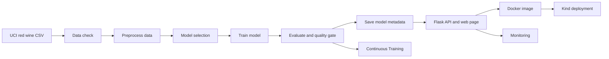

# MLOps Red Wine Quality Classifier


Public GitHub repository: <https://github.com/lorcan973232/mlops-wine-quality-pipeline>

This is my MLOps project for a red wine quality classifier. It predicts whether a wine sample is `standard quality` or `good quality` from 11 chemical measurements.

The project uses Python, scikit-learn, Flask, Docker, Kind Kubernetes, GitHub Actions, pytest, and simple monitoring scripts. The main evidence is saved in `reports/`, the trained model is in `models/`, and the workflows are in `.github/workflows/`.

Quick local run:

```powershell
powershell -ExecutionPolicy Bypass -File scripts/setup_local.ps1
powershell -ExecutionPolicy Bypass -File scripts/run_pipeline.ps1
pytest -q
python -m app.main
```

Then open:

```text
http://127.0.0.1:5000/
```

## Short project summary

The repository shows a full student MLOps workflow. It starts with the UCI red wine dataset, trains a model, checks the model, serves it through a Flask API, packages it with Docker, deploys it to Kind, and writes reports that can be checked later.

The model gives useful results for this project, but it is not a complete wine-quality system. The main point is to show the full MLOps workflow: data, training, testing, API, Docker, Kind, GitHub Actions, monitoring, and saved evidence.

## What the project does

The project can:

- download and check the red wine dataset;
- create a processed dataset for binary classification;
- train an `ExtraTreesClassifier`;
- compare the model with a baseline;
- save metrics and model metadata;
- serve predictions through Flask;
- show a small browser page for manual predictions;
- run tests with pytest;
- build and smoke test a Docker image;
- deploy the image to local Kind Kubernetes;
- run GitHub Actions for CI, training, Docker, Kind, monitoring, and security.

## Dataset and prediction task

The project uses the UCI Wine Quality red wine dataset.

| Item | Value |
|---|---|
| Dataset | UCI Wine Quality - Red Wine |
| Source | <https://archive.ics.uci.edu/dataset/186/wine+quality> |
| Raw CSV | `data/raw/winequality-red.csv` |
| Raw SHA-256 | `4a402cf041b025d4566d954c3b9ba8635a3a8a01e039005d97d6a710278cf05e` |
| Source target | `quality` |
| Model target | `quality_label` |
| Positive class | `good quality` when `quality >= 6` |
| Negative class | `standard quality` |

The input columns are:

```text
fixed_acidity, volatile_acidity, citric_acid, residual_sugar, chlorides,
free_sulfur_dioxide, total_sulfur_dioxide, density, ph, sulphates, alcohol
```

This dataset is useful for coursework because it is public, small, and easy to rerun. It is not live winery data.

## Main files and folders

| Path | What it is for |
|---|---|
| `app/` | Flask API, model loading, request checks, and web page |
| `data/raw/` | Original UCI CSV |
| `data/processed/` | Processed dataset used by training and monitoring |
| `deployment/kind/` | Kubernetes manifests for Kind |
| `models/wine_quality_classifier.joblib` | Saved model used by Flask, Docker, and Kind |
| `reports/metrics/` | Model metrics, quality gate, and metadata |
| `reports/monitoring/` | Data checks and drift reports |
| `reports/explainability/` | SHAP and feature explanation reports |
| `reports/fairness/` | Proxy group fairness check |
| `reports/business/` | Cost-benefit example |
| `reports/security/` | Security scan outputs |
| `reports/submission/public_repository_evidence.json` | Current repository visibility snapshot |
| `scripts/` | Setup, pipeline, deployment, monitoring, and smoke-test scripts |
| `src/` | Data, preprocessing, training, evaluation, and registry code |
| `tests/` | pytest tests |
| `.github/workflows/` | GitHub Actions workflows |
| `Dockerfile` | Docker image build |
| `Makefile` | Short commands for common tasks |

## How the pipeline runs



The local pipeline runs these steps:

1. `python -m src.data`
2. `python -m src.preprocess`
3. `python -m src.model_selection`
4. `python -m src.train`
5. `python -m src.evaluate`
6. `python -m src.model_registry`
7. `python -m src.predict`

The same steps can be run with:

```powershell
powershell -ExecutionPolicy Bypass -File scripts/run_pipeline.ps1
```

or:

```bash
bash scripts/run_pipeline.sh
```

## Model results

The selected model is an `ExtraTreesClassifier`. It uses median imputation and `StandardScaler` in the preprocessing pipeline. The saved model is `models/wine_quality_classifier.joblib`.

Main saved results:

| Metric | Saved value |
|---|---:|
| Accuracy | 0.825 |
| Balanced accuracy | 0.824 |
| Macro F1 | 0.824 |
| Weighted F1 | 0.825 |
| ROC AUC | 0.919 |
| Baseline accuracy | 0.534 |
| 5-fold CV accuracy mean | 0.810 |
| Quality gate | Passed |

The quality gate checks accuracy, balanced accuracy, macro F1, weighted F1, cross-validation accuracy, and improvement over the baseline. The current saved model passes all of these checks.

Full values are saved in:

- `reports/metrics/latest_metrics.json`
- `reports/metrics/quality_gate_report.json`
- `reports/metrics/model_metadata.json`
- `reports/metrics/model_comparison.json`
- `reports/metrics/classification_report.json`
- `reports/metrics/confusion_matrix.json`
- `reports/metrics/cross_validation_results.json`

## Flask API and web page

The Flask app is in `app/main.py`.

| Route | What it does |
|---|---|
| `/` | Browser page for entering wine values |
| `/health` | Checks that the app can load the model |
| `/predict` | Returns the predicted class, confidence, probabilities, and model version |
| `/dashboard/` | Optional dashboard built from saved reports |

Example request body:

```json
{
  "features": {
    "fixed_acidity": 7.4,
    "volatile_acidity": 0.7,
    "citric_acid": 0.0,
    "residual_sugar": 1.9,
    "chlorides": 0.076,
    "free_sulfur_dioxide": 11.0,
    "total_sulfur_dioxide": 34.0,
    "density": 0.9978,
    "ph": 3.51,
    "sulphates": 0.56,
    "alcohol": 9.4
  }
}
```

The web page uses the real `/predict` route. This means the browser demo uses the same model path as the API tests, Docker container, and Kind deployment.

## Run the project locally

On Windows, use PowerShell:

```powershell
powershell -ExecutionPolicy Bypass -File scripts/setup_local.ps1
powershell -ExecutionPolicy Bypass -File scripts/check_setup.ps1
.\.venv\Scripts\Activate.ps1
```

On Linux, macOS, or Git Bash:

```bash
bash scripts/setup_local.sh
bash scripts/check_setup.sh
source .venv/bin/activate 2>/dev/null || source .venv/Scripts/activate
```

Run the full pipeline:

```powershell
python -m src.data
python -m src.preprocess
python -m src.model_selection
python -m src.train
python -m src.evaluate
python -m src.model_registry
python -m src.predict
```

Start Flask:

```powershell
python -m app.main
```

Open the browser page:

```text
http://127.0.0.1:5000/
```

Smoke test the local API:

```powershell
powershell -ExecutionPolicy Bypass -File scripts/smoke_test_api.ps1 -ApiUrl http://127.0.0.1:5000
```

Makefile shortcuts are also available:

```bash
make setup
make test
make train
make evaluate
make run-api
make docker-build
make kind-deploy
make monitor
make security-scan
```

## Run the tests

Run the main checks with:

```powershell
python -m compileall app src tests scripts
pytest -q
```

The tests cover data handling, model reports, API behaviour, UI routes, monitoring, workflows, explainability, fairness, cost-benefit output, and deployment readiness.

## Run with Docker

Docker runs the same Flask app and saved model in a container.

Build and start the container:

```powershell
docker build -t mlops-flask-api:latest .
docker run --rm -d --name mlops-flask-demo -p 5001:5000 mlops-flask-api:latest
```

Open the Docker web page:

```text
http://127.0.0.1:5001/
```

Smoke test it:

```powershell
powershell -ExecutionPolicy Bypass -File scripts/smoke_test_api.ps1 -ApiUrl http://127.0.0.1:5001
docker stop mlops-flask-demo
```

The Docker workflow is `.github/workflows/docker-build.yml`.

## Deploy with Kind Kubernetes

Kind is used for a local Kubernetes demo. It is not a public cloud service.

The Kind files are:

- `deployment/kind/deployment.yaml`
- `deployment/kind/service.yaml`
- `scripts/create_kind_cluster.ps1`
- `scripts/deploy_kind.ps1`
- `scripts/create_kind_cluster.sh`
- `scripts/deploy_kind.sh`

PowerShell:

```powershell
powershell -ExecutionPolicy Bypass -File scripts/create_kind_cluster.ps1
powershell -ExecutionPolicy Bypass -File scripts/deploy_kind.ps1
kubectl get pods
kubectl get svc
kubectl rollout status deployment/mlops-flask-api
kubectl port-forward service/mlops-flask-api 8080:80
```

Bash:

```bash
bash scripts/create_kind_cluster.sh
bash scripts/deploy_kind.sh
kubectl get pods
kubectl get svc
kubectl rollout status deployment/mlops-flask-api
kubectl port-forward service/mlops-flask-api 8080:80
```

Open the Kind web page:

```text
http://127.0.0.1:8080/
```

Smoke test it:

```powershell
powershell -ExecutionPolicy Bypass -File scripts/smoke_test_api.ps1 -ApiUrl http://127.0.0.1:8080
```

Check local deployment tools with:

```powershell
python scripts/check_deployment_readiness.py
```

If local Docker, Kind, or kubectl are missing, this script can point to `github_actions_current_sha` when the matching GitHub Actions evidence exists for the current commit.

The Kind workflow is `.github/workflows/deploy.yml`.

## GitHub Actions workflows

The workflows are in `.github/workflows/`.

| Workflow file | Display name | When it runs | Main job |
|---|---|---|---|
| `.github/workflows/ci.yml` | CI | Push, pull request, manual | Compile, lint, tests, Flask import, ML smoke path |
| `.github/workflows/data-preprocessing.yml` | Data Preprocessing | Data/preprocess changes, pull request, manual | Data check and processed dataset |
| `.github/workflows/train-and-evaluate.yml` | Train and Evaluate | Model changes, pull request, manual | Training, metrics, model metadata |
| `.github/workflows/continuous-training.yml` | Continuous Training | Weekly and manual | Retraining and quality gate |
| `.github/workflows/docker-build.yml` | Docker Build | Push, pull request, manual | Docker build and API smoke test |
| `.github/workflows/deploy.yml` | Deploy Kind | Push to `main` and manual | Kind rollout and API smoke test |
| `.github/workflows/monitoring.yml` | Monitoring | Daily and manual | Data checks, drift checks, retraining signal |
| `.github/workflows/model-analysis.yml` | Tier 3 Model Analysis | Model/report changes, pull request, manual | SHAP, proxy fairness, cost-benefit, model analysis |
| `.github/workflows/security-scan.yml` | Security Scan | Push, pull request, manual | Secrets, dependencies, Docker checks, SBOM |
| `.github/workflows/final-readiness.yml` | Final Readiness | Push to `main` and manual | Current readiness report |
| `.github/workflows/bash-script-verification.yml` | Bash Script Verification | Push, pull request, manual | Bash scripts on Ubuntu |
| `.github/workflows/repository-visibility-check.yml` | Repository Visibility Check | Daily and manual | Current repository visibility snapshot |

Do not assume a workflow passed just because the file exists. Check the Actions tab for the commit being shown.

## Continuous Training

Continuous Training is in `.github/workflows/continuous-training.yml`. It runs weekly and can also be started by hand.

It reruns data loading, preprocessing, model selection, training, evaluation, and model registry steps. A new model is accepted only if it passes the quality gate in `src/evaluate.py`.

Useful files:

| File | What to check |
|---|---|
| `reports/metrics/quality_gate_report.json` | Current quality gate result |
| `reports/metrics/model_registry.json` | Latest model registry entry |
| `reports/model_registry/version_history.json` | Model version history |
| `reports/metrics/model_metadata.json` | Model, data, metrics, and settings |

## Monitoring and drift checks

Monitoring is simulated unless an API URL is passed in.

Run offline monitoring:

```powershell
python scripts/monitor.py
python scripts/check_drift.py
```

Run monitoring against a live API:

```powershell
python scripts/monitor.py --api-url http://127.0.0.1:8080
```

Main reports:

| File | What it shows |
|---|---|
| `reports/monitoring/data_quality_report.json` | Schema and missing-value checks |
| `reports/monitoring/monitoring_report.json` | Overall monitoring status |
| `reports/monitoring/drift_report.json` | PSI drift results and retraining flags |
| `reports/monitoring/api_monitoring_report.json` | API-aware monitoring output |

The current batch has no drift. The drift report also includes a simulated drift example to show that the retraining trigger works.

## Extra evidence, if included

### Feature importance and SHAP

Feature importance is saved in `reports/metrics/feature_importance.json`. The top three features in the current report are alcohol, sulphates, and volatile acidity.

SHAP reports are saved in `reports/explainability/`. The feature report helps explain what the model uses when it makes predictions.

Limit: these reports explain this saved model and dataset split. They do not prove that the same patterns will hold for new real-world data.

### Fairness proxy check

The fairness check is saved in `reports/fairness/`. The wine dataset does not include protected attributes, so the check uses proxy groups based on alcohol and sulphates.

The current report has a maximum equalized-odds-style gap of `0.592`. This means subgroup errors should be reviewed before any real use.

Limit: this is not a protected-attribute audit.

### Cost-benefit example

The cost-benefit example is saved in `reports/business/cost_benefit_report.json`. It links the confusion matrix to made-up decision values.

Limit: the values are simulated examples, not real company values.

### Drift checks

Drift reports are saved in `reports/monitoring/`. They check schema, missing values, PSI drift, and retraining flags.

Limit: the drift signal is simulated unless the script is run against real changing data.

### Security checks

Security outputs are saved in `reports/security/`. They include a secrets scan, dependency scan, Docker notes, security summary, and SBOM.

Run the local security script with:

```powershell
python scripts/security_scan.py
```

Limit: these checks are a snapshot. They do not mean future dependencies or images will always be safe.

## Branching strategy

The repository uses a simple `feature/* -> develop -> main` strategy.

- `main` is the stable branch used for submission.
- `develop` is the integration branch.
- `feature/*` branches are used for grouped changes.

Branching notes are saved in `reports/submission/branching_evidence.md`.

## Traceability table

| Project need | Where it is shown | How to check it |
|---|---|---|
| Model training and testing | `src/train.py`, `src/evaluate.py`, `tests/`, `reports/metrics/latest_metrics.json` | Run `python -m src.train`, `python -m src.evaluate`, and `pytest -q` |
| Flask prediction API | `app/main.py`, `app/schemas.py`, `scripts/smoke_test_api.ps1` | Run `python -m app.main` and the smoke test |
| Docker container | `Dockerfile`, `.dockerignore`, `.github/workflows/docker-build.yml` | Run the Docker commands or check the Docker workflow |
| Kind deployment | `deployment/kind/`, `scripts/deploy_kind.ps1`, `.github/workflows/deploy.yml` | Run the Kind commands or check the Deploy Kind workflow |
| GitHub Actions | `.github/workflows/` | Open the Actions tab or run `pytest tests/test_workflows.py -q` |
| Continuous Training | `.github/workflows/continuous-training.yml`, `reports/metrics/quality_gate_report.json` | Start the workflow manually or rerun local training and evaluation |
| Monitoring | `scripts/monitor.py`, `scripts/check_drift.py`, `reports/monitoring/` | Run the monitoring commands |
| Tests | `tests/` | Run `pytest -q` |
| Branching strategy | `reports/submission/branching_evidence.md` | Read the branch notes and compare with PR history |
| Extra model evidence | `reports/explainability/`, `reports/fairness/`, `reports/business/`, `reports/security/` | Open the saved reports or rerun the matching scripts |

## Demo steps

These steps give a quick way to show the project working.

1. Open the repository and this README.
2. Show `src/`, `app/`, `tests/`, `Dockerfile`, `deployment/kind/`, `.github/workflows/`, and `reports/`.
3. Open `reports/metrics/latest_metrics.json` and `reports/metrics/quality_gate_report.json`.
4. Run `python -m compileall app src tests scripts`.
5. Run `pytest -q`.
6. Start Flask with `python -m app.main`.
7. Open `http://127.0.0.1:5000/`.
8. Click `Use Example`, then `Predict Quality`.
9. Open `http://127.0.0.1:5000/health`.
10. Run the API smoke test against `http://127.0.0.1:5000`.
11. Show the Docker workflow or run the Docker commands if Docker is available.
12. Show the Kind workflow or run the Kind commands if Docker, Kind, and kubectl are ready.
13. Show `reports/monitoring/drift_report.json`.
14. Show `reports/fairness/fairness_report.json`.
15. Show `reports/security/security_scan_summary.md`.
16. Open the current GitHub Actions runs for CI, Train, Docker, Deploy, Continuous Training, Monitoring, and Security.

Useful demo commands:

```powershell
powershell -ExecutionPolicy Bypass -File scripts/check_setup.ps1
python -m compileall app src tests scripts
pytest -q
python -m app.main
```

In another terminal while Flask is running:

```powershell
powershell -ExecutionPolicy Bypass -File scripts/smoke_test_api.ps1 -ApiUrl http://127.0.0.1:5000
python scripts/monitor.py
python scripts/check_drift.py
```

## Limitations

This is a student project, not a live wine-quality service.

Monitoring is simulated unless an API URL is passed in.

The fairness check uses proxy groups because the dataset does not include protected attributes.

The cost-benefit values are made-up examples, not real company values.

Kind is used for a local Kubernetes demo. It is not a public cloud service.

The model is trained on a fixed public dataset, so it may not work well on very different wine data.

Before showing the project, check that the browser prediction, tests, Docker container, Kind deployment, reports, and GitHub Actions all use the same saved model.
