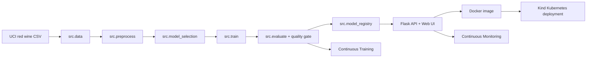

# MLOps Red Wine Quality Classifier


Public GitHub repository: <https://github.com/lorcan973232/mlops-wine-quality-pipeline>

This repository is the artefact component only. It implements a reproducible MLOps pipeline around a Flask prediction service, Docker image, Kind Kubernetes deployment, GitHub Actions CI/CD/CT/CM workflows, tests, monitoring, and traceability evidence. The repository must remain public until 21 June 2026.

## Project Overview

The artefact classifies a red wine sample as `standard quality` or `good quality` from 11 physicochemical inputs. The binary model target is `quality_label`, derived from the original UCI `quality` score where `quality >= 6` is treated as good quality.

| Item | Value |
|---|---|
| Dataset | UCI Wine Quality - Red Wine |
| Public source | <https://archive.ics.uci.edu/dataset/186/wine+quality> |
| Download file | `https://archive.ics.uci.edu/ml/machine-learning-databases/wine-quality/winequality-red.csv` |
| Raw SHA-256 | `4a402cf041b025d4566d954c3b9ba8635a3a8a01e039005d97d6a710278cf05e` |
| Task type | Binary classification |
| Source target | `quality` |
| Model target | `quality_label` |
| Positive class | `good quality` when `quality >= 6` |
| Model | `ExtraTreesClassifier` |
| Model path | `models/wine_quality_classifier.joblib` |
| Model version | `wine-quality-extra-trees-v1` |

## Input Schema

| Field | Meaning |
|---|---|
| `fixed_acidity` | Non-volatile tartaric acid concentration |
| `volatile_acidity` | Acetic acid level |
| `citric_acid` | Citric acid concentration |
| `residual_sugar` | Sugar left after fermentation |
| `chlorides` | Salt concentration |
| `free_sulfur_dioxide` | Free sulfur dioxide concentration |
| `total_sulfur_dioxide` | Total sulfur dioxide concentration |
| `density` | Wine density |
| `ph` | Acidity/alkalinity value |
| `sulphates` | Sulphate concentration |
| `alcohol` | Alcohol by volume percentage |

The `/predict` endpoint returns the class id, class label, class probabilities, confidence, target name, and model version.

## Latest Metrics

Run `python -m src.evaluate` to regenerate metrics.

| Metric | Latest value |
|---|---:|
| Accuracy | `0.825` |
| Balanced accuracy | `0.8237371953373366` |
| Precision macro | `0.8243482364043884` |
| Recall macro | `0.8237371953373366` |
| F1 macro | `0.8240100565681961` |
| Precision weighted | `0.8248997286775982` |
| Recall weighted | `0.825` |
| F1 weighted | `0.8249175047140165` |
| ROC AUC | `0.9192668472075041` |
| 5-fold CV accuracy mean/std | `0.8100122549019607 / 0.019345789260910167` |
| Baseline accuracy | `0.534375` |
| Baseline weighted F1 | `0.37221232179226066` |

Quality gate thresholds:

| Gate | Threshold | Status |
|---|---:|---|
| Accuracy | `>= 0.80` | Passed |
| Weighted F1 | `>= 0.80` | Passed |
| Macro F1 | `>= 0.80` | Passed |
| CV accuracy mean | `>= 0.77` | Passed |
| Accuracy improvement over baseline | `>= 0.20` | Passed |

Metric evidence files:

| File | Evidence |
|---|---|
| `reports/metrics/latest_metrics.json` | Current accuracy, precision, recall, F1, ROC AUC, quality gate |
| `reports/metrics/baseline_metrics.json` | Dummy most-frequent baseline |
| `reports/metrics/quality_gate_report.json` | CT acceptance/rejection gate |
| `reports/metrics/model_metadata.json` | Dataset, schema, hyperparameters, metrics, model version |
| `reports/metrics/model_comparison.json` | Candidate model and baseline comparison |
| `reports/metrics/classification_report.json` | Per-class, macro, and weighted classification report |
| `reports/metrics/confusion_matrix.json` | Held-out confusion matrix |
| `reports/metrics/cross_validation_results.json` | 5-fold StratifiedKFold results |

## Hyperparameters

```json
{
  "algorithm": "ExtraTreesClassifier",
  "classifier": {
    "n_estimators": 300,
    "max_depth": null,
    "min_samples_leaf": 1,
    "min_samples_split": 2,
    "class_weight": "balanced",
    "random_state": 42,
    "n_jobs": 1
  },
  "train_test_split": {
    "test_size": 0.2,
    "random_state": 42,
    "shuffle": true,
    "stratify": "quality_label"
  },
  "preprocessing": {
    "numeric_imputer_strategy": "median",
    "numeric_scaler": "StandardScaler"
  }
}
```

## Architecture



## Local Setup

PowerShell:

```powershell
powershell -ExecutionPolicy Bypass -File scripts/setup_local.ps1
powershell -ExecutionPolicy Bypass -File scripts/check_setup.ps1
```

Bash or Git Bash:

```bash
bash scripts/setup_local.sh
bash scripts/check_setup.sh
```

## Core Verification Commands

```powershell
python -m compileall app src tests
python -m src.data
python -m src.preprocess
python -m src.model_selection
python -m src.train
python -m src.evaluate
python -m src.model_registry
python -m src.predict
python scripts/monitor.py
python scripts/check_drift.py
pytest -q
ruff check src tests
python -c "from app.main import app; print('Flask import OK')"
```

## Flask API and UI

Run:

```powershell
python -m app.main
```

Open:

```text
http://127.0.0.1:5000/
```

Click `Use Example`, then `Predict Quality`. The UI calls `/predict`, displays the predicted quality class, confidence, and model version.

Example payload:

```json
{
  "features": {
    "fixed_acidity": 7.4,
    "volatile_acidity": 0.7,
    "citric_acid": 0.0,
    "residual_sugar": 1.9,
    "chlorides": 0.076,
    "free_sulfur_dioxide": 11.0,
    "total_sulfur_dioxide": 34.0,
    "density": 0.9978,
    "ph": 3.51,
    "sulphates": 0.56,
    "alcohol": 9.4
  }
}
```

Smoke test:

```powershell
powershell -ExecutionPolicy Bypass -File scripts/smoke_test_api.ps1 -ApiUrl http://127.0.0.1:5000
```

## Docker

```powershell
docker build -t mlops-flask-api:latest .
docker run --rm -d --name mlops-flask-demo -p 5001:5000 mlops-flask-api:latest
powershell -ExecutionPolicy Bypass -File scripts/smoke_test_api.ps1 -ApiUrl http://127.0.0.1:5001
docker stop mlops-flask-demo
```

Open Docker UI:

```text
http://127.0.0.1:5001/
```

## Kind Kubernetes

PowerShell:

```powershell
powershell -ExecutionPolicy Bypass -File scripts/create_kind_cluster.ps1
powershell -ExecutionPolicy Bypass -File scripts/deploy_kind.ps1
kubectl get pods
kubectl get svc
kubectl rollout status deployment/mlops-flask-api
kubectl port-forward service/mlops-flask-api 8080:80
```

Bash:

```bash
scripts/create_kind_cluster.sh
scripts/deploy_kind.sh
kubectl get pods
kubectl get svc
kubectl rollout status deployment/mlops-flask-api
kubectl port-forward service/mlops-flask-api 8080:80
```

Open Kind UI:

```text
http://127.0.0.1:8080/
```

Smoke test and API-aware monitoring:

```powershell
powershell -ExecutionPolicy Bypass -File scripts/smoke_test_api.ps1 -ApiUrl http://127.0.0.1:8080
python scripts/monitor.py --api-url http://127.0.0.1:8080
```

## GitHub Actions

| Workflow | Purpose | Trigger | Main evidence |
|---|---|---|---|
| `.github/workflows/ci.yml` | Compile, lint, tests, ML smoke path | Push/PR/manual | `compileall`, `ruff`, `pytest`, pipeline scripts |
| `.github/workflows/data-preprocessing.yml` | Ingest and preprocess public dataset | Push/PR/manual | `data_ingestion.json`, processed CSV |
| `.github/workflows/train-and-evaluate.yml` | Train, evaluate, register | Push/PR/manual | model and metrics artefacts |
| `.github/workflows/docker-build.yml` | Build and smoke-test image | Push/PR/manual | Docker health/predict smoke test |
| `.github/workflows/continuous-training.yml` | Scheduled/manual retraining | Schedule/manual | `quality_gate_report.json` |
| `.github/workflows/deploy.yml` | Kind deployment only | Push/manual/workflow_run | rollout and smoke logs |
| `.github/workflows/monitoring.yml` | Offline monitoring and drift | Schedule/manual | monitoring and drift reports |

Post-push verification is required in the GitHub Actions tab. If a workflow has not run after the final push, run it manually from Actions using `Run workflow`.

## Branching Strategy

| Branch | Purpose |
|---|---|
| `main` | Stable release branch; deployment workflow is scoped to `main` |
| `develop` | Integration branch before release |
| `feature/*` | Feature work through pull requests |
| `hotfix/*` | Optional urgent corrections |

Pull requests trigger CI. CI must pass before merge. Continuous Training and Monitoring are scheduled from the repository workflow definitions and can also be run manually.

## Continuous Training and Monitoring

Continuous Training reruns ingestion, preprocessing, model selection, training, evaluation, and the quality gate. The candidate is accepted only if accuracy, macro F1, weighted F1, CV accuracy, and baseline improvement thresholds pass.

Offline monitoring:

```powershell
python scripts/monitor.py
python scripts/check_drift.py
```

API-aware monitoring after Kind port-forward:

```powershell
python scripts/monitor.py --api-url http://127.0.0.1:8080
```

Reports are written under `reports/monitoring/`. The artefact does not claim production telemetry; monitoring uses deterministic batch checks, schema validation, simulated drift, and optional deployed API checks.

## Live Demo Checklist

1. Show the public GitHub repo and this README.
2. Run `python -m compileall app src tests`, `pytest -q`, and `ruff check src tests`.
3. Run `python -m src.data`, `python -m src.preprocess`, `python -m src.model_selection`, `python -m src.train`, `python -m src.evaluate`, `python -m src.model_registry`, and `python -m src.predict`.
4. Show `latest_metrics.json`, `classification_report.json`, `confusion_matrix.json`, `model_metadata.json`, `model_comparison.json`, and `quality_gate_report.json`.
5. Start Flask and open `http://127.0.0.1:5000/`.
6. Click `Use Example`, then `Predict Quality`.
7. Build Docker, open `http://127.0.0.1:5001/`, and run the smoke test.
8. Deploy to Kind, port-forward the service, open `http://127.0.0.1:8080/`, and run the smoke test.
9. Run offline monitoring, drift check, and API-aware monitoring.
10. Show GitHub Actions workflows and recent runs.

## Traceability Matrix

| Artefact requirement | File/path | Local command | GitHub Actions workflow | Quality gate/test | Status | Remaining action |
|---|---|---|---|---|---|---|
| Public dataset ingestion | `src/data.py`, `data/raw/winequality-red.csv` | `python -m src.data` | `data-preprocessing.yml` | SHA-256/schema validation, `tests/test_data.py` | Verified locally | Confirm final GitHub run |
| Preprocessing | `src/preprocess.py` | `python -m src.preprocess` | `data-preprocessing.yml` | deterministic processed CSV | Verified locally | Confirm final GitHub run |
| Model selection | `src/model_selection.py` | `python -m src.model_selection` | `train-and-evaluate.yml` | model comparison JSON | Verified locally | Confirm final GitHub run |
| Training | `src/train.py` | `python -m src.train` | `train-and-evaluate.yml`, `continuous-training.yml` | saved model and metadata | Verified locally | Confirm final GitHub run |
| Evaluation | `src/evaluate.py` | `python -m src.evaluate` | `train-and-evaluate.yml`, `continuous-training.yml` | accuracy/F1/baseline gate | Verified locally | Confirm final GitHub run |
| Flask API/UI | `app/` | `python -m app.main` | `ci.yml`, Docker/Deploy workflows | `tests/test_api.py`, `tests/test_ui.py` | Verified locally | Open UI during demo |
| Docker | `Dockerfile`, `.dockerignore` | `docker build -t mlops-flask-api:latest .` | `docker-build.yml` | smoke test script | Verified locally | Confirm final GitHub run |
| Kind Kubernetes | `deployment/kind/`, `scripts/deploy_kind.*` | `scripts/deploy_kind.ps1` or `.sh` | `deploy.yml` | rollout + smoke test | Verified locally | Confirm final GitHub run |
| Continuous Training | `continuous-training.yml` | `python -m src.evaluate` | `continuous-training.yml` | `quality_gate_report.json` | Verified locally | Confirm final GitHub run |
| Continuous Monitoring | `scripts/monitor.py`, `scripts/check_drift.py` | `python scripts/monitor.py` | `monitoring.yml` | drift/API reports | Verified locally | Confirm final GitHub run |
| Tests | `tests/` | `pytest -q` | `ci.yml` | pytest suite | Verified locally | Confirm final GitHub run |
| Branching | README | `git status --short --branch` | PR workflows | CI before merge | Documented | None |
| Public GitHub | README, remote repo | `gh repo view` | GitHub Actions tab | repo public check | Documented | Keep public until 21 June 2026 |

## Limitations

The dataset is a fixed public research dataset rather than live production telemetry. Monitoring is therefore simulated and API-aware rather than production-grade observability. The model is intended for MLOps pipeline demonstration, not wine-production decision making.
