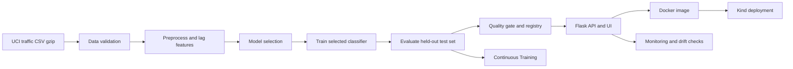

# MLOps Traffic Volume Classifier


Public GitHub repository: <https://github.com/lorcan973232/mlops-wine-quality-pipeline>

This artefact is an MLOps pipeline for classifying the next hourly traffic state as `normal traffic` or `high traffic` from public UCI Metro Interstate Traffic Volume data. It includes real data ingestion, preprocessing, model selection, training, evaluation, model registry metadata, Flask serving, Docker packaging, Kind Kubernetes deployment, Continuous Training, Continuous Monitoring, tests, security evidence, and live-demo instructions.

The repository must remain public until **21 June 2026**. Current visibility evidence is in `reports/submission/public_repository_evidence.json`; future visibility still depends on the repository staying public.

## Quick Verification

Run the local Python artefact path:

```powershell
powershell -ExecutionPolicy Bypass -File scripts/setup_local.ps1
powershell -ExecutionPolicy Bypass -File scripts/run_pipeline.ps1
```

Equivalent Bash/Git Bash route:

```bash
bash scripts/setup_local.sh
bash scripts/run_pipeline.sh
```

Core marker commands:

```powershell
python -m compileall app src tests
python -m src.data
python -m src.preprocess
python -m src.model_selection
python -m src.train
python -m src.evaluate --fail-on-rejection
python -m src.model_registry
python -m src.predict
python scripts/monitor.py
python scripts/check_drift.py
pytest -q
ruff check src tests
python -c "from app.main import app; print('Flask import OK')"
pytest tests/test_workflows.py -q
```

## Dataset

| Item | Value |
|---|---|
| Dataset | UCI Metro Interstate Traffic Volume |
| Source | <https://archive.ics.uci.edu/dataset/492/metro+interstate+traffic+volume> |
| Raw file | `data/raw/Metro_Interstate_Traffic_Volume.csv.gz` |
| Raw SHA-256 | `0b3679ac15173f79c6dc6c5ef8a0798d806fa5c5d7f05c84a5fa711bd1b05f07` |
| Source target | `traffic_volume` |
| Model target | `high_traffic` |
| Positive class | `high traffic` when `traffic_volume >= 3800` |
| Negative class | `normal traffic` |

The model features are:

```text
temp, rain_1h, snow_1h, clouds_all, hour, month, day_of_week,
is_weekend, is_holiday, weather_main, lag_1h_volume, lag_24h_volume,
lag_168h_volume, rolling_3h_volume, rolling_24h_volume
```

Lag and rolling features use prior traffic observations only. The current target column is not used as a feature.

## Pipeline



Main evidence files:

| Evidence | Path |
|---|---|
| Ingestion | `reports/metrics/data_ingestion.json` |
| Preprocessing | `reports/metrics/preprocessing.json` |
| Latest metrics | `reports/metrics/latest_metrics.json` |
| Quality gate | `reports/metrics/quality_gate_report.json` |
| Model metadata | `reports/metrics/model_metadata.json` |
| Registry | `reports/metrics/model_registry.json`, `reports/model_registry/version_history.json` |
| Monitoring | `reports/monitoring/monitoring_report.json`, `reports/monitoring/drift_report.json` |
| Security | `reports/security/security_scan_summary.md`, `reports/security/secret_scan.txt` |

## Model Results

Current generated metrics are approximately:

| Metric | Value |
|---|---:|
| Accuracy | 0.9787 |
| Balanced accuracy | 0.9785 |
| Macro F1 | 0.9786 |
| Weighted F1 | 0.9787 |
| ROC AUC | 0.9978 |
| Baseline accuracy | 0.5406 |
| 5-fold CV accuracy mean | 0.9797 |
| Quality gate target | 0.975 |

The gate is deliberately implemented in code and fails when `--fail-on-rejection` is used. The accepted threshold is 97.5%, because this model does not honestly clear a 98.0% all-metrics gate.

## Flask API and UI

Start locally:

```powershell
python -m app.main
```

Open:

```text
http://127.0.0.1:5000/
```

Routes:

| Route | Purpose |
|---|---|
| `/` | Browser form that calls the live prediction API |
| `/health` | Confirms model loading, schema, class labels, and model version |
| `/predict` | Returns prediction, label, probabilities, confidence, and model version |
| `/dashboard/` | Optional dashboard over saved reports |

Smoke test:

```powershell
powershell -ExecutionPolicy Bypass -File scripts/smoke_test_api.ps1 -ApiUrl http://127.0.0.1:5000
```

## Docker

```powershell
docker build -t mlops-flask-api:latest .
docker run --rm -d --name mlops-flask-demo -p 5001:5000 mlops-flask-api:latest
powershell -ExecutionPolicy Bypass -File scripts/smoke_test_api.ps1 -ApiUrl http://127.0.0.1:5001
docker stop mlops-flask-demo
```

The image uses `MODEL_PATH=models/traffic_volume_classifier.joblib`, runs as a non-root user, executes the core ML pipeline during build, and exposes `/health`.

## Kind Kubernetes

Kind is the deployment target for this coursework artefact. It is local Kubernetes, not a persistent cloud server.

```powershell
powershell -ExecutionPolicy Bypass -File scripts/create_kind_cluster.ps1
powershell -ExecutionPolicy Bypass -File scripts/deploy_kind.ps1
kubectl port-forward service/mlops-flask-api 8080:80
powershell -ExecutionPolicy Bypass -File scripts/smoke_test_api.ps1 -ApiUrl http://127.0.0.1:8080
python scripts/monitor.py --api-url http://127.0.0.1:8080
```

Bash equivalents:

```bash
bash scripts/create_kind_cluster.sh
bash scripts/deploy_kind.sh
kubectl port-forward service/mlops-flask-api 8080:80
bash scripts/smoke_test_api.sh http://127.0.0.1:8080
python scripts/monitor.py --api-url http://127.0.0.1:8080
```

If Docker, Kind, or kubectl are unavailable locally, run:

```powershell
python scripts/check_deployment_readiness.py
```

That script reports whether local tooling is ready or whether current-SHA GitHub Actions evidence is the available deployment proof. Its GitHub fallback status is `github_actions_current_sha`.

## GitHub Actions workflows

| Workflow file | Display name | Evidence |
|---|---|---|
| `.github/workflows/ci.yml` | CI | Compile, lint, tests, Flask import, ML smoke path |
| `.github/workflows/data-preprocessing.yml` | Data Preprocessing | Data ingestion and processed dataset artefacts |
| `.github/workflows/train-and-evaluate.yml` | Train and Evaluate | Training, evaluation, model metadata, explainability |
| `.github/workflows/continuous-training.yml` | Continuous Training | Scheduled/manual retraining and quality-gate acceptance/rejection |
| `.github/workflows/docker-build.yml` | Docker Build | Image build, container run, API smoke test, latency benchmark |
| `.github/workflows/deploy.yml` | Deploy Kind | Kind rollout, port-forward, API smoke test, logs |
| `.github/workflows/monitoring.yml` | Monitoring | Data quality, drift checks, retraining signal |
| `.github/workflows/model-analysis.yml` | Tier 3 Model Analysis | Explainability, fairness proxy, cost-benefit reports |
| `.github/workflows/security-scan.yml` | Security Scan | Secret scan, dependency scan, Docker checks, SBOM |
| `.github/workflows/repository-visibility-check.yml` | Repository Visibility Check | Public repository snapshot |
| `.github/workflows/bash-script-verification.yml` | Bash Script Verification | Ubuntu Bash setup and smoke scripts |
| `.github/workflows/final-readiness.yml` | Final Readiness | Current readiness evidence |

Do not treat badges or workflow files as success evidence. Check the Actions tab for the submitted commit SHA.

## Continuous Training

Continuous Training reruns data ingestion, preprocessing, model selection, training, evaluation, explainability, fairness, and cost-benefit evidence. It promotes a candidate only when `reports/metrics/quality_gate_report.json` has:

```json
{
  "passed": true,
  "decision": "accept_candidate_model"
}
```

The gate checks accuracy, balanced accuracy, precision, recall, macro F1, weighted F1, ROC AUC, per-class metrics, CV stability, baseline improvement, and validation/test consistency.

## Monitoring

Offline monitoring:

```powershell
python scripts/monitor.py
python scripts/check_drift.py
```

API-aware monitoring:

```powershell
python scripts/monitor.py --api-url http://127.0.0.1:8080
```

Monitoring is simulated unless an API URL is provided. The drift report includes a deterministic simulated drift case so the retraining trigger can be inspected.

## Extra evidence, if included

| Evidence | Path |
|---|---|
| SHAP/permutation explainability | `reports/explainability/` |
| Proxy fairness/class-balance audit | `reports/fairness/` |
| Simulated cost-benefit analysis | `reports/business/` |
| API benchmark/SLA | `reports/benchmarks/api_sla_report.json` |
| Security scan and SBOM | `reports/security/` |

The fairness and cost-benefit files are clearly limited: the traffic dataset has no demographic protected attributes, and cost values are simulated examples.

## Branching strategy

The repository uses a simple `feature/* -> develop -> main` strategy. Branching evidence is saved in `reports/submission/branching_evidence.md`.

## Traceability table

| Requirement | Evidence | Check |
|---|---|---|
| Public GitHub | `reports/submission/public_repository_evidence.json` | `gh repo view --json visibility,isPrivate,url` |
| Data ingestion | `src/data.py`, `reports/metrics/data_ingestion.json` | `python -m src.data` |
| Preprocessing | `src/preprocess.py`, `reports/metrics/preprocessing.json` | `python -m src.preprocess` |
| Training | `src/train.py`, `models/traffic_volume_classifier.joblib` | `python -m src.train` |
| Evaluation | `src/evaluate.py`, `reports/metrics/latest_metrics.json` | `python -m src.evaluate --fail-on-rejection` |
| API/UI | `app/`, `scripts/smoke_test_api.ps1` | Start Flask and run smoke test |
| Docker | `Dockerfile`, `.github/workflows/docker-build.yml` | Build/run image or inspect current Actions run |
| Kind | `deployment/kind/`, `.github/workflows/deploy.yml` | Deploy Kind or inspect current Actions run |
| CT | `.github/workflows/continuous-training.yml` | Run workflow manually or inspect scheduled run |
| CM | `scripts/monitor.py`, `scripts/check_drift.py` | Run monitoring commands |
| Tests | `tests/` | `pytest -q` |
| Security | `scripts/security_scan.py`, `reports/security/` | `python scripts/security_scan.py` |
| Reproducibility | `Makefile`, setup scripts, pinned requirements | Run setup and pipeline scripts |

## Demo steps

1. Show the public GitHub repo and current commit SHA.
2. Show `.github/workflows/` and the latest successful runs for the same SHA.
3. Open `reports/metrics/latest_metrics.json`, `quality_gate_report.json`, and `model_metadata.json`.
4. Run `python -m compileall app src tests`.
5. Run `pytest -q`.
6. Start Flask with `python -m app.main`.
7. Open `http://127.0.0.1:5000/`, click `Use Example`, then predict.
8. Run the API smoke test against local Flask.
9. Show Docker Build and Deploy Kind evidence or run Docker/Kind locally if tools are available.
10. Show `reports/monitoring/drift_report.json`, `reports/fairness/fairness_report.json`, and `reports/security/security_scan_summary.md`.

## Limitations

This is a coursework artefact, not a production traffic-control system. Monitoring is simulated without a live API URL. The cost-benefit report uses simulated values. The model depends on a fixed public dataset and should not be used for operational traffic decisions without domain validation.
