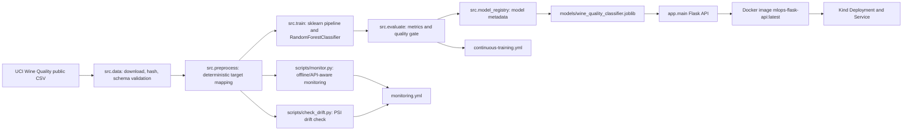

# MLOps Wine Quality Pipeline Artefact


Public GitHub repository: <https://github.com/lorcan973232/mlops-wine-quality-pipeline>

Workflow badge URLs:

| Workflow | Badge URL |
| --- | --- |
| CI | `https://github.com/lorcan973232/mlops-wine-quality-pipeline/actions/workflows/ci.yml/badge.svg` |
| Data Preprocessing | `https://github.com/lorcan973232/mlops-wine-quality-pipeline/actions/workflows/data-preprocessing.yml/badge.svg` |
| Train and Evaluate | `https://github.com/lorcan973232/mlops-wine-quality-pipeline/actions/workflows/train-and-evaluate.yml/badge.svg` |
| Continuous Training | `https://github.com/lorcan973232/mlops-wine-quality-pipeline/actions/workflows/continuous-training.yml/badge.svg` |
| Docker Build | `https://github.com/lorcan973232/mlops-wine-quality-pipeline/actions/workflows/docker-build.yml/badge.svg` |
| Deploy Kind | `https://github.com/lorcan973232/mlops-wine-quality-pipeline/actions/workflows/deploy.yml/badge.svg` |
| Monitoring | `https://github.com/lorcan973232/mlops-wine-quality-pipeline/actions/workflows/monitoring.yml/badge.svg` |

This repository is the artefact section only. It does not contain the report, video, slides, speaker notes, or presentation material. This repository alone is insufficient for final assignment submission because the report and video must be completed separately.

The repository must be pushed to the student's personal GitHub account, set to public, and remain public until 21 June 2026.

## MLOps Use Case

The artefact implements a reproducible supervised machine learning pipeline that predicts a wine quality class from physicochemical measurements. The trained model is served through a Flask API, packaged with Docker, deployed to Kind Kubernetes, and supported by CI, CD, Continuous Training, Continuous Monitoring, tests, quality gates, and setup checks.

## Selected Public Dataset

| Item | Value |
| --- | --- |
| Dataset name | UCI Wine Quality - white wine |
| Public source page | <https://archive.ics.uci.edu/dataset/186/wine+quality> |
| Direct CSV source | `https://archive.ics.uci.edu/ml/machine-learning-databases/wine-quality/winequality-white.csv` |
| DOI | `10.24432/C56S3T` |
| License | Creative Commons Attribution 4.0 International |
| Verified CSV SHA-256 | `76c3f809815c17c07212622f776311faeb31e87610d52c26d87d6e361b169836` |
| Raw data path | `data/raw/winequality-white.csv` |
| Processed data path | `data/processed/winequality-white-processed.csv` |
| Target variable | `quality` |
| Model target | `quality_class` |
| Task type | Multiclass classification |
| Model type | scikit-learn `RandomForestClassifier` inside a preprocessing `Pipeline` |

Why this dataset is suitable:

- Public, non-sensitive, legal, and ethical for a student artefact.
- Real-world tabular dataset with enough rows to be more credible than a toy dataset.
- Small enough for GitHub Actions, Docker builds, and Kind deployment smoke tests.
- Deterministic schema supports data-quality checks, API payload validation, drift simulation, and repeatable tests.
- Numeric features make `/predict` examples simple to demonstrate live.

Dataset limitations:

- It is a static public dataset, so monitoring is simulated unless an API URL is supplied.
- The target is ordinal, but this artefact converts it into three deterministic classes for easier API testing and quality gates.
- Dataset download depends on the public UCI source. A cached local copy is accepted only when its SHA-256 matches the verified hash.

Target mapping:

| Raw `quality` value | Model class |
| --- | --- |
| `<= 5` | `low` |
| `6` | `medium` |
| `>= 7` | `high` |

Feature schema:

```text
fixed_acidity, volatile_acidity, citric_acid, residual_sugar, chlorides,
free_sulfur_dioxide, total_sulfur_dioxide, density, pH, sulphates, alcohol
```

## Input and Output Schema

`POST /predict` accepts either `{"features": {...}}`, a feature object, or a list of feature objects. Each feature must be numeric and must match the selected public dataset schema exactly.

Example request:

```json
{
  "features": {
    "fixed_acidity": 7.0,
    "volatile_acidity": 0.27,
    "citric_acid": 0.36,
    "residual_sugar": 20.7,
    "chlorides": 0.045,
    "free_sulfur_dioxide": 45.0,
    "total_sulfur_dioxide": 170.0,
    "density": 1.001,
    "pH": 3.0,
    "sulphates": 0.45,
    "alcohol": 8.8
  }
}
```

Example response shape:

```json
{
  "model_version": "wine-quality-random-forest-v1",
  "prediction": "low",
  "probabilities": {
    "high": 0.07989542535588882,
    "low": 0.688847437306355,
    "medium": 0.23125713733775607
  },
  "predictions": [
    {
      "prediction": "low",
      "probabilities": {
        "high": 0.07989542535588882,
        "low": 0.688847437306355,
        "medium": 0.23125713733775607
      }
    }
  ]
}
```

## API Endpoints

| Endpoint | Method | Purpose | Evidence |
| --- | --- | --- | --- |
| `/health` | `GET` | Confirms API health, model load status, model version, dataset metadata, feature count, and class labels. | `scripts/smoke_test_api.sh` |
| `/predict` | `POST` | Validates selected-dataset feature schema and returns prediction, probabilities, and model version. | `tests/test_api.py`, `scripts/smoke_test_api.sh` |

Example `/health` response:

```json
{
  "status": "healthy",
  "model_loaded": true,
  "model_version": "wine-quality-random-forest-v1",
  "model_path": "models/wine_quality_classifier.joblib",
  "dataset": {
    "name": "UCI Wine Quality - white wine",
    "source": "https://archive.ics.uci.edu/dataset/186/wine+quality",
    "doi": "10.24432/C56S3T"
  },
  "feature_count": 11,
  "class_labels": ["low", "medium", "high"]
}
```

## Pipeline Architecture



## Repository Structure

```text
.github/workflows/
  ci.yml
  data-preprocessing.yml
  train-and-evaluate.yml
  continuous-training.yml
  docker-build.yml
  deploy.yml
  monitoring.yml
app/
  __init__.py
  main.py
  model_loader.py
  schemas.py
src/
  data.py
  preprocess.py
  train.py
  evaluate.py
  predict.py
  model_registry.py
scripts/
  setup_local.sh
  setup_local.ps1
  check_setup.sh
  check_setup.ps1
  run_pipeline.sh
  smoke_test_api.sh
  smoke_test_api.ps1
  create_kind_cluster.sh
  create_kind_cluster.ps1
  deploy_kind.sh
  deploy_kind.ps1
  monitor.py
  check_drift.py
deployment/
  docker-compose.yml
  kind/deployment.yaml
  kind/service.yaml
  kind/README.md
tests/
  test_data.py
  test_model.py
  test_api.py
  test_workflows.py
models/.gitkeep
data/raw/.gitkeep
data/processed/.gitkeep
reports/metrics/.gitkeep
reports/monitoring/.gitkeep
Dockerfile
.dockerignore
.gitignore
Makefile
requirements.txt
pyproject.toml
README.md
```

## Local Setup

Use Python 3.11 or 3.12. The pinned dependency set is not intended for Python 3.13 or later.

Linux, macOS, Git Bash, or WSL:

```bash
bash scripts/setup_local.sh
source .venv/bin/activate
bash scripts/check_setup.sh
```

On Windows, if `bash` opens the WSL stub and no Linux distribution is installed, use Git Bash directly or use the PowerShell scripts below:

```powershell
& "C:\Program Files\Git\bin\bash.exe" scripts/check_setup.sh
make BASH="C:/Program Files/Git/bin/bash.exe" check-setup
```

The Bash scripts load `scripts/env_paths.sh`, which adds the standard Docker Desktop and WinGet tool locations for Git Bash before checking Docker, Kind, and kubectl.

Windows PowerShell:

```powershell
powershell -ExecutionPolicy Bypass -File scripts/setup_local.ps1
.\.venv\Scripts\Activate.ps1
powershell -ExecutionPolicy Bypass -File scripts/check_setup.ps1
```

If PowerShell script execution is blocked, use one of these options:

```powershell
Set-ExecutionPolicy -Scope CurrentUser RemoteSigned
powershell -ExecutionPolicy Bypass -File scripts/check_setup.ps1
```

`scripts/setup_local.sh` and `scripts/setup_local.ps1` create a virtual environment and install `requirements.txt`.

`scripts/check_setup.sh` and `scripts/check_setup.ps1` verify:

- `python`
- `pip`
- virtual environment support
- repository root
- Docker CLI
- Kind
- `kubectl`
- Git
- GitHub CLI when requested with `--require-gh` or `-RequireGh`
- required Python package imports
- Docker daemon availability where feasible

Install or verify tooling:

| Tool | Purpose | Install guidance |
| --- | --- | --- |
| Python 3.11 or 3.12 | Runs the pipeline, tests, Flask API, and workflows. | <https://www.python.org/downloads/> |
| pip | Installs `requirements.txt`. | Included with Python or `python -m ensurepip --upgrade` |
| virtual environment | Isolates dependencies. | `python -m venv .venv` |
| Bash shell | Runs `.sh` setup, deployment, and smoke-test scripts. | Git Bash or WSL on Windows |
| PowerShell | Runs `.ps1` setup, deployment, and smoke-test scripts on Windows. | Built into Windows |
| Docker Desktop | Builds and runs the API container. | `winget install Docker.DockerDesktop` or <https://docs.docker.com/desktop/> |
| Kind | Runs local Kubernetes deployment evidence. | `winget install Kubernetes.kind` or <https://kind.sigs.k8s.io/docs/user/quick-start/#installation> |
| kubectl | Applies manifests, checks rollout, and port-forwards. | `winget install Kubernetes.kubectl` or <https://kubernetes.io/docs/tasks/tools/> |
| Git | Version control and GitHub publication. | `winget install Git.Git` or <https://git-scm.com/downloads> |
| GitHub CLI | Optional publication and workflow checks. | `winget install GitHub.cli`, then `gh auth login` |

If a required local tool is missing, the result is `BLOCKED_BY_LOCAL_SETUP` until that tool is installed and `scripts/check_setup.sh` or `scripts/check_setup.ps1` passes.

For non-deployment CI jobs, the Python-only setup check is:

```bash
bash scripts/check_setup.sh --python-only
```

PowerShell equivalent:

```powershell
powershell -ExecutionPolicy Bypass -File scripts/check_setup.ps1 -PythonOnly
```

## Core Reproducibility Commands

All commands run from the repository root after activating the Python 3.11 or 3.12 environment.

```bash
python -m compileall app src tests
pytest
python -m src.data
python -m src.preprocess
python -m src.train
python -m src.evaluate
python -m src.model_registry
python -m src.predict
python scripts/monitor.py
python scripts/check_drift.py
```

Pipeline helper:

```bash
bash scripts/run_pipeline.sh
```

Make targets:

```bash
make setup
make setup-ps
make check-setup
make check-setup-ps
make test
make data
make preprocess
make train
make evaluate
make run-api
make docker-build
make docker-run
make kind-create
make kind-create-ps
make kind-load
make kind-deploy
make kind-deploy-ps
make kind-smoke-test
make kind-smoke-test-ps
make monitor
make drift-check
make full-local-verify
```

## Flask API

Run locally:

```bash
python -m app.main
```

Smoke test from a second terminal:

```bash
bash scripts/smoke_test_api.sh http://127.0.0.1:8080
```

Windows PowerShell smoke test:

```powershell
powershell -ExecutionPolicy Bypass -File scripts/smoke_test_api.ps1 -ApiUrl http://127.0.0.1:8080
```

The API loads `models/wine_quality_classifier.joblib`. If the model file is missing, `/health` returns an unhealthy response and `/predict` fails clearly without claiming a model is loaded.

## Docker

Build and run:

```bash
docker build -t mlops-flask-api:latest .
docker run --rm -p 8080:8080 mlops-flask-api:latest
bash scripts/smoke_test_api.sh http://127.0.0.1:8080
```

Windows PowerShell smoke test against the same container:

```powershell
powershell -ExecutionPolicy Bypass -File scripts/smoke_test_api.ps1 -ApiUrl http://127.0.0.1:8080
```

Optional local container helper:

```bash
docker compose -f deployment/docker-compose.yml up --build
bash scripts/smoke_test_api.sh http://127.0.0.1:8080
```

The Docker image uses `python:3.11-slim`, installs `requirements.txt`, copies the application and model-management files, builds the model during image creation, exposes port `8080`, and starts `gunicorn app.main:app`.

## Kind Kubernetes Deployment

This artefact documents and implements Kind Kubernetes deployment only.

Local Kind deployment commands:

```bash
docker build -t mlops-flask-api:latest .
bash scripts/create_kind_cluster.sh
kind load docker-image mlops-flask-api:latest --name mlops-kind
kubectl apply -f deployment/kind/
kubectl rollout status deployment/mlops-flask-api --timeout=180s
kubectl port-forward service/mlops-flask-api 8080:80
```

In a second terminal:

```bash
bash scripts/smoke_test_api.sh http://127.0.0.1:8080
```

Windows PowerShell equivalent:

```powershell
docker build -t mlops-flask-api:latest .
powershell -ExecutionPolicy Bypass -File scripts/create_kind_cluster.ps1 -ClusterName mlops-kind -NodeImage kindest/node:v1.30.2
kind load docker-image mlops-flask-api:latest --name mlops-kind
kubectl apply -f deployment/kind/
kubectl rollout status deployment/mlops-flask-api --timeout=180s
kubectl port-forward service/mlops-flask-api 8080:80
```

In a second PowerShell terminal:

```powershell
powershell -ExecutionPolicy Bypass -File scripts/smoke_test_api.ps1 -ApiUrl http://127.0.0.1:8080
```

Scripted deployment:

```bash
bash scripts/deploy_kind.sh
```

PowerShell scripted deployment:

```powershell
powershell -ExecutionPolicy Bypass -File scripts/deploy_kind.ps1 -ClusterName mlops-kind -ImageName mlops-flask-api:latest -NodeImage kindest/node:v1.30.2
```

Kind evidence files:

- `deployment/kind/deployment.yaml`
- `deployment/kind/service.yaml`
- `deployment/kind/README.md`
- `.github/workflows/deploy.yml`

The deployment defines a Kubernetes `Deployment`, a `Service`, matching labels/selectors, port `8080`, readiness and liveness probes on `/health`, image `mlops-flask-api:latest`, rollout verification, port-forwarding, and API smoke tests.

## GitHub Actions Workflow Summary

| Workflow | Purpose | Trigger | Main commands | Dataset usage | Quality gate | Artefacts produced | Failure condition |
| --- | --- | --- | --- | --- | --- | --- | --- |
| `.github/workflows/ci.yml` | Validate code, tests, ML path, API logic, and monitoring scripts. | Push/PR to `main` and `develop`, manual. | `bash scripts/check_setup.sh --python-only`, `ruff check .`, `python -m compileall app src tests`, `pytest`, `python -m src.data`, `python -m src.preprocess`, `python -m src.train`, `python -m src.evaluate`, `python -m src.model_registry`, `python scripts/monitor.py`, `python scripts/check_drift.py`. | Downloads and validates UCI Wine Quality, preprocesses it, trains/evaluates model. | Pytest, lint, compile, schema validation, evaluation quality gate. | `reports/`, `models/`. | Any command exits non-zero. |
| `.github/workflows/data-preprocessing.yml` | Prove dataset ingestion and deterministic preprocessing. | Manual, push/PR changes to data or preprocessing files. | `python -m src.data`, `python -m src.preprocess`, `test -s data/processed/winequality-white-processed.csv`. | Uses UCI public CSV and verified schema. | SHA-256, required columns, numeric data, processed output exists. | ingestion report, preprocessing report, processed CSV. | Download, validation, preprocessing, or output check fails. |
| `.github/workflows/train-and-evaluate.yml` | Train, evaluate, and register candidate model metadata. | Manual, push/PR source/test/workflow changes. | `python -m src.data`, `python -m src.preprocess`, `python -m src.train`, `python -m src.evaluate`, `python -m src.model_registry`, `python -m src.predict`. | Uses processed UCI dataset. | Evaluation quality gate and prediction smoke path. | `models/`, `reports/metrics/`. | Training, evaluation, registry, or prediction fails. |
| `.github/workflows/continuous-training.yml` | Scheduled/manual retraining with candidate rejection or promotion. | Weekly schedule, manual. | `python -m src.data`, `python -m src.preprocess`, `python -m src.train`, `python -m src.evaluate`, quality-gate JSON enforcement, `python -m src.model_registry`. | Retrains on selected public dataset. | Requires `quality_gate_report.json` with `passed: true`. | CT candidate, quality-gate report, promoted model metadata. | Quality gate rejects candidate or required artefacts are missing. |
| `.github/workflows/docker-build.yml` | Build API container and run container-level smoke test. | Push/PR to `main` and `develop`, manual. | `docker build`, `docker run`, `bash scripts/smoke_test_api.sh http://127.0.0.1:8080`. | Docker build runs the same model path and app schema. | `/health` and `/predict` smoke tests. | Docker smoke logs. | Docker build, container start, health check, or predict smoke test fails. |
| `.github/workflows/deploy.yml` | Build image, deploy through Kind, and smoke-test Kubernetes service. | Push to `main`, successful Docker Build workflow, manual. | install Kind and kubectl, `docker build`, `docker save`, `kind create cluster`, `kind load docker-image`, `kubectl apply -f deployment/kind/`, rollout, port-forward, smoke test. | Container serves trained model and selected dataset schema. | Kubernetes rollout plus `/health` and `/predict` smoke tests. | Kind deployment logs. | Build, Kind, image load, manifest apply, rollout, or smoke test fails. |
| `.github/workflows/monitoring.yml` | Scheduled/manual model-management context, monitoring, drift checks, and retraining recommendation. | Daily schedule, manual. | `python -m src.data`, `python -m src.preprocess`, `python -m src.train`, `python -m src.evaluate`, `python -m src.model_registry`, `python scripts/monitor.py`, `python scripts/check_drift.py`. | Uses selected dataset schema for data-quality and drift checks. | Schema checks, monitoring report, drift report, retraining flag. | `reports/monitoring/`, `reports/metrics/model_metadata.json`. | Monitoring or drift scripts fail. |

## Workflow Lifecycle

| Stage | Dependency evidence | Command evidence |
| --- | --- | --- |
| CI validates code and tests | `ci.yml`: `quality-gates` needs `setup-check`. | `ruff check .`, `python -m compileall app src tests`, `pytest`. |
| Data preprocessing prepares data | `data-preprocessing.yml`: `preprocess` needs `ingest`. | `python -m src.data`, `python -m src.preprocess`. |
| Training/evaluation creates model and metrics | `train-and-evaluate.yml`: `train-evaluate` needs `prepare-data`. | `python -m src.train`, `python -m src.evaluate`, `python -m src.model_registry`. |
| Continuous Training gates candidates | `continuous-training.yml`: `quality-gate` needs `retrain-candidate`; `promote-model` needs `quality-gate`. | Reads `latest_metrics.json` and `quality_gate_report.json`. |
| Docker packages the API/model path | `docker-build.yml`: build then run then smoke test. | `docker build`, container `/health`, `/predict` smoke test. |
| Kind deploys and smoke-tests the container | `deploy.yml`: `deploy-kind` needs `build-image`. | `kind create cluster`, `kind load docker-image`, `kubectl apply -f deployment/kind/`, rollout, smoke test. |
| Monitoring checks schema and drift | `monitoring.yml`: `batch-monitoring` needs `prepare-model-metadata`. | `python scripts/monitor.py`, `python scripts/check_drift.py`. |

## Branching Strategy

- `main`: stable production/release branch for assessed artefact evidence.
- `develop`: integration branch. It must be validated before merging into `main`.
- `feature/*`: focused branches for dataset, preprocessing, model, API, Docker, Kind, CI/CD, CT, and CM changes.
- `hotfix/*`: optional urgent correction branches that still require CI before merge.
- Pull requests to `main` or `develop` trigger CI.
- CI must pass before merge.
- `develop` is validated before merging into `main`.
- Pushes to `main` trigger Kind deployment through `.github/workflows/deploy.yml`.
- Scheduled Continuous Training runs from `main` when `main` is the default branch.
- Scheduled monitoring runs from `main` when `main` is the default branch.

## Continuous Integration

CI is implemented in `.github/workflows/ci.yml`. It checks Python dependency setup, runs linting, compiles modules, runs pytest, exercises dataset ingestion, preprocessing, training, evaluation, model registry, prediction, monitoring, and drift checks. CI fails if code quality, tests, model logic, API logic, metrics generation, or monitoring scripts break.

## Continuous Delivery and Deployment Through Kind

Docker build evidence is implemented in `.github/workflows/docker-build.yml`. Deployment evidence is implemented in `.github/workflows/deploy.yml`, which uses Kind only. The deployment workflow builds the image, creates a Kind cluster, loads the image with `kind load docker-image`, applies `deployment/kind/`, checks rollout status, port-forwards the service, and runs `/health` and `/predict` smoke tests.

## Continuous Training Quality Gate

Evaluation writes:

- `reports/metrics/baseline_metrics.json`
- `reports/metrics/latest_metrics.json`
- `reports/metrics/quality_gate.json`
- `reports/metrics/quality_gate_report.json`
- `reports/metrics/model_metadata.json`

The quality gate requires:

- accuracy `>= 0.50`
- macro F1 `>= 0.35`
- accuracy and macro F1 no more than `0.02` below the baseline

The Continuous Training workflow fails or rejects the candidate model if `quality_gate_report.json` has `passed: false`. Accepted candidates are registered by `src/model_registry.py`.

## Continuous Monitoring and Model Management

Monitoring is implemented as artefact evidence. It is not a claim of live production telemetry.

What is monitored:

- UCI Wine Quality request feature schema.
- Offline batch data quality: missing columns, unexpected columns, numeric feature types, and missing values.
- Feature distribution drift using Population Stability Index.
- Model metadata: model version, dataset name/source, model path, metrics, and quality-gate status.
- API health and prediction response schema when an API URL is supplied.

Run offline simulated monitoring:

```bash
python scripts/monitor.py
python scripts/check_drift.py
```

Run API-aware monitoring against a local or Kind-deployed API:

```bash
python -m app.main
python scripts/monitor.py --api-url http://127.0.0.1:8080
```

For Kind, first port-forward the service with `kubectl port-forward service/mlops-flask-api 8080:80`, then run:

```bash
python scripts/monitor.py --api-url http://127.0.0.1:8080
```

Generated reports:

- `reports/monitoring/monitoring_report.json`
- `reports/monitoring/drift_report.json`
- `reports/monitoring/api_monitoring_report.json` when `--api-url` is used
- `reports/metrics/model_registry.json`
- `reports/metrics/model_metadata.json`

Current generated monitoring reports were regenerated on 14 May 2026 during offline, drift, and API-aware monitoring verification and are committed as artefact evidence. Refresh them before any future artefact demonstration with:

```bash
python -m src.evaluate
python -m src.model_registry
python scripts/monitor.py
python scripts/check_drift.py
```

Monitoring reports include `retraining_required`, `retraining_recommended`, `reason`, `drift_score`, and data-quality status. Monitoring supports the Continuous Training lifecycle by flagging drift or API/model issues that should be investigated before scheduled retraining promotes a new model.

## Tests and Quality Gates

| Test file | Purpose | Command | CI evidence |
| --- | --- | --- | --- |
| `tests/test_data.py` | Dataset schema, raw validation, preprocessing class mapping. | `pytest tests/test_data.py` | `.github/workflows/ci.yml` |
| `tests/test_model.py` | Training, saved model, prediction, metadata compatibility. | `pytest tests/test_model.py` | `.github/workflows/ci.yml` |
| `tests/test_api.py` | Flask `/health`, `/predict`, invalid payload handling. | `pytest tests/test_api.py` | `.github/workflows/ci.yml` |
| `tests/test_workflows.py` | Workflow presence, YAML parsing, Kind-only deployment, no hard-coded credentials, monitoring evidence. | `pytest tests/test_workflows.py` | `.github/workflows/ci.yml` |

## Traceability Matrix

| Artefact requirement | File/path | Local command | GitHub Actions workflow | Quality gate or test | Status | Remaining action |
| --- | --- | --- | --- | --- | --- | --- |
| Public dataset ingestion | `src/data.py`, `data/raw/winequality-white.csv` | `python -m src.data` | `ci.yml`, `data-preprocessing.yml`, `train-and-evaluate.yml`, `continuous-training.yml` | SHA-256, schema validation, `tests/test_data.py` | Implemented, locally verified, and GitHub-verified | None |
| Data preprocessing | `src/preprocess.py`, `data/processed/winequality-white-processed.csv` | `python -m src.preprocess` | `ci.yml`, `data-preprocessing.yml`, `train-and-evaluate.yml`, `continuous-training.yml` | deterministic class mapping, `tests/test_data.py` | Implemented, locally verified, and GitHub-verified | None |
| Model training | `src/train.py`, `models/wine_quality_classifier.joblib` | `python -m src.train` | `ci.yml`, `train-and-evaluate.yml`, `continuous-training.yml` | model file exists, `tests/test_model.py` | Implemented, locally verified, and GitHub-verified | None |
| Model evaluation | `src/evaluate.py`, `reports/metrics/latest_metrics.json`, `reports/metrics/quality_gate_report.json` | `python -m src.evaluate` | `ci.yml`, `train-and-evaluate.yml`, `continuous-training.yml` | accuracy, macro F1, baseline regression quality gate | Implemented, locally verified, and GitHub-verified | None |
| Model metadata and registry | `src/model_registry.py` | `python -m src.model_registry` | `ci.yml`, `train-and-evaluate.yml`, `continuous-training.yml`, `monitoring.yml` | metadata includes version, dataset, schema, metrics, path | Implemented and locally verified | None |
| Local prediction | `src/predict.py` | `python -m src.predict` | `ci.yml`, `train-and-evaluate.yml` | saved model schema matches API schema | Implemented and locally verified | None |
| Flask API | `app/main.py`, `app/model_loader.py`, `app/schemas.py` | `python -m app.main`; `scripts/smoke_test_api.ps1 -ApiUrl http://127.0.0.1:8080` | `docker-build.yml`, `deploy.yml` | `tests/test_api.py`, smoke scripts | Implemented and locally verified | None |
| Docker containerisation | `Dockerfile`, `.dockerignore` | `docker build -t mlops-flask-api:latest .` | `docker-build.yml` | container `/health` and `/predict` smoke test | Implemented and GitHub Actions verified | None for repository; local use requires Docker installed and running |
| Kind Kubernetes deployment | `deployment/kind/deployment.yaml`, `deployment/kind/service.yaml`, `deployment/kind/README.md` | `scripts/deploy_kind.sh` or `scripts/deploy_kind.ps1` | `deploy.yml` | rollout status and smoke test | Implemented and GitHub Actions verified | None for repository; local use requires Docker, Kind, and kubectl installed |
| CI workflow | `.github/workflows/ci.yml` | `pytest`; `ruff check .` | `ci.yml` | compile, ruff, pytest, ML path, monitoring | Implemented, locally YAML-validated, and GitHub-verified | None |
| Data workflow | `.github/workflows/data-preprocessing.yml` | `python -m src.data`; `python -m src.preprocess` | `data-preprocessing.yml` | data validation and processed output check | Implemented, locally YAML-validated, and GitHub-verified | None |
| Train/evaluate workflow | `.github/workflows/train-and-evaluate.yml` | `python -m src.train`; `python -m src.evaluate` | `train-and-evaluate.yml` | model and metrics artefacts | Implemented, locally YAML-validated, and GitHub-verified | None |
| Continuous Training | `.github/workflows/continuous-training.yml` | `python -m src.evaluate` | `continuous-training.yml` | `quality_gate_report.json` must pass | Implemented, quality-gated, and GitHub-verified | None |
| Docker build workflow | `.github/workflows/docker-build.yml` | `docker build -t mlops-flask-api:latest .` | `docker-build.yml` | Docker smoke test | Implemented and verified in GitHub Actions | None for repository; local use requires Docker installed and running |
| Kind deployment workflow | `.github/workflows/deploy.yml` | `kubectl rollout status deployment/mlops-flask-api --timeout=180s` | `deploy.yml` | rollout plus `/health` and `/predict` smoke test | Implemented and verified in GitHub Actions, including push and Docker workflow triggers | None for repository; local use requires Docker, Kind, and kubectl installed |
| Continuous Monitoring | `scripts/monitor.py`, `scripts/check_drift.py`, `reports/monitoring/.gitkeep` | `python scripts/monitor.py`; `python scripts/check_drift.py`; `python scripts/monitor.py --api-url http://127.0.0.1:8080` | `monitoring.yml` | schema checks, PSI drift report, API-aware monitoring, retraining flag | Implemented and locally verified offline and against Kind API | None |
| Setup verification | `scripts/setup_local.sh`, `scripts/setup_local.ps1`, `scripts/check_setup.sh`, `scripts/check_setup.ps1`, `scripts/env_paths.sh` | `scripts/check_setup.sh`; `powershell -ExecutionPolicy Bypass -File scripts/check_setup.ps1` | `ci.yml` uses `--python-only` | dependency and tooling checks | Implemented and verified with PowerShell and Git Bash | None |
| Smoke tests | `scripts/smoke_test_api.sh`, `scripts/smoke_test_api.ps1` | `scripts/smoke_test_api.sh http://127.0.0.1:8080`; `scripts/smoke_test_api.ps1 -ApiUrl http://127.0.0.1:8080` | `docker-build.yml`, `deploy.yml` | `/health`, `/predict`, model version, probabilities | Implemented and verified against Docker and Kind APIs | None |
| Branching strategy | `README.md`, `.github/pull_request_template.md` | Pull request to `main` or `develop` | `ci.yml` | CI must pass before merge | Documented and ready for repository maintenance | None |
| README evidence | `README.md` | `pytest tests/test_workflows.py` | `ci.yml` | workflow and path consistency tests | Implemented and locally verified | None |

## Live Demonstration Checklist

Run from the repository root. There are no hidden manual steps; each item maps to a file or command in this repository.

1. Show repository structure: `Get-ChildItem` on Windows or `find . -maxdepth 3 -type f` on Linux/macOS.
2. Show selected dataset source and schema in `README.md` and `src/data.py`.
3. Verify setup with Bash: `bash scripts/check_setup.sh`, or with PowerShell: `powershell -ExecutionPolicy Bypass -File scripts/check_setup.ps1`.
4. If setup reports `BLOCKED_BY_LOCAL_SETUP`, install the missing tool and rerun the setup check before claiming full local verification.
5. Run compile checks: `python -m compileall app src tests`.
6. Run tests: `pytest`.
7. Ingest public dataset: `python -m src.data`.
8. Preprocess dataset: `python -m src.preprocess`.
9. Train model: `python -m src.train`.
10. Evaluate model and quality gate: `python -m src.evaluate`.
11. Register model metadata: `python -m src.model_registry`.
12. Run local prediction: `python -m src.predict`.
13. Start Flask API: `python -m app.main`.
14. Smoke-test API from another terminal: `bash scripts/smoke_test_api.sh http://127.0.0.1:8080` or `powershell -ExecutionPolicy Bypass -File scripts/smoke_test_api.ps1 -ApiUrl http://127.0.0.1:8080`.
15. Build Docker image: `docker build -t mlops-flask-api:latest .`.
16. Run Docker container: `docker run --rm -p 8080:8080 mlops-flask-api:latest`.
17. Smoke-test Docker API: `bash scripts/smoke_test_api.sh http://127.0.0.1:8080` or `powershell -ExecutionPolicy Bypass -File scripts/smoke_test_api.ps1 -ApiUrl http://127.0.0.1:8080`.
18. Create or reuse Kind cluster: `bash scripts/create_kind_cluster.sh` or `powershell -ExecutionPolicy Bypass -File scripts/create_kind_cluster.ps1 -ClusterName mlops-kind -NodeImage kindest/node:v1.30.2`.
19. Load image into Kind: `kind load docker-image mlops-flask-api:latest --name mlops-kind`.
20. Apply manifests: `kubectl apply -f deployment/kind/`.
21. Verify rollout: `kubectl rollout status deployment/mlops-flask-api --timeout=180s`.
22. Port-forward service: `kubectl port-forward service/mlops-flask-api 8080:80`.
23. Smoke-test Kind deployment: `bash scripts/smoke_test_api.sh http://127.0.0.1:8080` or `powershell -ExecutionPolicy Bypass -File scripts/smoke_test_api.ps1 -ApiUrl http://127.0.0.1:8080`.
24. Run offline monitoring: `python scripts/monitor.py`.
25. Run drift check: `python scripts/check_drift.py`.
26. Run API-aware monitoring while API is available: `python scripts/monitor.py --api-url http://127.0.0.1:8080`.
27. Show GitHub Actions files in `.github/workflows/`.
28. Show workflow artefact paths under `reports/`, `models/`, and workflow upload sections.

## GitHub Publication Steps

Current public repository: <https://github.com/lorcan973232/mlops-wine-quality-pipeline>

Publication status:

- Remote `origin` points to `https://github.com/lorcan973232/mlops-wine-quality-pipeline.git`.
- GitHub repository visibility is `PUBLIC`.
- Default branch is `main`.
- The repository must remain public until 21 June 2026.

Use these commands to recheck publication state:

```bash
git remote -v
git branch -M main
git push -u origin main
gh repo view --json nameWithOwner,url,visibility,isPrivate,defaultBranchRef
gh workflow list
gh run list --branch main --limit 12
```

If publishing a fresh copy, authenticate first and create the repository from the local source:

```bash
gh auth login
gh repo create mlops-wine-quality-pipeline --public --source=. --remote=origin --push
```

After future changes, push to `main`, then check the Actions tab and run manual workflows where required.

## Academic Integrity and AI Assistance Note

This repository is implementation evidence for the artefact only. Any AI-assisted code, documentation, or design decisions must be reviewed by the student, tested locally, and acknowledged according to the university's academic-integrity rules. The student remains responsible for correctness, reproducibility, and final submission decisions.

## Honest Limitations and Setup Blockers

- This repository is not the full assignment submission. The report and video must be produced separately.
- Monitoring is simulated unless `python scripts/monitor.py --api-url http://127.0.0.1:8080` is run against a live local, Docker, or Kind API.
- Local Docker and Kind verification requires Docker Desktop, Kind, kubectl, and a working Docker daemon.
- On Windows, use Git Bash or PowerShell. If plain `bash` resolves to the WSL stub without a Linux distribution, run the `.ps1` scripts or call Git Bash directly.
- If Docker, Kind, or kubectl are missing, local deployment verification is `BLOCKED_BY_LOCAL_SETUP`.
- GitHub Actions workflow success is verified for the public repository; recheck the Actions tab after any future changes.
- No secrets are required for this artefact. Do not commit `.env` files, tokens, credentials, private keys, or generated secret material.
