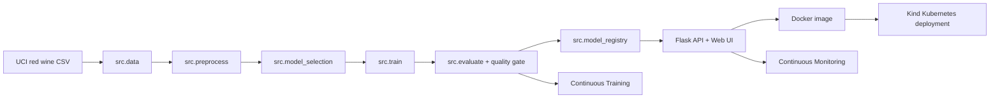
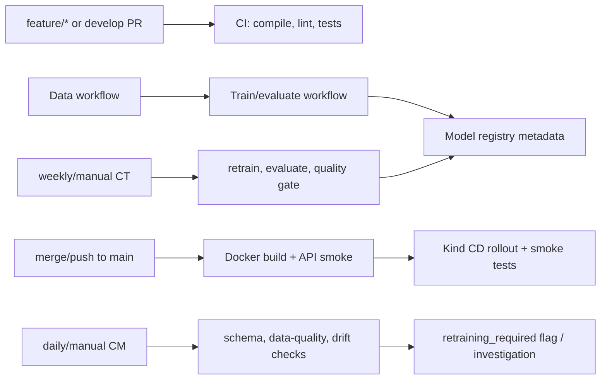

# MLOps Red Wine Quality Classifier


Public GitHub repository: <https://github.com/lorcan973232/mlops-wine-quality-pipeline>

This repository is the artefact component only. It implements a reproducible MLOps pipeline around a Flask prediction service, Docker image, Kind Kubernetes deployment, GitHub Actions CI/CD/CT/CM workflows, tests, monitoring, and traceability evidence. The repository is currently public and must remain public until 21 June 2026.

| Public repository evidence | Value |
|---|---|
| Final GitHub URL | <https://github.com/lorcan973232/mlops-wine-quality-pipeline> |
| Current visibility evidence | `reports/submission/public_repository_evidence.json` |
| Automated visibility workflow | `.github/workflows/repository-visibility-check.yml` |
| Requirement | Repository must remain public until 21 June 2026 |

The evidence file verifies current public visibility only. It does not claim that future public availability is permanently proven before 21 June 2026.

## Project Overview

The artefact classifies a red wine sample as `standard quality` or `good quality` from 11 physicochemical inputs. The binary model target is `quality_label`, derived from the original UCI `quality` score where `quality >= 6` is treated as good quality.

| Item | Value |
|---|---|
| Dataset | UCI Wine Quality - Red Wine |
| Public source | <https://archive.ics.uci.edu/dataset/186/wine+quality> |
| Download file | `https://archive.ics.uci.edu/ml/machine-learning-databases/wine-quality/winequality-red.csv` |
| Raw SHA-256 | `4a402cf041b025d4566d954c3b9ba8635a3a8a01e039005d97d6a710278cf05e` |
| Task type | Binary classification |
| Source target | `quality` |
| Model target | `quality_label` |
| Positive class | `good quality` when `quality >= 6` |
| Model | `ExtraTreesClassifier` |
| Model path | `models/wine_quality_classifier.joblib` |
| Model version | `wine-quality-extra-trees-v1` |

## Input Schema

| Field | Meaning |
|---|---|
| `fixed_acidity` | Non-volatile tartaric acid concentration |
| `volatile_acidity` | Acetic acid level |
| `citric_acid` | Citric acid concentration |
| `residual_sugar` | Sugar left after fermentation |
| `chlorides` | Salt concentration |
| `free_sulfur_dioxide` | Free sulfur dioxide concentration |
| `total_sulfur_dioxide` | Total sulfur dioxide concentration |
| `density` | Wine density |
| `ph` | Acidity/alkalinity value |
| `sulphates` | Sulphate concentration |
| `alcohol` | Alcohol by volume percentage |

The `/predict` endpoint returns the class id, class label, class probabilities, confidence, target name, and model version.

## Latest Metrics

Run `python -m src.evaluate` to regenerate metrics.

| Metric | Latest value |
|---|---:|
| Accuracy | `0.825` |
| Balanced accuracy | `0.8237371953373366` |
| Precision macro | `0.8243482364043884` |
| Recall macro | `0.8237371953373366` |
| F1 macro | `0.8240100565681961` |
| Precision weighted | `0.8248997286775982` |
| Recall weighted | `0.825` |
| F1 weighted | `0.8249175047140165` |
| ROC AUC | `0.9192668472075041` |
| 5-fold CV accuracy mean/std | `0.8100122549019607 / 0.019345789260910167` |
| Baseline accuracy | `0.534375` |
| Baseline weighted F1 | `0.37221232179226066` |

Quality gate thresholds:

| Gate | Threshold | Status |
|---|---:|---|
| Accuracy | `>= 0.80` | Passed |
| Balanced accuracy | `>= 0.80` | Passed |
| Weighted F1 | `>= 0.80` | Passed |
| Macro F1 | `>= 0.80` | Passed |
| CV accuracy mean | `>= 0.77` | Passed |
| Accuracy improvement over baseline | `>= 0.20` | Passed |

Metric evidence files:

| File | Evidence |
|---|---|
| `reports/metrics/latest_metrics.json` | Current accuracy, precision, recall, F1, ROC AUC, quality gate |
| `reports/metrics/baseline_metrics.json` | Dummy most-frequent baseline |
| `reports/metrics/quality_gate_report.json` | CT acceptance/rejection gate |
| `reports/metrics/model_metadata.json` | Dataset, schema, hyperparameters, metrics, model version |
| `reports/metrics/model_comparison.json` | Candidate model and baseline comparison |
| `reports/metrics/classification_report.json` | Per-class, macro, and weighted classification report |
| `reports/metrics/confusion_matrix.json` | Held-out confusion matrix |
| `reports/metrics/cross_validation_results.json` | 5-fold StratifiedKFold results |

## Hyperparameters

```json
{
  "algorithm": "ExtraTreesClassifier",
  "classifier": {
    "n_estimators": 300,
    "max_depth": null,
    "min_samples_leaf": 1,
    "min_samples_split": 2,
    "class_weight": "balanced",
    "random_state": 42,
    "n_jobs": 1
  },
  "train_test_split": {
    "test_size": 0.2,
    "random_state": 42,
    "shuffle": true,
    "stratify": "quality_label"
  },
  "preprocessing": {
    "numeric_imputer_strategy": "median",
    "numeric_scaler": "StandardScaler"
  }
}
```

## Architecture



## Local Setup

Run setup first. Bare system Python is not expected to run this artefact until `requirements.txt` has been installed. The supported reproducibility path is either activating `.venv`, using the `.venv` Python directly, or using the Makefile/script targets below.

PowerShell:

```powershell
powershell -ExecutionPolicy Bypass -File scripts/setup_local.ps1
powershell -ExecutionPolicy Bypass -File scripts/check_setup.ps1
.\.venv\Scripts\Activate.ps1
```

Bash or Git Bash:

```bash
bash scripts/setup_local.sh
bash scripts/check_setup.sh
source .venv/bin/activate 2>/dev/null || source .venv/Scripts/activate
```

If the environment is not activated, run the verification commands with
`.\.venv\Scripts\python.exe` on Windows or `.venv/bin/python` on Linux/macOS.

Make targets mirror the scripts:

```bash
make setup
make check-setup
make test
make data
make preprocess
make train
make evaluate
make run-api
make docker-build
make kind-deploy
make monitor
make full-local-verify
```

## Core Verification Commands

Run these after activating `.venv`, or replace `python` with the `.venv` Python path shown above.

```powershell
python -m compileall app src tests
python -m src.data
python -m src.preprocess
python -m src.model_selection
python -m src.train
python -m src.evaluate
python -m src.model_registry
python -m src.predict
python scripts/monitor.py
python scripts/check_drift.py
pytest -q
ruff check src tests
python -c "from app.main import app; print('Flask import OK')"
```

One-command local artefact verification:

```powershell
powershell -ExecutionPolicy Bypass -File scripts/run_pipeline.ps1
```

```bash
bash scripts/run_pipeline.sh
```

## Flask API and UI

Run:

```powershell
python -m app.main
```

Open:

```text
http://127.0.0.1:5000/
```

Click `Use Example`, then `Predict Quality`. The UI calls `/predict`, displays the predicted quality class, confidence, and model version.

Example payload:

```json
{
  "features": {
    "fixed_acidity": 7.4,
    "volatile_acidity": 0.7,
    "citric_acid": 0.0,
    "residual_sugar": 1.9,
    "chlorides": 0.076,
    "free_sulfur_dioxide": 11.0,
    "total_sulfur_dioxide": 34.0,
    "density": 0.9978,
    "ph": 3.51,
    "sulphates": 0.56,
    "alcohol": 9.4
  }
}
```

Smoke test:

```powershell
powershell -ExecutionPolicy Bypass -File scripts/smoke_test_api.ps1 -ApiUrl http://127.0.0.1:5000
```

## Docker

```powershell
docker build -t mlops-flask-api:latest .
docker run --rm -d --name mlops-flask-demo -p 5001:5000 mlops-flask-api:latest
powershell -ExecutionPolicy Bypass -File scripts/smoke_test_api.ps1 -ApiUrl http://127.0.0.1:5001
docker stop mlops-flask-demo
```

Open Docker UI:

```text
http://127.0.0.1:5001/
```

## Kind Kubernetes

PowerShell:

```powershell
powershell -ExecutionPolicy Bypass -File scripts/create_kind_cluster.ps1
powershell -ExecutionPolicy Bypass -File scripts/deploy_kind.ps1
kubectl get pods
kubectl get svc
kubectl rollout status deployment/mlops-flask-api
kubectl port-forward service/mlops-flask-api 8080:80
```

Bash:

```bash
scripts/create_kind_cluster.sh
scripts/deploy_kind.sh
kubectl get pods
kubectl get svc
kubectl rollout status deployment/mlops-flask-api
kubectl port-forward service/mlops-flask-api 8080:80
```

Open Kind UI:

```text
http://127.0.0.1:8080/
```

Smoke test and API-aware monitoring:

```powershell
powershell -ExecutionPolicy Bypass -File scripts/smoke_test_api.ps1 -ApiUrl http://127.0.0.1:8080
python scripts/monitor.py --api-url http://127.0.0.1:8080
```

## MLOps Workflow Detail: CI/CD/CT/CM

The workflow implementation is intentionally evidence-first: every stage runs repository
commands, writes reports or logs, fails on broken contracts, and uploads artefacts for
inspection in the GitHub Actions run. The marker should assess the YAML files together
with the generated files under `reports/`, the test suite, and the Actions run logs.



| Workflow | MLOps stage | Trigger | Main commands | Artefacts/logs | Quality gate/failure condition | Evidence path | Live demo evidence |
|---|---|---|---|---|---|---|---|
| CI | Continuous Integration | `push`/`pull_request` on `main`, `develop`; manual | `python -m compileall app src tests`; `ruff check src tests`; `pytest -q`; `python -c "from app.main import app; print('Flask import OK')"`; pipeline smoke commands | `ci-artifacts` containing `reports/` and `models/` | Any compile, lint, test, Flask import, pipeline, prediction, or monitoring command exits non-zero | `.github/workflows/ci.yml`, `tests/` | Show CI run log and pytest output in Actions tab |
| Data Preprocessing | Data acquisition and preprocessing | Manual; `push`/PR when data/preprocess files change | `python -m src.data`; `python -m src.preprocess`; processed-data summary check | `data-ingestion-report`; `preprocessing-artifacts` with processed CSV and reports | Dataset hash/schema validation fails, preprocessing fails, or processed CSV missing | `.github/workflows/data-preprocessing.yml`, `reports/metrics/data_ingestion.json`, `reports/metrics/preprocessing.json` | Show uploaded processed CSV/report artefact |
| Train and Evaluate | Model training, model selection, evaluation | Manual; `push`/PR when `src/`, `app/`, `tests/`, requirements, or workflow changes | `python -m src.data`; `python -m src.preprocess`; `python -m src.model_selection`; `python -m src.train`; `python -m src.evaluate`; `python -m src.model_registry`; `python -m src.predict` | `train-evaluate-artifacts` with `models/` and `reports/metrics/` | Training/evaluation fails, quality gate in `src.evaluate` fails, or required metric package files are missing | `.github/workflows/train-and-evaluate.yml`, `models/wine_quality_classifier.joblib`, `reports/metrics/*` | Show `latest_metrics.json`, `model_metadata.json`, confusion matrix, classification report |
| Docker Build | Container build and API verification | Manual; `push`/PR on `main`, `develop` | `docker build -t mlops-flask-api:${{ github.sha }}`; `docker run`; `curl /health`; `bash scripts/smoke_test_api.sh http://127.0.0.1:5001` | `docker-smoke-logs` | Image build fails, container does not become healthy, or `/predict` smoke test fails | `.github/workflows/docker-build.yml`, `Dockerfile`, `scripts/smoke_test_api.sh` | Show Docker run log and smoke-test JSON |
| Deploy Kind | Continuous Delivery/Deployment | Manual; `push` to `main`; successful Docker Build `workflow_run` on `main` | `docker build`; `docker save`; `kind create cluster`; `kind load docker-image`; `kubectl apply -f deployment/kind/`; `kubectl rollout status`; `kubectl get pods`; `kubectl get svc`; smoke test on `8080` | `deployment-image`; `kind-deployment-logs` including pods, services, describe, port-forward, smoke test, API logs | Kind setup, image load, manifest apply, rollout, port-forward, `/health`, or `/predict` smoke test fails | `.github/workflows/deploy.yml`, `deployment/kind/` | Show rollout log, pod/service output, smoke-test log, and local `http://127.0.0.1:8080/` |
| Continuous Training | Scheduled/manual retraining and model acceptance | Weekly cron `0 6 * * 1`; manual | data/preprocess/model-selection/train/evaluate; quality-gate contract check; `python -m src.model_registry` after acceptance | `ct-candidate`; `ct-quality-gate`; `continuous-training-artifacts` | Fails if quality gate lacks required checks or `passed` is false; candidate is rejected instead of silently accepted | `.github/workflows/continuous-training.yml`, `reports/metrics/quality_gate_report.json` | Show CT run, gate JSON, accepted/rejected decision |
| Monitoring | Continuous Monitoring and model management | Daily cron `0 7 * * *`; manual | `python -m src.data`; `python -m src.preprocess`; `python -m src.train`; `python -m src.evaluate`; `python -m src.model_registry`; `python scripts/monitor.py`; `python scripts/check_drift.py` | `monitoring-model-metadata`; `monitoring-artifacts` with `reports/monitoring/` | Fails if model metadata cannot be built, monitoring/drift scripts fail, or required monitoring fields are missing | `.github/workflows/monitoring.yml`, `scripts/monitor.py`, `scripts/check_drift.py`, `reports/monitoring/` | Show monitoring report, drift score, `retraining_required`, and reason |
| Repository Visibility Check | Public-repository evidence | Weekly cron `0 8 * * 1`; manual | GitHub repository API visibility check | `repository-visibility-evidence` | Fails if the repository is private or visibility is not `public` | `.github/workflows/repository-visibility-check.yml`, `reports/submission/public_repository_evidence.json` | Show current public visibility evidence and deadline note |

### Continuous Integration Details

CI is not a superficial syntax check. It gates branch and pull-request work by compiling
all Python modules, running Ruff against production and test code, importing the Flask
application, executing API/UI/model/data/workflow tests, and running the deterministic
ML smoke path. The workflow is allowed only read access to repository contents and
does not use credentials.

### Continuous Delivery and Deployment Details

The Docker workflow proves that the artefact is containerised and serving real
predictions by starting the built image and calling `/health` and `/predict`. The
deployment workflow then proves delivery into Kind, not a cloud VM: it installs Kind
and kubectl, creates `mlops-kind`, loads the local image into the cluster, applies
`deployment/kind/`, waits for `deployment/mlops-flask-api`, captures pods/services,
port-forwards `service/mlops-flask-api` to `8080`, and runs the same smoke test used
locally and in Docker. Failure at any step fails the workflow.

### Continuous Training Details

Continuous Training is scheduled and manually runnable. It retrains from the public
dataset, regenerates all metrics, compares against the dummy baseline, and accepts the
candidate only when the quality gate passes. The gate is implemented in `src/evaluate.py`
and enforced again in `.github/workflows/continuous-training.yml`; it checks:

- accuracy >= `0.80`;
- balanced accuracy >= `0.80`;
- weighted F1 >= `0.80`;
- macro F1 >= `0.80`;
- CV accuracy mean >= `0.77`;
- accuracy improvement over the baseline >= `0.20`.

If `reports/metrics/quality_gate_report.json` has `passed: false`, the CT workflow
exits non-zero and the candidate is rejected. Accepted candidates are registered by
`src/model_registry.py`, producing model metadata for deployment and monitoring.

### Continuous Monitoring and Model Management Details

Continuous Monitoring is scheduled and manually runnable. It is honest about the
student setting: there is no live production telemetry claim. Instead, it performs
deterministic batch monitoring on the public dataset, validates the feature schema,
computes feature summaries, runs a simulated drift check, emits `retraining_required`
and `reason`, and uploads reports. API-aware monitoring is also supported locally
after Kind port-forward:

```powershell
python scripts/monitor.py --api-url http://127.0.0.1:8080
```

Model-management evidence is stored in `reports/metrics/model_metadata.json` and
`reports/metrics/model_registry.json`. These include model version, model path,
dataset source/hash, feature schema, target mapping, hyperparameters, metrics summary,
training timestamp, and quality-gate result. Monitoring uses this metadata to report
the model version and schema context for any retraining investigation.

### How To Verify Workflows As A Marker

1. Open the Actions tab for <https://github.com/lorcan973232/mlops-wine-quality-pipeline>.
2. Open the latest run for each workflow listed above.
3. Confirm the run SHA matches the submitted `main` commit.
4. Inspect the logs for the exact commands listed in this section.
5. Download artefacts from each run and compare them to the evidence paths in this README.
6. For CT, inspect `quality_gate_report.json`.
7. For CM, inspect `monitoring_report.json`, `drift_report.json`, and the `retraining_required` fields.
8. For CD, inspect the Kind rollout, pod/service, port-forward, and smoke-test logs.
9. For public visibility, inspect `reports/submission/public_repository_evidence.json` and the Repository Visibility Check workflow.

## Branching Strategy

| Branch | Purpose |
|---|---|
| `main` | Stable release/deployment branch. Pushes trigger CI, Docker Build, Train and Evaluate when relevant, and Kind deployment. Scheduled CT and CM run from the workflow definitions on this stable branch. |
| `develop` | Integration branch before release. Pushes and PRs trigger CI, data, training, and Docker checks where relevant without deploying to Kind as the release environment. |
| `feature/*` | Isolated feature work. Pull requests into `develop` or `main` trigger CI and relevant stage workflows before merge. |
| `hotfix/*` | Optional urgent corrections. The same PR checks apply; no direct untested change should be merged into `main`. |

Workflow policy:

1. Pull requests trigger CI; CI must pass before merge.
2. `develop` validates integration before promotion to `main`.
3. Merge/push to `main` triggers Docker Build and Kind deployment.
4. Data and training workflows run when their source files change and can be run manually for evidence.
5. Continuous Training runs weekly and manually; it can reject a candidate model.
6. Continuous Monitoring runs daily and manually; it produces drift/data-quality reports and a retraining flag.
7. Direct untested changes to `main` are not part of the intended workflow.

Real branch and pull-request evidence is recorded in `reports/submission/branching_evidence.md`. It maps the actual `feature/final-artefact-verification -> develop -> main` evidence path back to this strategy.

## Continuous Training and Monitoring

Continuous Training reruns ingestion, preprocessing, model selection, training, evaluation, and the quality gate. The candidate is accepted only if accuracy, macro F1, weighted F1, CV accuracy, and baseline improvement thresholds pass.

Offline monitoring:

```powershell
python scripts/monitor.py
python scripts/check_drift.py
```

API-aware monitoring after Kind port-forward:

```powershell
python scripts/monitor.py --api-url http://127.0.0.1:8080
```

Reports are written under `reports/monitoring/`. The artefact does not claim production telemetry; monitoring uses deterministic batch checks, schema validation, simulated drift, and optional deployed API checks.

## Live Demo Checklist

1. Show the public GitHub repo and this README.
2. Show `reports/submission/public_repository_evidence.json` and explain that current public visibility is verified while the repo must remain public until 21 June 2026.
3. Show `reports/submission/branching_evidence.md` and the linked GitHub pull request evidence.
4. Open the GitHub Actions tab and show latest successful runs for CI, Data Preprocessing, Train and Evaluate, Docker Build, Deploy Kind, Continuous Training, Monitoring, and Repository Visibility Check.
5. Open one workflow log and point to the real commands, not just the YAML.
6. Download or open uploaded artefacts: CI artefacts, preprocessing artefacts, train/evaluate artefacts, Docker logs, Kind deployment logs, CT quality gate, monitoring reports, and visibility evidence.
7. Run `powershell -ExecutionPolicy Bypass -File scripts/run_pipeline.ps1` on Windows or `bash scripts/run_pipeline.sh` in Bash to show the full local verification path.
8. Run `python -m compileall app src tests`, `pytest -q`, and `ruff check src tests` if the marker wants to see the individual CI commands.
9. Run `python -m src.data`, `python -m src.preprocess`, `python -m src.model_selection`, `python -m src.train`, `python -m src.evaluate`, `python -m src.model_registry`, and `python -m src.predict`.
10. Show `latest_metrics.json`, `classification_report.json`, `confusion_matrix.json`, `model_metadata.json`, `model_comparison.json`, and `quality_gate_report.json`.
11. Explain the CT quality gate and show `passed`, thresholds, baseline comparison, and accepted/rejected decision.
12. Start Flask and open `http://127.0.0.1:5000/`; click `Use Example`, then `Predict Quality`.
13. Build Docker, open `http://127.0.0.1:5001/`, and run the smoke test.
14. Deploy to Kind, port-forward the service, open `http://127.0.0.1:8080/`, and run the smoke test.
15. Run offline monitoring, drift check, and API-aware monitoring; show `retraining_required` and `reason`.

## Traceability Matrix

| Requirement | File/path | Local command | GitHub Actions workflow | Artefact produced | Quality gate/test | Status | Remaining action |
|---|---|---|---|---|---|---|---|
| Public repository visibility | `reports/submission/public_repository_evidence.json`, `.github/workflows/repository-visibility-check.yml` | `gh api repos/lorcan973232/mlops-wine-quality-pipeline` | `repository-visibility-check.yml` | `repository-visibility-evidence` | Fails if repository is private or visibility is not `public` | Current visibility verified; must remain public until 21 June 2026 | Check latest visibility workflow for submitted SHA |
| CI | `.github/workflows/ci.yml`, `tests/` | `python -m compileall app src tests`; `ruff check src tests`; `pytest -q` | `ci.yml` | `ci-artifacts` | compile, lint, Flask import, pytest, ML smoke path | Implemented and verifiable in Actions | Check latest run for submitted SHA |
| Data acquisition/preprocessing | `src/data.py`, `src/preprocess.py`, `data/raw/winequality-red.csv` | `python -m src.data`; `python -m src.preprocess` | `data-preprocessing.yml` | processed CSV, ingestion and preprocessing reports | SHA-256, schema validation, processed CSV exists | Implemented and verifiable in Actions | Check latest run for submitted SHA |
| Training/evaluation | `src/model_selection.py`, `src/train.py`, `src/evaluate.py` | `python -m src.model_selection`; `python -m src.train`; `python -m src.evaluate` | `train-and-evaluate.yml` | model, latest metrics, reports, metadata | metric package exists; quality gate in evaluation | Implemented and verifiable in Actions | Check latest run for submitted SHA |
| Docker build | `Dockerfile`, `.dockerignore`, `scripts/smoke_test_api.sh` | `docker build -t mlops-flask-api:latest .` | `docker-build.yml` | Docker smoke logs | image builds, container healthy, `/predict` smoke passes | Implemented and verifiable in Actions | Check latest run for submitted SHA |
| Continuous Deployment | `deployment/kind/`, `scripts/deploy_kind.*` | `scripts/deploy_kind.ps1` or `scripts/deploy_kind.sh` | `deploy.yml` | deployment image archive, Kind deployment logs | Kind cluster, image load, manifest apply, rollout, API smoke | Implemented and verifiable in Actions | Check latest run for submitted SHA |
| Continuous Training | `continuous-training.yml`, `src/evaluate.py`, `src/model_registry.py` | `python -m src.data`; `python -m src.preprocess`; `python -m src.model_selection`; `python -m src.train`; `python -m src.evaluate`; `python -m src.model_registry` | `continuous-training.yml` | CT candidate, quality gate, promoted metadata | accuracy, balanced accuracy, macro F1, weighted F1, CV accuracy, baseline improvement | Implemented and verifiable in Actions | Check latest scheduled/manual run |
| Continuous Monitoring | `monitoring.yml`, `scripts/monitor.py`, `scripts/check_drift.py` | `python scripts/monitor.py`; `python scripts/check_drift.py` | `monitoring.yml` | monitoring and drift reports | required CM fields, schema/data-quality checks, drift score, retraining flag | Implemented and verifiable in Actions | Check latest scheduled/manual run |
| Model management | `src/model_registry.py`, `reports/metrics/model_metadata.json`, `reports/metrics/model_registry.json` | `python -m src.model_registry` | `train-and-evaluate.yml`, `continuous-training.yml`, `monitoring.yml` | model metadata and registry record | quality gate passed before registration in CT | Implemented | None |
| Branching strategy | README Branching Strategy section, `reports/submission/branching_evidence.md` | `git branch -a`; `gh pr list --state all` | CI, Docker, Deploy, CT, Monitoring workflows | PR and run evidence in GitHub | CI before merge; `main` deploys; schedules run from workflow definitions | Documented and evidence file present | Check PR links and latest run status |
| Live demonstration evidence | README Live Demo Checklist, `scripts/run_pipeline.sh`, `scripts/run_pipeline.ps1` | commands in checklist; `powershell -ExecutionPolicy Bypass -File scripts/run_pipeline.ps1`; `bash scripts/run_pipeline.sh` | Actions tab plus local commands | workflow artefacts, API responses, reports | marker observes real commands and artefacts | Documented | Student must show during video |

## Limitations

The dataset is a fixed public research dataset rather than live production telemetry. Monitoring is therefore simulated and API-aware rather than production-grade observability. The model is intended for MLOps pipeline demonstration, not wine-production decision making.
