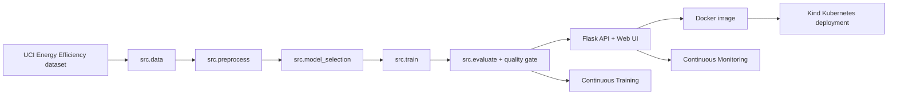

# MLOps Building Energy Load Predictor


Public GitHub repository: <https://github.com/lorcan973232/mlops-wine-quality-pipeline>

This repository is the artefact component only. It implements a complete MLOps pipeline around a Flask prediction service, Docker image, Kind Kubernetes deployment, GitHub Actions CI/CD/CT/CM workflows, tests, monitoring, and traceability evidence. The repository must remain public until 21 June 2026.

## Use Case

The artefact predicts a building's heating load from eight simple design inputs. This was selected because it is much easier to demonstrate than a specialist medical feature form, while still achieving excellent honest regression metrics on a public dataset.

| Item | Value |
|---|---|
| Dataset | UCI Energy Efficiency |
| Public source | <https://archive.ics.uci.edu/dataset/242/energy+efficiency> |
| Download file | `https://archive.ics.uci.edu/ml/machine-learning-databases/00242/ENB2012_data.xlsx` |
| Task type | Regression |
| Target | `heating_load` |
| Model | `GradientBoostingRegressor` |
| Model path | `models/energy_efficiency_heating_load_regressor.joblib` |
| Model version | `energy-efficiency-gradient-boosting-v1` |

## Input Schema

| Field | Meaning |
|---|---|
| `relative_compactness` | Building compactness score |
| `surface_area` | Total external surface area |
| `wall_area` | Wall area |
| `roof_area` | Roof area |
| `overall_height` | Building height |
| `orientation` | Integer-coded orientation, 2 to 5 |
| `glazing_area` | Window/glazing proportion |
| `glazing_area_distribution` | Integer-coded glazing distribution, 0 to 5 |

The `/predict` endpoint returns a numeric heating-load estimate, the target name, unit label, and model version.

## Latest Metrics

Run `python -m src.evaluate` to regenerate the latest metrics.

| Metric | Quality gate |
|---|---:|
| R2 | `>= 0.98` |
| RMSE | `<= 0.75` |
| MAE | `<= 0.55` |

Latest verified local values:

| Metric | Value |
|---|---:|
| R2 | `0.9984497713108541` |
| RMSE | `0.4019752121804286` |
| MAE | `0.2856033894786758` |
| MAPE | `0.013062033221972814` |
| 5-fold CV R2 mean/std | `0.9984581530470245 / 0.0002890719506428489` |

Metric files:

| File | Evidence |
|---|---|
| `reports/metrics/latest_metrics.json` | Latest R2, RMSE, MAE, MSE, residual and quality-gate summary |
| `reports/metrics/baseline_metrics.json` | Dummy mean baseline |
| `reports/metrics/model_comparison.json` | Candidate model and baseline comparison |
| `reports/metrics/cross_validation_results.json` | 5-fold KFold CV results |
| `reports/metrics/model_metadata.json` | Dataset, schema, hyperparameters, metrics, and quality gate |
| `reports/metrics/quality_gate_report.json` | Continuous Training acceptance/rejection gate |

Classification-specific files are marked `NOT_APPLICABLE` because the selected task is regression.

## Architecture



## Local Setup

PowerShell:

```powershell
powershell -ExecutionPolicy Bypass -File scripts/setup_local.ps1
powershell -ExecutionPolicy Bypass -File scripts/check_setup.ps1
```

Bash or Git Bash:

```bash
bash scripts/setup_local.sh
bash scripts/check_setup.sh
```

If PowerShell blocks scripts:

```powershell
Set-ExecutionPolicy -Scope CurrentUser RemoteSigned
```

Temporary bypass:

```powershell
powershell -ExecutionPolicy Bypass -File scripts/check_setup.ps1
```

## Core Commands

```powershell
python -m compileall app src tests
pytest -q
ruff check src tests
python -m src.data
python -m src.preprocess
python -m src.model_selection
python -m src.train
python -m src.evaluate
python -m src.model_registry
python -m src.predict
python scripts/monitor.py
python scripts/check_drift.py
```

## Flask Web UI

Run:

```powershell
python -m app.main
```

Open:

```text
http://127.0.0.1:5000/
```

The UI is a simple card-style form inspired by the supplied reference layout, but it uses the real Energy Efficiency dataset. Click `Use Example`, then `Predict Heating Load`. The UI calls `/predict` and displays the model version.

Example payload:

```json
{
  "features": {
    "relative_compactness": 0.76,
    "surface_area": 661.5,
    "wall_area": 416.5,
    "roof_area": 122.5,
    "overall_height": 7.0,
    "orientation": 2,
    "glazing_area": 0.4,
    "glazing_area_distribution": 5
  }
}
```

Smoke test:

```powershell
powershell -ExecutionPolicy Bypass -File scripts/smoke_test_api.ps1 -ApiUrl http://127.0.0.1:5000
```

## Docker

```powershell
docker build -t mlops-flask-api:latest .
docker run --rm -d --name mlops-flask-demo -p 5001:5000 mlops-flask-api:latest
powershell -ExecutionPolicy Bypass -File scripts/smoke_test_api.ps1 -ApiUrl http://127.0.0.1:5001
docker stop mlops-flask-demo
```

Open Docker UI:

```text
http://127.0.0.1:5001/
```

## Kind Kubernetes

PowerShell:

```powershell
powershell -ExecutionPolicy Bypass -File scripts/create_kind_cluster.ps1
powershell -ExecutionPolicy Bypass -File scripts/deploy_kind.ps1
kubectl get pods
kubectl get svc
kubectl rollout status deployment/mlops-flask-api
kubectl port-forward service/mlops-flask-api 8080:80
```

Bash:

```bash
scripts/create_kind_cluster.sh
scripts/deploy_kind.sh
kubectl get pods
kubectl get svc
kubectl rollout status deployment/mlops-flask-api
kubectl port-forward service/mlops-flask-api 8080:80
```

Open Kind UI:

```text
http://127.0.0.1:8080/
```

Smoke test:

```powershell
powershell -ExecutionPolicy Bypass -File scripts/smoke_test_api.ps1 -ApiUrl http://127.0.0.1:8080
python scripts/monitor.py --api-url http://127.0.0.1:8080
```

## GitHub Actions

| Workflow | Purpose | Trigger | Main evidence |
|---|---|---|---|
| `.github/workflows/ci.yml` | Compile, lint, tests | Push/PR | `compileall`, `ruff`, `pytest` |
| `.github/workflows/data-preprocessing.yml` | Ingest and preprocess public dataset | Push/PR/manual | `python -m src.data`, `python -m src.preprocess` |
| `.github/workflows/train-and-evaluate.yml` | Train, evaluate, register | Push/PR/manual | model and metrics artefacts |
| `.github/workflows/continuous-training.yml` | Scheduled/manual retraining | Schedule/manual | `quality_gate_report.json` |
| `.github/workflows/docker-build.yml` | Build and smoke-test image | Push/PR/manual | Docker smoke logs |
| `.github/workflows/deploy.yml` | Kind deployment only | Push/manual/workflow_run | rollout and smoke logs |
| `.github/workflows/monitoring.yml` | Offline monitoring and drift | Schedule/manual | monitoring reports |

## Branching Strategy

| Branch | Purpose |
|---|---|
| `main` | Stable release branch; triggers deployment workflow |
| `develop` | Integration branch before release |
| `feature/*` | Feature work through pull requests |
| `hotfix/*` | Optional urgent corrections |

Pull requests trigger CI. CI must pass before merge. Continuous Training and Monitoring are scheduled from the repository workflow definitions.

## Monitoring

Offline simulated monitoring:

```powershell
python scripts/monitor.py
python scripts/check_drift.py
```

API-aware monitoring after Kind port-forward:

```powershell
python scripts/monitor.py --api-url http://127.0.0.1:8080
```

Reports are written under `reports/monitoring/`. The artefact does not claim production telemetry; it implements simulated data-quality/drift checks and API-aware health/prediction monitoring.

## Live Demo Checklist

1. Show public GitHub repo and this README.
2. Run setup check.
3. Run tests and lint.
4. Run data ingestion, preprocessing, model selection, training, evaluation, registry, prediction.
5. Show `latest_metrics.json`, `model_metadata.json`, `model_comparison.json`, and `quality_gate_report.json`.
6. Start Flask and open `http://127.0.0.1:5000/`.
7. Click `Use Example`, then `Predict Heating Load`.
8. Build Docker, open `http://127.0.0.1:5001/`, and run smoke test.
9. Deploy to Kind, port-forward, open `http://127.0.0.1:8080/`, and run smoke test.
10. Run offline monitoring, drift check, and API-aware monitoring.
11. Show GitHub Actions workflows and recent runs.

## Traceability Matrix

| Artefact requirement | File/path | Local command | GitHub Actions workflow | Quality gate/test | Status | Remaining action |
|---|---|---|---|---|---|---|
| Public dataset ingestion | `src/data.py`, `data/raw/energy-efficiency.xlsx` | `python -m src.data` | `data-preprocessing.yml` | SHA-256/schema validation, `tests/test_data.py` | Verified locally | Rerun before demo |
| Preprocessing | `src/preprocess.py` | `python -m src.preprocess` | `data-preprocessing.yml` | deterministic processed CSV | Verified locally | Rerun before demo |
| Model selection | `src/model_selection.py` | `python -m src.model_selection` | `train-and-evaluate.yml` | model comparison JSON | Verified locally | Rerun before demo |
| Training | `src/train.py` | `python -m src.train` | `train-and-evaluate.yml`, `continuous-training.yml` | saved model and metadata | Verified locally | Rerun before demo |
| Evaluation | `src/evaluate.py` | `python -m src.evaluate` | `train-and-evaluate.yml`, `continuous-training.yml` | R2/RMSE/MAE gate | Verified locally | Rerun before demo |
| Flask API/UI | `app/` | `python -m app.main` | `ci.yml`, Docker/Deploy workflows | `tests/test_api.py`, `tests/test_ui.py` | Verified locally | Open UI during demo |
| Docker | `Dockerfile`, `.dockerignore` | `docker build -t mlops-flask-api:latest .` | `docker-build.yml` | smoke test script | Verified locally | Rerun before demo |
| Kind Kubernetes | `deployment/kind/`, `scripts/deploy_kind.*` | `scripts/deploy_kind.sh` or `.ps1` | `deploy.yml` | rollout + smoke test | Verified locally | Rerun before demo |
| Continuous Training | `continuous-training.yml` | `python -m src.evaluate` | `continuous-training.yml` | `quality_gate_report.json` | Verified locally | Confirm GitHub run after push |
| Continuous Monitoring | `scripts/monitor.py`, `scripts/check_drift.py` | `python scripts/monitor.py` | `monitoring.yml` | retraining flag/report | Verified locally | Confirm GitHub run after push |
| Tests | `tests/` | `pytest -q` | `ci.yml` | pytest suite | Verified locally | Rerun before demo |
| Branching | README | `git status --short --branch` | PR workflows | CI before merge | Documented | None |
| Public GitHub | README, remote repo | `gh repo view` | GitHub Actions tab | repo public check | Implemented | Keep public until 21 June 2026 |

## Limitations

The dataset is simulation-based building-performance data rather than live production telemetry. This is acceptable for the artefact because the repository demonstrates reproducible ingestion, training, evaluation, API serving, Docker, Kind deployment, Continuous Training, Continuous Monitoring, tests, and traceability without hidden manual steps.
