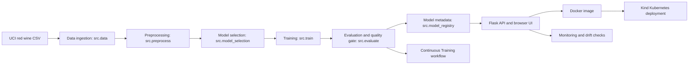

# MLOps Red Wine Quality Classifier


Public GitHub repository: <https://github.com/lorcan973232/mlops-wine-quality-pipeline>

This repository contains my working MLOps pipeline for a red wine quality classifier. It includes the data ingestion code, preprocessing, model training, evaluation, Flask prediction API, browser UI, Docker image, Kind Kubernetes deployment, GitHub Actions workflows, monitoring scripts, tests, security checks, and saved evidence reports.

The project is meant to be easy to rerun during assessment. The model is not treated as a black box: the repository saves metrics, metadata, model-selection outputs, monitoring reports, and deployment evidence so the result can be checked again.

## What This Repository Contains

The pipeline predicts whether a red wine sample is `standard quality` or `good quality` from 11 physicochemical measurements. The target is derived from the original UCI wine `quality` score: wines with `quality >= 6` are labelled as `good quality`, and the rest are labelled as `standard quality`.

The main audience is the student running the live demo and the assessor checking the artefact. The repository is therefore organised around commands and evidence files rather than hidden manual steps.

| Area | What is included | Main locations |
|---|---|---|
| Dataset and preprocessing | UCI red wine CSV, SHA-256 check, processed training dataset | `data/raw/`, `data/processed/`, `src/data.py`, `src/preprocess.py`, `reports/metrics/data_ingestion.json`, `reports/metrics/preprocessing.json` |
| Model training | ExtraTreesClassifier with StandardScaler preprocessing and saved metadata | `src/model_selection.py`, `src/train.py`, `src/evaluate.py`, `models/wine_quality_classifier.joblib`, `reports/metrics/` |
| API and UI | Flask app with `/`, `/health`, `/predict`, and optional dashboard routes | `app/main.py`, `app/schemas.py`, `app/templates/index.html`, `static/`, `templates/dashboard.html` |
| Tests | Unit and integration tests for data, model, API, UI, monitoring, evidence, and workflows | `tests/` |
| Docker | Container build for the same Flask app and saved model | `Dockerfile`, `.dockerignore`, `deployment/docker-compose.yml` |
| Kind deployment | Local Kubernetes deployment using Kind and port-forwarding | `deployment/kind/`, `scripts/create_kind_cluster.*`, `scripts/deploy_kind.*` |
| Automation | CI, training, Docker, deployment, monitoring, security, and final-readiness workflows | `.github/workflows/` |
| Evidence reports | Metrics, explainability, fairness proxy checks, cost-benefit assumptions, drift checks, security outputs | `reports/` |

## Repository Access

The repository is public for assessment access and must remain public until 21 June 2026. A small visibility-check script is included so the current repository status can be checked again before submission or a live demo.

| Evidence item | Path or command |
|---|---|
| Public repository URL | <https://github.com/lorcan973232/mlops-wine-quality-pipeline> |
| Current visibility snapshot | `reports/submission/public_repository_evidence.json` |
| Local visibility check | `python scripts/check_repo_visibility.py` |
| Scheduled/manual visibility workflow | `.github/workflows/repository-visibility-check.yml` |
| Required access period | The repository must remain public until 21 June 2026 |

## Why The Project Was Built This Way

The coursework is about the MLOps workflow as well as the trained model. For that reason, the repository does more than fit a classifier. It shows how data is ingested, checked, transformed, trained, evaluated, served, containerised, deployed, monitored, and tested.

Docker is included so the same Flask app and model can run in a repeatable container. Kind is included to show a Kubernetes-style deployment locally and in GitHub Actions without needing a long-lived cloud service. GitHub Actions is used because each stage can be rerun from the repository and inspected through logs and uploaded artefacts.

## Dataset And Prediction Task

The project uses the UCI Wine Quality red wine dataset.

| Item | Value |
|---|---|
| Dataset | UCI Wine Quality - Red Wine |
| Source | <https://archive.ics.uci.edu/dataset/186/wine+quality> |
| Raw download | `https://archive.ics.uci.edu/ml/machine-learning-databases/wine-quality/winequality-red.csv` |
| Raw SHA-256 | `4a402cf041b025d4566d954c3b9ba8635a3a8a01e039005d97d6a710278cf05e` |
| Source target | `quality` |
| Model target | `quality_label` |
| Positive class | `good quality` where `quality >= 6` |
| Model type | Binary classification |

The dataset is small, public, and deterministic, which makes it suitable for demonstrating reproducible MLOps stages. It is not live production data. The 11 input features are chemical measurements from the wine sample:

| Feature | Meaning |
|---|---|
| `fixed_acidity` | Non-volatile tartaric acid concentration |
| `volatile_acidity` | Acetic acid level |
| `citric_acid` | Citric acid concentration |
| `residual_sugar` | Sugar left after fermentation |
| `chlorides` | Salt concentration |
| `free_sulfur_dioxide` | Free sulfur dioxide concentration |
| `total_sulfur_dioxide` | Total sulfur dioxide concentration |
| `density` | Wine density |
| `ph` | Acidity/alkalinity value |
| `sulphates` | Sulphate concentration |
| `alcohol` | Alcohol by volume percentage |

## Repository Structure

```text
.
|-- app/                       Flask API, validation, model loading, UI routes
|-- data/
|   |-- raw/                   Downloaded UCI CSV
|   `-- processed/             Processed classification dataset
|-- deployment/
|   |-- docker-compose.yml
|   `-- kind/                  Kubernetes manifests for Kind
|-- models/                    Saved model bundle used by API and Docker
|-- reports/                   Metrics, monitoring, security, and submission evidence
|-- scripts/                   Setup, smoke tests, deployment, monitoring, security checks
|-- src/                       Data, preprocessing, training, evaluation, registry code
|-- tests/                     Pytest suite
|-- Dockerfile
|-- Makefile
|-- requirements.txt
`-- .github/workflows/         GitHub Actions workflows
```

## How The Pipeline Works



The local pipeline runs in this order:

1. `src.data` downloads or validates the raw UCI CSV and records dataset evidence.
2. `src.preprocess` creates the processed classification dataset and records the schema.
3. `src.model_selection` compares candidate approaches and writes model-selection reports.
4. `src.train` trains the selected model and saves the model bundle.
5. `src.evaluate` writes metrics, confusion matrices, classification reports, and the quality-gate decision.
6. `src.model_registry` records lightweight model metadata and version evidence.
7. `app.main` loads the saved model and serves the prediction API and UI.
8. Docker and Kind run the same app through repeatable deployment commands.
9. Monitoring scripts check schema, missing values, PSI drift, and optional API availability.

## Model Training And Evaluation

The selected model is an `ExtraTreesClassifier`. The preprocessing pipeline uses median imputation and `StandardScaler` for the numeric feature columns. Model selection is recorded by `src/model_selection.py`, which compares the baseline, tuned ExtraTrees model, and ensemble option. The final saved model is stored at `models/wine_quality_classifier.joblib`.

The main metrics are accuracy, balanced accuracy, macro F1, weighted F1, precision, recall, ROC AUC, and cross-validation accuracy. Balanced accuracy and macro F1 are useful here because the two derived classes are not guaranteed to behave identically.

Current saved metric evidence is in `reports/metrics/latest_metrics.json`.

| Metric | Current saved value |
|---|---:|
| Accuracy | `0.825` |
| Balanced accuracy | `0.8237371953373366` |
| Precision macro | `0.8243482364043884` |
| Recall macro | `0.8237371953373366` |
| F1 macro | `0.8240100565681961` |
| Precision weighted | `0.8248997286775982` |
| Recall weighted | `0.825` |
| F1 weighted | `0.8249175047140165` |
| ROC AUC | `0.9192668472075041` |
| 5-fold CV accuracy mean/std | `0.8100122549019607 / 0.019345789260910167` |
| Baseline accuracy | `0.534375` |
| Baseline weighted F1 | `0.37221232179226066` |

The quality gate is recorded in `reports/metrics/quality_gate_report.json`.

| Gate | Threshold | Current saved status |
|---|---:|---|
| Accuracy | `>= 0.80` | Passed |
| Balanced accuracy | `>= 0.80` | Passed |
| Weighted F1 | `>= 0.80` | Passed |
| Macro F1 | `>= 0.80` | Passed |
| CV accuracy mean | `>= 0.77` | Passed |
| Accuracy improvement over baseline | `>= 0.20` | Passed |

These values are good enough for the coursework pipeline, but they should not be read as a perfect wine-quality model. The model performance should be read alongside the full MLOps pipeline, because the project is assessing the workflow as well as the trained model.

## Model Metrics And Hyperparameters

The current model metadata is saved under `reports/metrics/model_metadata.json` and `reports/metrics/latest_metrics.json`.

```json
{
  "algorithm": "ExtraTreesClassifier",
  "classifier": {
    "n_estimators": 300,
    "max_depth": null,
    "min_samples_leaf": 1,
    "min_samples_split": 2,
    "class_weight": "balanced",
    "random_state": 42,
    "n_jobs": 1
  },
  "preprocessing": {
    "numeric_imputer_strategy": "median",
    "numeric_scaler": "StandardScaler"
  },
  "train_test_split": {
    "test_size": 0.2,
    "random_state": 42,
    "shuffle": true,
    "stratify": "quality_label"
  }
}
```

Useful metric files:

| File | What it records |
|---|---|
| `reports/metrics/latest_metrics.json` | Current model metrics and quality-gate summary |
| `reports/metrics/baseline_metrics.json` | Dummy most-frequent baseline |
| `reports/metrics/quality_gate_report.json` | Accept/reject decision for the candidate model |
| `reports/metrics/model_metadata.json` | Dataset, schema, hyperparameters, metrics, and model version |
| `reports/metrics/model_comparison.json` | Candidate model and baseline comparison |
| `reports/metrics/classification_report.json` | Per-class, macro, and weighted metrics |
| `reports/metrics/confusion_matrix.json` | Held-out confusion matrix |
| `reports/metrics/cross_validation_results.json` | Stratified 5-fold cross-validation results |
| `reports/metrics/feature_importance.json` | Feature importance ranking |

## Advanced Tier 3 Evidence

Feature importance is saved in `reports/metrics/feature_importance.json`. The top features in the current saved report are alcohol, sulphates, and volatile acidity. This is useful in a live demo because it gives model-derived evidence rather than just naming the algorithm.

SHAP evidence is generated by `scripts/explain_model.py` and saved under `reports/explainability/`. The reports include global feature evidence and one local example explanation. If SHAP has to fall back for an environment reason, the output is labelled rather than presented as something it is not.

The fairness audit is in `reports/fairness/`. The UCI wine dataset does not contain protected attributes, so the audit uses non-sensitive proxy groups based on alcohol and sulphates tertiles. Those proxy groups are useful for checking subgroup behaviour, but they are not a protected-characteristic fairness claim. The current summary reports a maximum equalized-odds-style gap of `0.5919`, so subgroup behaviour should be reviewed before any real operational use.

The cost-benefit analysis is in `reports/business/`. The values are labelled as simulated assumptions and should not be treated as real business values.

## Flask API And Live-Demo Web UI

The Flask app is in `app/main.py`. It exposes:

| Route | Purpose |
|---|---|
| `/` | Browser UI for entering wine features and making a prediction |
| `/health` | Checks that the API can load the saved model bundle |
| `/predict` | Validates the request body and returns prediction, label, confidence, probabilities, target name, and model version |
| `/dashboard/` | Optional dashboard view built from saved reports |

The browser UI calls the real `/predict` endpoint. That matters for the live demo because clicking `Use Example` and `Predict Quality` exercises the same validation and model path used by the API smoke tests, Docker container, and Kind deployment.

Example request body:

```json
{
  "features": {
    "fixed_acidity": 7.4,
    "volatile_acidity": 0.7,
    "citric_acid": 0.0,
    "residual_sugar": 1.9,
    "chlorides": 0.076,
    "free_sulfur_dioxide": 11.0,
    "total_sulfur_dioxide": 34.0,
    "density": 0.9978,
    "ph": 3.51,
    "sulphates": 0.56,
    "alcohol": 9.4
  }
}
```

## Running Locally

Use the setup scripts before running the pipeline on a fresh machine. Windows users should normally use the PowerShell scripts. The Bash scripts are kept for Linux, macOS, Git Bash, and GitHub Actions.

PowerShell:

```powershell
powershell -ExecutionPolicy Bypass -File scripts/setup_local.ps1
powershell -ExecutionPolicy Bypass -File scripts/check_setup.ps1
.\.venv\Scripts\Activate.ps1
```

Bash or Git Bash:

```bash
bash scripts/setup_local.sh
bash scripts/check_setup.sh
source .venv/bin/activate 2>/dev/null || source .venv/Scripts/activate
```

Explicit Git Bash on Windows:

```powershell
& "C:\Program Files\Git\bin\bash.exe" scripts/setup_local.sh
& "C:\Program Files\Git\bin\bash.exe" scripts/check_setup.sh
```

Run the full local pipeline:

```powershell
python -m src.data
python -m src.preprocess
python -m src.model_selection
python -m src.train
python -m src.evaluate
python -m src.model_registry
python -m src.predict
```

One-command local pipeline wrappers:

```powershell
powershell -ExecutionPolicy Bypass -File scripts/run_pipeline.ps1
```

```bash
bash scripts/run_pipeline.sh
```

Makefile shortcuts mirror the same scripts and modules:

```bash
make setup
make check-setup
make test
make data
make preprocess
make train
make evaluate
make run-api
make docker-build
make kind-deploy
make monitor
make security-scan
make full-local-verify
```

## Running Tests

Run these checks after activating the virtual environment:

```powershell
python -m compileall app src tests scripts
pytest -q
ruff check src tests scripts
python -c "from app.main import app; print('Flask import OK')"
```

The test suite covers the data path, API validation, model evidence, monitoring scripts, workflow YAML, UI route, explainability outputs, fairness audit, and cost-benefit report.

## Starting Flask Locally

Start the API:

```powershell
python -m app.main
```

Open the UI:

```text
http://127.0.0.1:5000/
```

Useful checks while Flask is running:

```powershell
powershell -ExecutionPolicy Bypass -File scripts/smoke_test_api.ps1 -ApiUrl http://127.0.0.1:5000
python scripts/benchmark_api.py http://127.0.0.1:5000 --samples 100
```

The current saved benchmark report is `reports/benchmarks/api_sla_report.json`. It is a local API latency check, not a guarantee about every future machine.

## Docker Container

Docker packages the Flask app, saved model, data path, reports, and Python dependencies into one image. The Dockerfile also re-runs the core pipeline during the image build and runs the app as a non-root user called `appuser`.

Build and smoke test the container:

```powershell
docker build -t mlops-flask-api:latest .
docker run --rm -d --name mlops-flask-demo -p 5001:5000 mlops-flask-api:latest
powershell -ExecutionPolicy Bypass -File scripts/smoke_test_api.ps1 -ApiUrl http://127.0.0.1:5001
docker stop mlops-flask-demo
```

Open the Docker-served UI:

```text
http://127.0.0.1:5001/
```

## Kind Kubernetes Deployment

Kind is used to show the container running through Kubernetes manifests without depending on a cloud VM. The deployment is local or GitHub-runner based and is expected to be temporary. It is not a persistent public service.

The manifests are in `deployment/kind/`. The deployment uses three replicas, readiness and liveness probes on `/health`, a `ClusterIP` service, and port-forwarding for local access.

PowerShell:

```powershell
powershell -ExecutionPolicy Bypass -File scripts/create_kind_cluster.ps1
powershell -ExecutionPolicy Bypass -File scripts/deploy_kind.ps1
kubectl get pods
kubectl get svc
kubectl rollout status deployment/mlops-flask-api
kubectl port-forward service/mlops-flask-api 8080:80
```

Bash:

```bash
bash scripts/create_kind_cluster.sh
bash scripts/deploy_kind.sh
kubectl get pods
kubectl get svc
kubectl rollout status deployment/mlops-flask-api
kubectl port-forward service/mlops-flask-api 8080:80
```

Open the Kind-served UI:

```text
http://127.0.0.1:8080/
```

Smoke test the Kind deployment:

```powershell
powershell -ExecutionPolicy Bypass -File scripts/smoke_test_api.ps1 -ApiUrl http://127.0.0.1:8080
python scripts/monitor.py --api-url http://127.0.0.1:8080
```

If Kind is slow during a live demo, it is reasonable to show the current `Deploy Kind` workflow run, the manifests, the rollout logs, and the saved smoke-test evidence instead of spending the whole demo waiting for a local cluster.

## MLOps Workflow Detail: CI/CD/CT/CM

GitHub Actions is used so the main MLOps stages can run without relying only on local commands. Each workflow should be checked through its current run logs and artefacts for the commit being submitted.

| Workflow | GitHub Actions display name | When it runs | What it checks or produces |
|---|---|---|---|
| `ci.yml` | CI | Push, pull request, manual | Compile check, lint, tests, Flask import, and core ML smoke path |
| `data-preprocessing.yml` | Data Preprocessing | Data/preprocess changes, pull request, manual | Raw data validation and processed dataset generation |
| `train-and-evaluate.yml` | Train and Evaluate | Model-code changes, pull request, manual | Training, evaluation, reports, and model metadata |
| `continuous-training.yml` | Continuous Training | Weekly schedule and manual | Retraining path, model evaluation, quality gate, and model registry evidence |
| `docker-build.yml` | Docker Build | Push, pull request, manual | Docker image build and API smoke test |
| `deploy.yml` | Deploy Kind | Push to `main` and manual | Kind cluster setup, image loading, Kubernetes rollout, and API smoke test |
| `monitoring.yml` | Monitoring | Daily schedule and manual | Data-quality checks, PSI drift check, and retraining signal evidence |
| `model-analysis.yml` | Tier 3 Model Analysis | Model/report changes, pull request, manual | SHAP, proxy fairness audit, optimisation, ensemble, cost-benefit, and monitoring evidence |
| `security-scan.yml` | Security Scan | Push, pull request, manual | No-secrets check, dependency scan, Docker checks, Trivy scan, and SBOM output |
| `repository-visibility-check.yml` | Repository Visibility Check | Daily schedule and manual | Current repository visibility snapshot |
| `bash-script-verification.yml` | Bash Script Verification | Push, pull request, manual | Bash script path on an Ubuntu runner |
| `final-readiness.yml` | Final Readiness | Push to `main` and manual | Final readiness report for the current SHA |

## Continuous Training

Continuous Training is handled by `.github/workflows/continuous-training.yml`. It runs weekly and can also be started manually. The workflow reruns the data, preprocessing, model selection, training, evaluation, and model-registry steps.

The important part is the quality gate in `src/evaluate.py`. A candidate model is accepted only if it passes the saved thresholds for accuracy, balanced accuracy, macro F1, weighted F1, cross-validation accuracy, and improvement over the baseline. A weaker candidate would fail the workflow instead of being treated as an accepted model.

Evidence files:

| File | Purpose |
|---|---|
| `reports/metrics/quality_gate_report.json` | Current quality-gate decision |
| `reports/metrics/model_registry.json` | Lightweight model registry record |
| `reports/model_registry/version_history.json` | Version history |
| `reports/metrics/model_metadata.json` | Model, data, metrics, and hyperparameter metadata |

## Continuous Monitoring And Drift Checks

Monitoring is a lightweight coursework monitoring stage rather than full production telemetry. It has two modes:

| Mode | How it is used |
|---|---|
| Offline simulated monitoring | Checks the processed dataset schema, missing values, feature distributions, and PSI drift logic |
| API-aware monitoring | Calls a deployed API URL when one is available, for example the Kind port-forward URL |

Run monitoring locally:

```powershell
python scripts/monitor.py
python scripts/check_drift.py
```

Run monitoring against a deployed API:

```powershell
python scripts/monitor.py --api-url http://127.0.0.1:8080
```

Main monitoring reports:

| File | What to look for |
|---|---|
| `reports/monitoring/data_quality_report.json` | Schema and missing-value checks |
| `reports/monitoring/monitoring_report.json` | Overall monitoring status |
| `reports/monitoring/drift_report.json` | PSI drift results, simulated drift batch, and retraining flags |
| `reports/monitoring/api_monitoring_report.json` | API-aware monitoring output when run against a service |

The current drift report records no drift in the current batch and includes a deterministic simulated drift batch to show that the retraining-trigger logic works. The simulated signal is useful for demonstration, but it is not the same as observing real production drift.

## Security And No-Secrets Checks

Security checks are included as practical evidence. They do not claim that dependencies or base images will never have future vulnerabilities.

| Evidence | Path |
|---|---|
| Security workflow | `.github/workflows/security-scan.yml` |
| Local security script | `scripts/security_scan.py` |
| Security summary | `reports/security/security_scan_summary.md` |
| Dependency scan report | `reports/security/dependency_scan.txt` |
| Secret scan report | `reports/security/secret_scan.txt` |
| Docker security notes | `reports/security/docker_security_notes.md` |
| SBOM | `reports/security/sbom.spdx.json` |

Run the local security evidence script:

```powershell
python scripts/security_scan.py
```

## Branching Strategy

The repository uses a simple `feature/* -> develop -> main` strategy. `main` is the stable assessment branch. `develop` is the integration branch. Feature branches are used for grouped changes before they are merged.

Branching evidence is saved in `reports/submission/branching_evidence.md`. That file records the pull-request route used for the project and the historic PR links. The current Actions page should still be checked for the submitted commit because older PR evidence does not say anything about a later commit.

## Final Readiness Evidence

The final-readiness script collects a snapshot of local and workflow-facing evidence:

```bash
python scripts/final_readiness_check.py
```

It writes generated output under `reports/final_readiness/generated/` and keeps stable supporting notes under:

| File | Purpose |
|---|---|
| `reports/final_readiness/final_readiness_summary.md` | Summary of final-readiness checks |
| `reports/final_readiness/live_demo_checklist.md` | Repeatable live-demo checklist |
| `.github/workflows/final-readiness.yml` | Workflow that uploads current readiness evidence |

Generated readiness files can become stale after another commit, so the current workflow artefact is the better evidence for the exact submitted SHA.

## Traceability Matrix

| Artefact requirement | Evidence in this repository | How to verify it | Status |
|---|---|---|---|
| Public GitHub repository | Public URL, `reports/submission/public_repository_evidence.json`, `.github/workflows/repository-visibility-check.yml` | Open the repository URL or run `python scripts/check_repo_visibility.py` | Current visibility evidence present |
| Repository public until 21 June 2026 | Repository access section, `reports/submission/public_repository_evidence.json`, scheduled visibility workflow | Keep the repository public and rerun `python scripts/check_repo_visibility.py` or the workflow close to submission | Current public status is checked; future status depends on repository visibility being maintained |
| Training/testing of ML model | `src/train.py`, `src/evaluate.py`, `tests/`, `reports/metrics/latest_metrics.json` | Run `python -m src.train`, `python -m src.evaluate`, `pytest -q` | Supported by code, tests, and reports |
| Flask/API deployment | `app/main.py`, `app/schemas.py`, `scripts/smoke_test_api.*` | Run `python -m app.main`, open `/health`, run smoke test | Present |
| Branching strategy | `reports/submission/branching_evidence.md` | Read the evidence file and compare with GitHub PR history | Evidence recorded |
| GitHub Actions workflows | `.github/workflows/*.yml` | Open Actions runs or run `pytest tests/test_workflows.py -q` | Workflows present and tested structurally |
| Data ingestion/preprocessing workflow | `src/data.py`, `src/preprocess.py`, `data/raw/`, `data/processed/`, `data-preprocessing.yml` | Run `python -m src.data` and `python -m src.preprocess` | Present |
| Retraining/Continuous Training workflow | `continuous-training.yml`, `src/evaluate.py`, `reports/metrics/quality_gate_report.json` | Start workflow manually or rerun local training/evaluation commands | Present |
| Continuous Deployment workflow | `deploy.yml`, `Dockerfile`, `deployment/kind/`, `scripts/deploy_kind.*` | Check `Deploy Kind` workflow or run the Kind commands locally | Present |
| Continuous Monitoring/model management | `monitoring.yml`, `scripts/monitor.py`, `scripts/check_drift.py`, `src/model_registry.py`, `reports/model_registry/` | Run monitoring and model registry commands | Present |
| At least two tests | `tests/` contains API, data, model, monitoring, workflow, UI, and evidence tests | Run `pytest -q` | Present |
| Docker containerisation | `Dockerfile`, `.dockerignore`, `docker-build.yml` | Run Docker build/run/smoke-test commands | Present |
| Kind Kubernetes deployment | `deployment/kind/deployment.yaml`, `deployment/kind/service.yaml`, `deploy.yml` | Run Kind commands or inspect workflow logs | Present |
| README and reproducibility evidence | `README.md`, `Makefile`, setup scripts, final-readiness reports | Follow README setup and verification commands | Present |
| Live demo readiness | Flask UI, smoke scripts, final-readiness checklist, reports | Follow the live demo sequence below | Present |

## Live Demo Checklist

This is the shortest route I would use in a live assessment.

1. Open the public repository and this README.
2. Show the repository structure: `src/`, `app/`, `tests/`, `Dockerfile`, `deployment/kind/`, `.github/workflows/`, and `reports/`.
3. Show `reports/metrics/latest_metrics.json`, `reports/metrics/model_metadata.json`, and `reports/metrics/quality_gate_report.json`.
4. Start Flask locally with `python -m app.main`.
5. Open `http://127.0.0.1:5000/`, click `Use Example`, then click `Predict Quality`.
6. Show `http://127.0.0.1:5000/health`.
7. Run the API smoke test against `http://127.0.0.1:5000`.
8. Show the Docker workflow or run the Docker build and smoke test if Docker is available locally.
9. Show the Kind workflow or run the Kind deployment if Docker, Kind, and kubectl are already set up.
10. Show the Continuous Training quality gate and explain what would reject a bad model.
11. Show `reports/monitoring/drift_report.json` and explain current-batch drift versus simulated drift.
12. Show `reports/fairness/fairness_report.json` and explain that the groups are proxy groups, not protected attributes.
13. Show `reports/security/security_scan_summary.md`, `secret_scan.txt`, and `docker_security_notes.md`.
14. Open the current GitHub Actions runs for CI, Train and Evaluate, Docker Build, Deploy Kind, Continuous Training, Monitoring, Security Scan, and Final Readiness.

Useful live-demo commands:

```powershell
powershell -ExecutionPolicy Bypass -File scripts/check_setup.ps1
python -m compileall app src tests scripts
pytest -q
python -m app.main
```

In another terminal while Flask is running:

```powershell
powershell -ExecutionPolicy Bypass -File scripts/smoke_test_api.ps1 -ApiUrl http://127.0.0.1:5000
python scripts/monitor.py
python scripts/check_drift.py
```

## Limitations

This project is a coursework MLOps artefact, not a production wine-quality system. The dataset is a fixed public research dataset, so it does not include live data collection, real customer feedback, or changing production distributions.

Monitoring is offline simulated by default, with optional API-aware checks when the Flask service is running. That is enough to demonstrate schema checks, missing-value checks, PSI drift logic, and retraining signals, but it is not full production telemetry.

The fairness audit uses proxy groups because the dataset does not contain protected attributes. The proxy subgroup results are useful for spotting uneven behaviour, but they should not be presented as a demographic fairness audit.

The cost-benefit values are simulated assumptions, not real business values. They are included to show how the confusion matrix could be connected to decision-making.

The Kind deployment is temporary and local or runner-based. It demonstrates Kubernetes manifests, rollout, probes, service routing, and smoke testing, but it is not a public cloud deployment.

Model management is implemented through saved metadata, version reports, quality gates, and workflow artefacts rather than an external registry such as MLflow.

## Final Notes

The most important thing to check is that the commands, reports, and workflow logs all line up. A prediction in the browser should use the same saved model as the local tests, Docker container, and Kind deployment. The saved reports under `reports/` make the training, evaluation, monitoring, and security evidence inspectable instead of relying on a verbal explanation.
