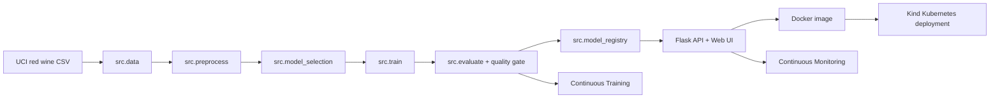
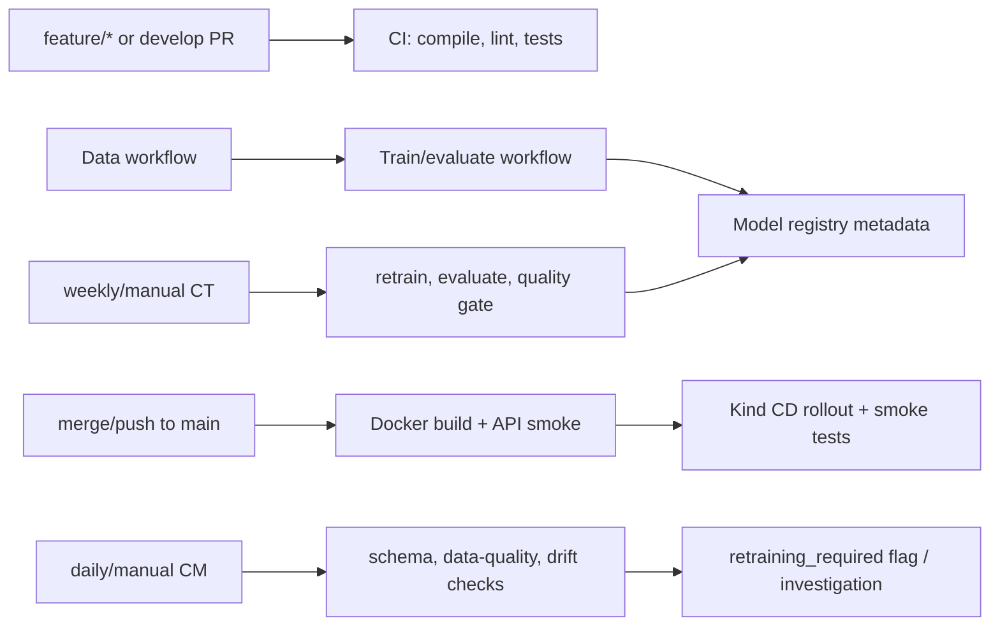

# MLOps Red Wine Quality Classifier


Public GitHub repository: <https://github.com/lorcan973232/mlops-wine-quality-pipeline>

This repository is the artefact component only. It implements a reproducible MLOps pipeline around a Flask prediction service, Docker image, Kind Kubernetes deployment, GitHub Actions CI/CD/CT/CM workflows, tests, monitoring, security evidence, and traceability evidence. The repository is currently public and must remain public until 21 June 2026.

| Public repository evidence | Value |
|---|---|
| Final GitHub URL | <https://github.com/lorcan973232/mlops-wine-quality-pipeline> |
| Current visibility evidence | `reports/submission/public_repository_evidence.json` |
| Automated visibility workflow | `.github/workflows/repository-visibility-check.yml` |
| Requirement | Repository must remain public until 21 June 2026 |

The evidence file verifies current public visibility only. It does not claim that future public availability is permanently proven before 21 June 2026.

## Repository Public-Access Requirement

The current repository visibility is verified as public. The assignment also
requires the repository to remain public until 21 June 2026, so a repeatable
visibility-check script, scheduled workflow, and evidence report are included.
The future date still depends on the repository being kept public.

| Evidence item | Path or command |
|---|---|
| Current visibility script | `python scripts/check_repo_visibility.py` |
| Current evidence report | `reports/submission/public_repository_evidence.json` |
| Scheduled/manual workflow | `.github/workflows/repository-visibility-check.yml` |
| Workflow artefact | `repository-visibility-evidence` |
| Required student action | Do not make the repository private before 21 June 2026 |

Current public visibility is verified. The future public-until date is
safeguarded through documentation and a repeatable visibility-check workflow,
but the student must keep the repository public until 21 June 2026. Rerun the
workflow close to submission and before the live demo.

## Project Overview

The artefact classifies a red wine sample as `standard quality` or `good quality` from 11 physicochemical inputs. The binary model target is `quality_label`, derived from the original UCI `quality` score where `quality >= 6` is treated as good quality.

| Item | Value |
|---|---|
| Dataset | UCI Wine Quality - Red Wine |
| Public source | <https://archive.ics.uci.edu/dataset/186/wine+quality> |
| Download file | `https://archive.ics.uci.edu/ml/machine-learning-databases/wine-quality/winequality-red.csv` |
| Raw SHA-256 | `4a402cf041b025d4566d954c3b9ba8635a3a8a01e039005d97d6a710278cf05e` |
| Task type | Binary classification |
| Source target | `quality` |
| Model target | `quality_label` |
| Positive class | `good quality` when `quality >= 6` |
| Model | `ExtraTreesClassifier` |
| Model path | `models/wine_quality_classifier.joblib` |
| Model version | `1.0.1` |

The UCI red wine dataset is intentionally small, public, and deterministic, which
makes it suitable for demonstrating MLOps engineering rather than hiding pipeline
behaviour behind large-data infrastructure. The artefact focus is reproducible
data acquisition, preprocessing, model selection, evaluation, quality gates,
serving, containerisation, Kind deployment, CT, CM, security evidence, and
traceability. The report still needs to justify the dataset and binary threshold
with academic references; that is marked as `USER_ACTION_REQUIRED` below.

## Input Schema

| Field | Meaning |
|---|---|
| `fixed_acidity` | Non-volatile tartaric acid concentration |
| `volatile_acidity` | Acetic acid level |
| `citric_acid` | Citric acid concentration |
| `residual_sugar` | Sugar left after fermentation |
| `chlorides` | Salt concentration |
| `free_sulfur_dioxide` | Free sulfur dioxide concentration |
| `total_sulfur_dioxide` | Total sulfur dioxide concentration |
| `density` | Wine density |
| `ph` | Acidity/alkalinity value |
| `sulphates` | Sulphate concentration |
| `alcohol` | Alcohol by volume percentage |

The `/predict` endpoint returns the class id, class label, class probabilities, confidence, target name, and model version.

## Latest Metrics

Run `python -m src.evaluate` to regenerate metrics.

| Metric | Latest value |
|---|---:|
| Accuracy | `0.825` |
| Balanced accuracy | `0.8237371953373366` |
| Precision macro | `0.8243482364043884` |
| Recall macro | `0.8237371953373366` |
| F1 macro | `0.8240100565681961` |
| Precision weighted | `0.8248997286775982` |
| Recall weighted | `0.825` |
| F1 weighted | `0.8249175047140165` |
| ROC AUC | `0.9192668472075041` |
| 5-fold CV accuracy mean/std | `0.8100122549019607 / 0.019345789260910167` |
| Baseline accuracy | `0.534375` |
| Baseline weighted F1 | `0.37221232179226066` |

Quality gate thresholds:

| Gate | Threshold | Status |
|---|---:|---|
| Accuracy | `>= 0.80` | Passed |
| Balanced accuracy | `>= 0.80` | Passed |
| Weighted F1 | `>= 0.80` | Passed |
| Macro F1 | `>= 0.80` | Passed |
| CV accuracy mean | `>= 0.77` | Passed |
| Accuracy improvement over baseline | `>= 0.20` | Passed |

Metric evidence files:

| File | Evidence |
|---|---|
| `reports/metrics/latest_metrics.json` | Current accuracy, precision, recall, F1, ROC AUC, quality gate |
| `reports/metrics/baseline_metrics.json` | Dummy most-frequent baseline |
| `reports/metrics/quality_gate_report.json` | CT acceptance/rejection gate |
| `reports/metrics/model_metadata.json` | Dataset, schema, hyperparameters, metrics, model version |
| `reports/metrics/model_comparison.json` | Candidate model and baseline comparison |
| `reports/metrics/classification_report.json` | Per-class, macro, and weighted classification report |
| `reports/metrics/confusion_matrix.json` | Held-out confusion matrix |
| `reports/metrics/cross_validation_results.json` | 5-fold StratifiedKFold results |
| `reports/metrics/feature_importance.json` | **NEW**: Feature importance ranking (top-3 most predictive features) |
| `reports/metrics/fairness_analysis.json` | **NEW**: Per-class metrics and fairness disparities (precision, recall, F1) |

## Model Explainability & Feature Importance

The model's feature importance is computed and ranked. The top-3 most predictive features are:

```bash
python -c "import json; f=json.load(open('reports/metrics/feature_importance.json')); print(json.dumps(f['top_3_features'], indent=2))"
```

Example output:
```json
[
  ["alcohol", 0.179],
  ["sulphates", 0.123],
  ["volatile_acidity", 0.103]
]
```

This helps understand which physicochemical properties drive wine quality predictions.

## Model Class-Balance Check

Per-class performance metrics are generated to detect class imbalance:

```bash
python -c "import json; f=json.load(open('reports/metrics/fairness_analysis.json')); print(json.dumps({k:f[k] for k in ['per_class_metrics', 'disparities', 'is_balanced']}, indent=2))"
```

| Metric | Standard Quality | Good Quality | Disparity |
|--------|------------------|--------------|-----------|
| Precision | 0.816 | 0.832 | 0.016 |
| Recall | 0.805 | 0.842 | 0.037 |
| F1 Score | 0.811 | 0.837 | 0.026 |

`is_balanced: true` in this legacy metrics file only means the two prediction
classes have similar precision, recall, and F1. It is not a protected-attribute
fairness claim. The full Tier 3 proxy subgroup audit is documented in
`reports/fairness/fairness_report.json` and the Advanced Tier 3 Evidence section.

## API Observability & Structured Logging

The Flask API now emits structured JSON logs for every prediction request:

```bash
python -m app.main 2>&1 | grep "event"
```

Example log output:
```json
{"event": "prediction_request_started", "request_id": "abc12345", "timestamp": "2026-05-16T..."}
{"event": "predictions_computed", "request_id": "abc12345", "prediction_count": 1, "execution_time_ms": 45.23}
{"event": "response_sent", "request_id": "abc12345", "status_code": 200, "latency_ms": 48.5}
```

This enables monitoring, debugging, and request tracing.

## API Performance & SLA

API latency is benchmarked and verified against an SLA (99th percentile latency < 200ms):

```powershell
powershell -ExecutionPolicy Bypass -File scripts/benchmark_api.ps1 -ApiUrl http://127.0.0.1:5000
```

```bash
python scripts/benchmark_api.py http://127.0.0.1:5000 --samples 100
```

Benchmark report (`reports/benchmarks/api_sla_report.json`):
```json
{
  "p50_ms": 92.07,
  "p95_ms": 185.64,
  "p99_ms": 185.64,
  "sla_threshold_ms": 200,
  "sla_met": true
}
```

## Hyperparameters

```json
{
  "algorithm": "ExtraTreesClassifier",
  "classifier": {
    "n_estimators": 300,
    "max_depth": null,
    "min_samples_leaf": 1,
    "min_samples_split": 2,
    "class_weight": "balanced",
    "random_state": 42,
    "n_jobs": 1
  },
  "train_test_split": {
    "test_size": 0.2,
    "random_state": 42,
    "shuffle": true,
    "stratify": "quality_label"
  },
  "preprocessing": {
    "numeric_imputer_strategy": "median",
    "numeric_scaler": "StandardScaler"
  }
}
```

## Architecture



## Local Setup

Run setup first. Bare system Python is not expected to run this artefact until `requirements.txt` has been installed. The supported reproducibility path is either activating `.venv`, using the `.venv` Python directly, or using the Makefile/script targets below.

Windows users should use the PowerShell scripts by default. Do not use `C:\Windows\System32\bash.exe` unless WSL is installed and configured. If using Git Bash on Windows, call Git Bash explicitly from `C:\Program Files\Git\bin\bash.exe`.

The PowerShell path is the recommended Windows route. The Bash scripts are also
kept and are verified through the Ubuntu GitHub Actions workflow
`.github/workflows/bash-script-verification.yml`. If a Windows machine resolves
`bash` to a broken WSL installation, use the PowerShell scripts, install Git
Bash, repair WSL, or use the GitHub Actions Ubuntu evidence for Bash-path
verification.

Recommended Windows PowerShell path:

```powershell
powershell -ExecutionPolicy Bypass -File scripts/setup_local.ps1
powershell -ExecutionPolicy Bypass -File scripts/check_setup.ps1
powershell -ExecutionPolicy Bypass -File scripts/check_bash_environment.ps1
.\.venv\Scripts\Activate.ps1
```

Bash or Git Bash:

```bash
bash scripts/setup_local.sh
bash scripts/check_bash_environment.sh
bash scripts/check_setup.sh
source .venv/bin/activate 2>/dev/null || source .venv/Scripts/activate
```

Explicit Git Bash on Windows:

```powershell
& "C:\Program Files\Git\bin\bash.exe" scripts/setup_local.sh
& "C:\Program Files\Git\bin\bash.exe" scripts/check_bash_environment.sh
& "C:\Program Files\Git\bin\bash.exe" scripts/check_setup.sh
```

If the environment is not activated, run the verification commands with
`.\.venv\Scripts\python.exe` on Windows or `.venv/bin/python` on Linux/macOS.

Make targets mirror the scripts:

```bash
make setup
make check-setup
make test
make data
make preprocess
make train
make evaluate
make run-api
make docker-build
make kind-deploy
make monitor
make security-scan
make full-local-verify
```

Setup scripts create or reuse `.venv`, install `requirements.txt`, and print
clear PASS/FAIL/BLOCKED messages. Check scripts verify the repository root,
Python, pip, dependency imports, Git, Docker, Kind, kubectl, and optionally
GitHub CLI. Bare system Python is not expected to work before dependencies are
installed.

## Core Verification Commands

Run these after activating `.venv`, or replace `python` with the `.venv` Python path shown above.

```powershell
python -m compileall app src tests
python -m src.data
python -m src.preprocess
python -m src.model_selection
python -m src.train
python -m src.evaluate
python -m src.model_registry
python -m src.predict
python scripts/monitor.py
python scripts/check_drift.py
python scripts/security_scan.py
pytest -q
ruff check src tests
python -c "from app.main import app; print('Flask import OK')"
```

One-command local artefact verification:

```powershell
powershell -ExecutionPolicy Bypass -File scripts/run_pipeline.ps1
```

```bash
bash scripts/run_pipeline.sh
```

## Flask API and UI

Run:

```powershell
python -m app.main
```

Open:

```text
http://127.0.0.1:5000/
```

Click `Use Example`, then `Predict Quality`. The UI calls `/predict`, displays the predicted quality class, confidence, and model version.

Example payload:

```json
{
  "features": {
    "fixed_acidity": 7.4,
    "volatile_acidity": 0.7,
    "citric_acid": 0.0,
    "residual_sugar": 1.9,
    "chlorides": 0.076,
    "free_sulfur_dioxide": 11.0,
    "total_sulfur_dioxide": 34.0,
    "density": 0.9978,
    "ph": 3.51,
    "sulphates": 0.56,
    "alcohol": 9.4
  }
}
```

Smoke test:

```powershell
powershell -ExecutionPolicy Bypass -File scripts/smoke_test_api.ps1 -ApiUrl http://127.0.0.1:5000
```

## Docker

The Docker image is built with a non-root runtime user (`USER appuser`). Dependency
installation and model/report generation happen during the image build, then the
Flask/Gunicorn process runs without root privileges.

```powershell
docker build -t mlops-flask-api:latest .
docker run --rm -d --name mlops-flask-demo -p 5001:5000 mlops-flask-api:latest
powershell -ExecutionPolicy Bypass -File scripts/smoke_test_api.ps1 -ApiUrl http://127.0.0.1:5001
docker stop mlops-flask-demo
```

Open Docker UI:

```text
http://127.0.0.1:5001/
```

## Kind Kubernetes

Kind Kubernetes is the selected deployment target for this artefact. This artefact does
not claim a persistent public cloud service. The Kind deployment is automated and
ephemeral: it runs locally or on a
GitHub Actions runner, verifies Kubernetes rollout, port-forwards the service, and
smoke-tests the deployed Flask API.

PowerShell:

```powershell
powershell -ExecutionPolicy Bypass -File scripts/create_kind_cluster.ps1
powershell -ExecutionPolicy Bypass -File scripts/deploy_kind.ps1
kubectl get pods
kubectl get svc
kubectl rollout status deployment/mlops-flask-api
kubectl port-forward service/mlops-flask-api 8080:80
```

Bash:

```bash
scripts/create_kind_cluster.sh
scripts/deploy_kind.sh
kubectl get pods
kubectl get svc
kubectl rollout status deployment/mlops-flask-api
kubectl port-forward service/mlops-flask-api 8080:80
```

Open Kind UI:

```text
http://127.0.0.1:8080/
```

Smoke test and API-aware monitoring:

```powershell
powershell -ExecutionPolicy Bypass -File scripts/smoke_test_api.ps1 -ApiUrl http://127.0.0.1:8080
python scripts/monitor.py --api-url http://127.0.0.1:8080
```

## Security Evidence

Security checks are artefact evidence, not report/video material. The repository includes:

| Evidence | Path |
|---|---|
| Security workflow | `.github/workflows/security-scan.yml` |
| Local security evidence generator | `scripts/security_scan.py` |
| Dependency scan report | `reports/security/dependency_scan.txt` |
| Secret scan report | `reports/security/secret_scan.txt` |
| Docker security notes | `reports/security/docker_security_notes.md` |
| SBOM | `reports/security/sbom.spdx.json` |

The Security Scan workflow runs a no-secrets check, a Dockerfile non-root check,
`pip-audit` against `requirements.txt`, a Docker runtime-user check, a Trivy image
scan, and SBOM generation. The Docker image scan is evidence output; it does not
claim that third-party base images are permanently free of CVEs. The workflow uploads
`security-reports` so a marker can inspect the current dependency, image, and SBOM
evidence for the submitted SHA.

## MLOps Workflow Detail: CI/CD/CT/CM

The workflow implementation is intentionally evidence-first: every stage runs repository
commands, writes reports or logs, fails on broken contracts, and uploads artefacts for
inspection in the GitHub Actions run. The marker should assess the YAML files together
with the generated files under `reports/`, the test suite, and the Actions run logs.



| Workflow | MLOps stage | Trigger | Main commands | Artefacts/logs | Quality gate/failure condition | Evidence path | Live demo evidence |
|---|---|---|---|---|---|---|---|
| CI | Continuous Integration | `push`/`pull_request` on `main`, `develop`; manual | `python -m compileall app src tests`; `ruff check src tests`; `pytest -q`; `python -c "from app.main import app; print('Flask import OK')"`; pipeline smoke commands | `ci-artifacts` containing `reports/` and `models/` | Any compile, lint, test, Flask import, pipeline, prediction, or monitoring command exits non-zero | `.github/workflows/ci.yml`, `tests/` | Show CI run log and pytest output in Actions tab |
| Data Preprocessing | Data acquisition and preprocessing | Manual; `push`/PR when data/preprocess files change | `python -m src.data`; `python -m src.preprocess`; processed-data summary check | `data-ingestion-report`; `preprocessing-artifacts` with processed CSV and reports | Dataset hash/schema validation fails, preprocessing fails, or processed CSV missing | `.github/workflows/data-preprocessing.yml`, `reports/metrics/data_ingestion.json`, `reports/metrics/preprocessing.json` | Show uploaded processed CSV/report artefact |
| Train and Evaluate | Model training, model selection, evaluation | Manual; `push`/PR when `src/`, `app/`, `tests/`, requirements, or workflow changes | `python -m src.data`; `python -m src.preprocess`; `python -m src.model_selection`; `python -m src.train`; `python -m src.evaluate`; `python -m src.model_registry`; `python -m src.predict` | `train-evaluate-artifacts` with `models/` and `reports/metrics/` | Training/evaluation fails, quality gate in `src.evaluate` fails, or required metric package files are missing | `.github/workflows/train-and-evaluate.yml`, `models/wine_quality_classifier.joblib`, `reports/metrics/*` | Show `latest_metrics.json`, `model_metadata.json`, confusion matrix, classification report |
| Docker Build | Container build and API verification | Manual; `push`/PR on `main`, `develop` | `docker build -t mlops-flask-api:${{ github.sha }}`; `docker run`; `curl /health`; `bash scripts/smoke_test_api.sh http://127.0.0.1:5001` | `docker-smoke-logs` | Image build fails, container does not become healthy, or `/predict` smoke test fails | `.github/workflows/docker-build.yml`, `Dockerfile`, `scripts/smoke_test_api.sh` | Show Docker run log and smoke-test JSON |
| Deploy Kind | Continuous Delivery/Deployment | Manual; `push` to `main`; successful Docker Build `workflow_run` on `main` | `docker build`; `docker save`; `kind create cluster`; `kind load docker-image`; `kubectl apply -f deployment/kind/`; `kubectl rollout status`; `kubectl get pods`; `kubectl get svc`; smoke test on `8080` | `deployment-image`; `kind-deployment-logs` including pods, services, describe, port-forward, smoke test, API logs | Kind setup, image load, manifest apply, rollout, port-forward, `/health`, or `/predict` smoke test fails | `.github/workflows/deploy.yml`, `deployment/kind/` | Show rollout log, pod/service output, smoke-test log, and local `http://127.0.0.1:8080/` |
| Continuous Training | Scheduled/manual retraining and model acceptance | Weekly cron `0 6 * * 1`; manual | data/preprocess/model-selection/train/evaluate; quality-gate contract check; `python -m src.model_registry` after acceptance | `ct-candidate`; `ct-quality-gate`; `continuous-training-artifacts` | Fails if quality gate lacks required checks or `passed` is false; candidate is rejected instead of silently accepted | `.github/workflows/continuous-training.yml`, `reports/metrics/quality_gate_report.json` | Show CT run, gate JSON, accepted/rejected decision |
| Monitoring | Continuous Monitoring and model management | Daily cron `0 7 * * *`; manual | `python -m src.data`; `python -m src.preprocess`; `python -m src.train`; `python -m src.evaluate`; `python -m src.model_registry`; `python scripts/monitor.py`; `python scripts/check_drift.py` | `monitoring-model-metadata`; `monitoring-artifacts` with `reports/monitoring/` | Fails if model metadata cannot be built, monitoring/drift scripts fail, or required monitoring fields are missing | `.github/workflows/monitoring.yml`, `scripts/monitor.py`, `scripts/check_drift.py`, `reports/monitoring/` | Show monitoring report, drift score, `retraining_required`, and reason |
| Repository Visibility Check | Public-repository evidence | Daily cron `0 8 * * *`; manual | `python scripts/check_repo_visibility.py` | `repository-visibility-evidence` | Fails if the repository is private or visibility is not `public` | `.github/workflows/repository-visibility-check.yml`, `reports/submission/public_repository_evidence.json` | Show current public visibility evidence and deadline note |
| Bash Script Verification | Bash/Linux reproducibility | `push`/PR on `main`, `develop`; manual | `chmod +x scripts/*.sh`; `bash -n`; `bash scripts/check_bash_environment.sh`; `bash scripts/check_setup.sh --python-only`; local Flask API smoke test | `bash-script-verification-logs` | Fails if Bash scripts have syntax errors, setup check fails, Flask health is unavailable, or Bash smoke test fails | `.github/workflows/bash-script-verification.yml`, `scripts/check_bash_environment.sh`, `scripts/smoke_test_api.sh` | Show Ubuntu Bash run when local Windows bash is blocked |
| Security Scan | Security/reproducibility evidence | `push`/PR on `main`, `develop`; manual | `python scripts/security_scan.py`; `python -m pip_audit -r requirements.txt`; Docker build; Docker runtime-user check; Trivy image scan; SBOM generation | `security-reports` with dependency, secret, Docker, Trivy, and SBOM evidence | Fails on hard-coded credential findings, missing non-root Docker user, dependency audit failure, or root runtime user | `.github/workflows/security-scan.yml`, `reports/security/` | Show no-secrets report, dependency scan, Docker non-root evidence, Trivy report, and SBOM |
| Final Readiness | Submission evidence consolidation | `push` to `main`; manual | compile, pytest, Ruff, workflow tests, security summary, stale-evidence check, visibility check, readiness report generation | `final-readiness-evidence` with generated readiness, submission, and security reports | Fails if tests/lint fail, internal files are tracked, stale evidence is committed, visibility is private, or required reports cannot be generated | `.github/workflows/final-readiness.yml`, `scripts/final_readiness_check.py`, `scripts/check_stale_evidence.py` | Show the latest `Final Readiness` artefact for SHA-specific proof |

### Continuous Integration Details

CI is not a superficial syntax check. It gates branch and pull-request work by compiling
all Python modules, running Ruff against production and test code, importing the Flask
application, executing API/UI/model/data/workflow tests, and running the deterministic
ML smoke path. The workflow is allowed only read access to repository contents and
does not use credentials.

### Continuous Delivery and Deployment Details

The Docker workflow proves that the artefact is containerised and serving real
predictions by starting the built image and calling `/health` and `/predict`. The
deployment workflow then proves delivery into Kind, not a cloud VM: it installs Kind
and kubectl, creates `mlops-kind`, loads the local image into the cluster, applies
`deployment/kind/`, waits for `deployment/mlops-flask-api`, captures pods/services,
port-forwards `service/mlops-flask-api` to `8080`, and runs the same smoke test used
locally and in Docker. Failure at any step fails the workflow.

### Continuous Training Details

Continuous Training is scheduled and manually runnable. It retrains from the public
dataset, regenerates all metrics, compares against the dummy baseline, and accepts the
candidate only when the quality gate passes. The gate is implemented in `src/evaluate.py`
and enforced again in `.github/workflows/continuous-training.yml`; it checks:

- accuracy >= `0.80`;
- balanced accuracy >= `0.80`;
- weighted F1 >= `0.80`;
- macro F1 >= `0.80`;
- CV accuracy mean >= `0.77`;
- accuracy improvement over the baseline >= `0.20`.

If `reports/metrics/quality_gate_report.json` has `passed: false`, the CT workflow
exits non-zero and the candidate is rejected. Accepted candidates are registered by
`src/model_registry.py`, producing model metadata for deployment and monitoring.
The model-management approach is deliberately lightweight and explicit: accepted
models, metrics, quality gates, and metadata are stored as repository evidence and
GitHub Actions artefacts. Version-history evidence is written to
`reports/model_registry/version_history.json`. This artefact does not claim an
external MLflow, GHCR, or cloud model-registry promotion.

### Continuous Monitoring and Model Management Details

Continuous Monitoring is scheduled and manually runnable. It is honest about the
student setting: there is no live production telemetry claim. Instead, it performs
deterministic batch monitoring on the public dataset, validates the feature schema,
computes feature summaries, runs a simulated drift check, emits `retraining_required`
and `reason`, and uploads reports. API-aware monitoring is also supported locally
after Kind port-forward:

```powershell
python scripts/monitor.py --api-url http://127.0.0.1:8080
```

Model-management evidence is stored in `reports/metrics/model_metadata.json` and
`reports/metrics/model_registry.json`, with version-history evidence under
`reports/model_registry/version_history.json`. These include model version, model
path, dataset source/hash, feature schema, target mapping, hyperparameters, metrics
summary, training timestamp, and quality-gate result. Monitoring uses this metadata
to report the model version and schema context for any retraining investigation.

### How To Verify Workflows As A Marker

1. Open the Actions tab for <https://github.com/lorcan973232/mlops-wine-quality-pipeline>.
2. Open the latest run for each workflow listed above.
3. Confirm the run SHA matches the submitted `main` commit.
4. Inspect the logs for the exact commands listed in this section.
5. Download artefacts from each run and compare them to the evidence paths in this README.
6. For CT, inspect `quality_gate_report.json`.
7. For CM, inspect `monitoring_report.json`, `drift_report.json`, and the `retraining_required` fields.
8. For CD, inspect the Kind rollout, pod/service, port-forward, and smoke-test logs.
9. For public visibility, inspect `reports/submission/public_repository_evidence.json` and the Repository Visibility Check workflow.
10. For security, inspect the Security Scan workflow and the `security-reports` artefact.

## Branching Strategy

| Branch | Purpose |
|---|---|
| `main` | Stable release/deployment branch. Pushes trigger CI, Docker Build, Train and Evaluate when relevant, and Kind deployment. Scheduled CT and CM run from the workflow definitions on this stable branch. |
| `develop` | Integration branch before release. Pushes and PRs trigger CI, data, training, and Docker checks where relevant without deploying to Kind as the release environment. |
| `feature/*` | Isolated feature work. Pull requests into `develop` or `main` trigger CI and relevant stage workflows before merge. |
| `hotfix/*` | Optional urgent corrections. The same PR checks apply; no direct untested change should be merged into `main`. |

Workflow policy:

1. Pull requests trigger CI; CI must pass before merge.
2. `develop` validates integration before promotion to `main`.
3. Merge/push to `main` triggers Docker Build and Kind deployment.
4. Data and training workflows run when their source files change and can be run manually for evidence.
5. Continuous Training runs weekly and manually; it can reject a candidate model.
6. Continuous Monitoring runs daily and manually; it produces drift/data-quality reports and a retraining flag.
7. Direct untested changes to `main` are not part of the intended workflow.

Real branch and pull-request evidence is recorded in `reports/submission/branching_evidence.md`. It maps the actual `feature/* -> develop -> main` evidence path back to this strategy and records whether `develop` is currently synced with `main`.

## Continuous Training and Monitoring

Continuous Training reruns ingestion, preprocessing, model selection, training, evaluation, and the quality gate. The candidate is accepted only if accuracy, macro F1, weighted F1, CV accuracy, and baseline improvement thresholds pass.

Offline monitoring:

```powershell
python scripts/monitor.py
python scripts/check_drift.py
```

API-aware monitoring after Kind port-forward:

```powershell
python scripts/monitor.py --api-url http://127.0.0.1:8080
```

Reports are written under `reports/monitoring/`. The artefact does not claim production telemetry; monitoring uses deterministic batch checks, schema validation, simulated drift, and optional deployed API checks.

## Advanced Tier 3 Evidence

The repository now includes research-grade artefact evidence beyond the core MLOps path. These features are implemented as reproducible scripts, tests, reports, and a dedicated GitHub Actions workflow. They are artefact outputs only and do not create the report, slides, video, or script.

| Tier 3 component | Purpose | Command | Main outputs | Workflow |
|---|---|---|---|---|
| SHAP explainability | Explain global and local drivers of good-quality predictions | `python scripts/explain_model.py` | `reports/explainability/shap_summary.json`, `shap_feature_importance.json`, `local_explanation_example.json` | `.github/workflows/model-analysis.yml` |
| Statistical fairness audit | Check proxy subgroup performance because no protected attributes exist | `python scripts/fairness_audit.py` | `reports/fairness/fairness_report.json`, `group_metrics.json`, `fairness_summary.txt` | `.github/workflows/model-analysis.yml` |
| Hyperparameter optimisation | Reproducible GridSearchCV using macro F1 primary scoring and balanced accuracy secondary evidence | `python -m src.model_selection` | `reports/metrics/hyperparameter_search_results.json`, `model_comparison.json` | `.github/workflows/model-analysis.yml`, `train-and-evaluate.yml`, `continuous-training.yml` |
| Ensemble comparison | Soft-voting ensemble compared against tuned ExtraTrees | `python -m src.model_selection` | `reports/metrics/ensemble_comparison.json` | `.github/workflows/model-analysis.yml` |
| Cost-benefit analysis | Demonstrate decision value under labelled simulated assumptions | `python scripts/cost_benefit_analysis.py` | `reports/business/cost_benefit_report.json`, `cost_benefit_summary.txt` | `.github/workflows/model-analysis.yml` |
| Drift/data monitoring | Offline simulated schema, data-quality, feature distribution, and PSI drift checks | `python scripts/monitor.py`; `python scripts/check_drift.py` | `reports/monitoring/monitoring_report.json`, `data_quality_report.json`, `drift_report.json` | `.github/workflows/monitoring.yml`, `.github/workflows/model-analysis.yml` |

### SHAP and Explainability

SHAP explains a prediction by estimating how much each feature contributes to the model output. `scripts/explain_model.py` uses `shap.TreeExplainer` for the selected tree model. If SHAP is unavailable or incompatible on a runner, the script falls back to sklearn permutation importance and labels the report with `status: shap_fallback` instead of claiming SHAP ran.

The current explainability evidence identifies `alcohol`, `sulphates`, `volatile_acidity`, and `total_sulfur_dioxide` as leading drivers in the generated report. Exact values are stored in `reports/explainability/shap_feature_importance.json`. Local explanation evidence for one held-out example is stored in `reports/explainability/local_explanation_example.json`.

### Fairness Analysis

The UCI wine dataset has physicochemical measurements and a quality score only; it has no demographic protected attributes. The fairness audit therefore uses clearly labelled non-sensitive proxy groups: alcohol tertiles and sulphates tertiles. These are operational subgroup checks, not protected-characteristic claims.

The audit reports group counts, accuracy, precision, recall, F1, true positive rate, false positive rate, false negative rate, disparity gaps, and an equalized-odds-style gap. Current evidence shows some proxy subgroup gaps, so the responsible interpretation is that subgroup behavior should be reviewed before any real operational use.

### Hyperparameter Optimisation and Ensemble Modelling

`src/model_selection.py` performs reproducible GridSearchCV with `f1_macro` as the primary scoring metric and balanced accuracy as secondary evidence. It compares the dummy baseline, default ExtraTrees, tuned ExtraTrees, and a soft-voting ensemble. `FAST_MODE=1` reduces the search space for GitHub Actions while preserving the same evidence structure.

The final model selection rule is conservative: use the ensemble only if it materially improves macro F1 and keeps cross-validation stability acceptable. Otherwise, retain tuned ExtraTrees for runtime, API compatibility, Docker/Kind reliability, and explainability.

### Cost-Benefit Analysis

`scripts/cost_benefit_analysis.py` demonstrates how predictions could support decision-making in a quality-screening workflow. The values are explicitly labelled `SIMULATED_ASSUMPTIONS`; they are not real business facts. The report uses the held-out confusion matrix to estimate relative decision value versus a majority-class baseline and records limitations.

### Drift and Data Monitoring

Monitoring is `offline_simulated` because this student artefact has no production telemetry. `scripts/monitor.py` validates schema and missing values and writes `reports/monitoring/data_quality_report.json`. `scripts/check_drift.py` computes Population Stability Index per feature, flags drift above the threshold, and includes a deterministic simulated drift batch to prove retraining-trigger logic. If a deployed API is available, run:

```powershell
python scripts/monitor.py --api-url http://127.0.0.1:8080
```

### Tier 3 Reproduction Commands

```powershell
python -m src.model_selection
python -m src.train
python -m src.evaluate
python scripts/explain_model.py
python scripts/fairness_audit.py
python scripts/cost_benefit_analysis.py
python scripts/monitor.py
python scripts/check_drift.py
pytest -q
ruff check src tests scripts
```

For Actions-safe execution:

```powershell
$env:FAST_MODE="1"
python -m src.model_selection
python scripts/explain_model.py
Remove-Item Env:\FAST_MODE
```

### Advanced Evidence Mapping

| Evidence area | Repository evidence |
|---|---|
| Advanced explainability | Real SHAP TreeExplainer reports or explicit fallback, global and local outputs |
| Responsible ML/fairness | Proxy subgroup audit with limitations and no false protected-attribute claims |
| Optimisation | Reproducible GridSearchCV with macro F1, balanced accuracy, CV, saved results |
| Ensemble evidence | Soft-voting model compared and selected/rejected by documented rule |
| Practical impact | Confusion-matrix-informed decision analysis with simulated assumptions |
| Continuous monitoring | Data quality, PSI drift, retraining flags, offline/API-aware modes |
| CI/CD/CT/CM integration | `model-analysis.yml`, `train-and-evaluate.yml`, `continuous-training.yml`, `monitoring.yml` |
| Reproducibility | Fixed random state, committed dataset hash, deterministic split, tests, reports |

### Tier 3 Live Demo Checklist

1. Open `reports/explainability/shap_summary.json` and `shap_feature_importance.json`.
2. Open `reports/fairness/fairness_report.json` and explain proxy groups and limitations.
3. Open `reports/metrics/hyperparameter_search_results.json`.
4. Open `reports/metrics/ensemble_comparison.json`.
5. Open `reports/business/cost_benefit_report.json` and point to `SIMULATED_ASSUMPTIONS`.
6. Open `reports/monitoring/drift_report.json` and `data_quality_report.json`.
7. Show `.github/workflows/model-analysis.yml` and its uploaded `tier3-model-analysis-reports`.
8. Show Continuous Training quality gate in `reports/metrics/quality_gate_report.json`.
9. Show Monitoring workflow output and `retraining_required`.

## Live Demo Checklist

1. Show the public GitHub repo and this README.
2. Show the latest `Final Readiness`, `Repository Visibility Check`, `Security Scan`, `Docker Build`, `Deploy Kind`, `Continuous Training`, and `Monitoring` GitHub Actions runs.
3. Open one workflow log and point to the real commands, not just the YAML.
4. Show `reports/submission/public_repository_evidence.json` as a current snapshot and explain that the repository must remain public until 21 June 2026.
5. Show `reports/submission/branching_evidence.md` and the linked pull-request evidence.
6. Open the Flask UI at `http://127.0.0.1:5000/`, click `Use Example`, then `Predict Quality`.
7. Show `/health` and `/predict` smoke-test responses.
8. Show `latest_metrics.json`, `model_metadata.json`, `model_comparison.json`, `classification_report.json`, and `quality_gate_report.json`.
9. Explain the CT quality gate and show `passed`, thresholds, baseline comparison, and accepted/rejected decision.
10. Show monitoring/drift reports and the `retraining_required` field.
11. Show security summaries: `reports/security/security_scan_summary.md`, `secret_scan.txt`, `docker_security_notes.md`, and `sbom.spdx.json`.
12. Run the PowerShell path on Windows: `powershell -ExecutionPolicy Bypass -File scripts/run_pipeline.ps1`.
13. If using Git Bash explicitly, run `& "C:\Program Files\Git\bin\bash.exe" scripts/run_pipeline.sh`.

## Recommended Live Demo Path

The safest 10-15 minute demonstration path is:

1. Show the public repository, README workflow table, and traceability matrix.
2. Show latest successful GitHub Actions runs and the `Final Readiness` artefact.
3. Run or show `powershell -ExecutionPolicy Bypass -File scripts/check_setup.ps1`.
4. Start Flask locally, open `http://127.0.0.1:5000/`, and make a real prediction.
5. Show `/health` and one API smoke-test response.
6. Show Docker evidence through the latest `Docker Build` workflow or a quick local smoke test if Docker is already warm.
7. Show Kind deployment through the latest `Deploy Kind` workflow artefact.
8. Show CT quality gate, monitoring report, drift/data-quality report, and security summary.

### If Kind Is Slow During the Live Demo

Kind cluster creation can be slow on Windows. If local Kind is not already running,
show the latest successful `Deploy Kind` workflow, Kubernetes manifests, deployment
logs, pod/service output, and saved smoke-test evidence. If the local cluster is
already running, show `kubectl get pods`, `kubectl get svc`, port-forward the
service, and open `http://127.0.0.1:8080/`. Do not spend most of the video waiting
for cluster creation.

## Final Submission Evidence

The latest GitHub Actions runs are the authoritative evidence for workflow success.
The committed reports are reproducibility evidence and current snapshots; they are
not permanent proof of future public visibility or future workflow status.

Before final submission and before the live demo, rerun or verify:

- `Final Readiness` workflow for SHA-specific readiness evidence;
- `Repository Visibility Check` workflow for current public visibility;
- `Security Scan` workflow for dependency/image/security evidence;
- `Docker Build` workflow for image and API smoke testing;
- `Deploy Kind` workflow for automatic Kubernetes deployment evidence;
- `Continuous Training` workflow for retraining and quality-gate evidence;
- `Monitoring` workflow for CM/drift evidence.

`USER_ACTION_REQUIRED` outside the artefact:

- add the GitHub repository link to the report;
- justify the dataset, target threshold, and use case with academic references;
- record the video with camera on;
- show latest successful GitHub Actions during the video;
- show Docker/Kind/deployment architecture during the video;
- mention model metrics and hyperparameters;
- submit the report and video to Blackboard.

## Final Readiness Evidence

The final readiness pack is generated by:

```bash
python scripts/final_readiness_check.py
```

It writes SHA-specific evidence under `reports/final_readiness/generated/`:

| File | Purpose |
|---|---|
| `reports/final_readiness/generated/final_readiness_report.json` | Current artefact-readiness evidence |
| `reports/final_readiness/generated/latest_github_actions_runs.json` | Current GitHub Actions run snapshot |
| `reports/final_readiness/generated/local_command_results.json` | Local verification and Bash/PowerShell route summary |
| `reports/final_readiness/final_readiness_summary.md` | Stable summary of the checks |
| `reports/final_readiness/live_demo_checklist.md` | Repeatable demo checklist with fallback path |

The generated directory is not committed because the contents become stale after
the next commit. The `Final Readiness` workflow uploads the current generated
files as a workflow artefact.

## Traceability Matrix

| Requirement | File/path | Local command | GitHub Actions workflow | Artefact produced | Quality gate/test | Status | Remaining action |
|---|---|---|---|---|---|---|---|
| Public repository visibility | `reports/submission/public_repository_evidence.json`, `.github/workflows/repository-visibility-check.yml` | `gh repo view --json name,url,visibility,isPrivate` | `repository-visibility-check.yml` | `repository-visibility-evidence` | Fails if repository is private or visibility is not `public` | Current visibility verified; must remain public until 21 June 2026 | Check latest visibility workflow for submitted SHA |
| Public until 21 June 2026 safeguard | README public-access section, `scripts/check_repo_visibility.py` | `python scripts/check_repo_visibility.py` | `repository-visibility-check.yml` | visibility snapshot with current SHA-at-check-time and public-until note | workflow fails if current visibility is private | Safeguarded honestly; future date still depends on student keeping repository public | Rerun close to submission and before live demo |
| Setup reproducibility | `scripts/setup_local.*`, `scripts/check_setup.*`, `Makefile` | `powershell -ExecutionPolicy Bypass -File scripts/check_setup.ps1`; `bash scripts/check_setup.sh` | `ci.yml`, `bash-script-verification.yml` | setup logs, CI setup check | dependency imports and tooling checks | Windows and Bash/Linux routes documented and checked | Use `.venv` or script/Makefile paths |
| Bash/PowerShell support | `scripts/check_bash_environment.*`, `scripts/smoke_test_api.*`, `scripts/deploy_kind.*` | `powershell -ExecutionPolicy Bypass -File scripts/check_bash_environment.ps1`; `bash scripts/check_bash_environment.sh` | `bash-script-verification.yml`, `deploy.yml` | Bash verification logs, Kind deployment logs | Bash syntax/setup/API smoke on Ubuntu; PowerShell route on Windows | Implemented with broken-WSL fallback | Use PowerShell if local Windows bash is broken |
| CI | `.github/workflows/ci.yml`, `tests/` | `python -m compileall app src tests`; `ruff check src tests`; `pytest -q` | `ci.yml` | `ci-artifacts` | compile, lint, Flask import, pytest, ML smoke path | Implemented and verifiable in Actions | Check latest run for submitted SHA |
| Data acquisition/preprocessing | `src/data.py`, `src/preprocess.py`, `data/raw/winequality-red.csv` | `python -m src.data`; `python -m src.preprocess` | `data-preprocessing.yml` | processed CSV, ingestion and preprocessing reports | SHA-256, schema validation, processed CSV exists | Implemented and verifiable in Actions | Check latest run for submitted SHA |
| Training/evaluation | `src/model_selection.py`, `src/train.py`, `src/evaluate.py` | `python -m src.model_selection`; `python -m src.train`; `python -m src.evaluate` | `train-and-evaluate.yml` | model, latest metrics, reports, metadata | metric package exists; quality gate in evaluation | Implemented and verifiable in Actions | Check latest run for submitted SHA |
| Tier 3 SHAP explainability | `scripts/explain_model.py`, `reports/explainability/` | `python scripts/explain_model.py` | `model-analysis.yml`, `ci.yml`, `train-and-evaluate.yml`, `continuous-training.yml` | `shap_summary.json`, `shap_feature_importance.json`, `local_explanation_example.json` | `tests/test_explainability.py`; report must be model-derived; fallback is labelled if used | Implemented with real SHAP plus explicit fallback | Show top features and one local explanation |
| Tier 3 fairness audit | `scripts/fairness_audit.py`, `reports/fairness/` | `python scripts/fairness_audit.py` | `model-analysis.yml`, `ci.yml`, `train-and-evaluate.yml`, `continuous-training.yml` | `fairness_report.json`, `group_metrics.json`, `fairness_summary.txt` | `tests/test_fairness.py`; proxy groups disclosed as non-protected | Implemented | Explain subgroup gaps and limitations |
| Tier 3 hyperparameter optimisation | `src/model_selection.py` | `python -m src.model_selection` | `model-analysis.yml`, `train-and-evaluate.yml`, `continuous-training.yml` | `hyperparameter_search_results.json`, `model_comparison.json` | `tests/test_model_selection.py`; `f1_macro` primary and balanced accuracy secondary | Implemented | Show GridSearchCV best params and selected model reason |
| Tier 3 ensemble comparison | `src/model_selection.py` | `python -m src.model_selection` | `model-analysis.yml`, `train-and-evaluate.yml`, `continuous-training.yml` | `ensemble_comparison.json` | `tests/test_model_selection.py`; selection/rejection reason required | Implemented | Show soft-voting comparison and why final model was retained or changed |
| Tier 3 cost-benefit analysis | `scripts/cost_benefit_analysis.py`, `reports/business/` | `python scripts/cost_benefit_analysis.py` | `model-analysis.yml`, `ci.yml`, `train-and-evaluate.yml`, `continuous-training.yml` | `cost_benefit_report.json`, `cost_benefit_summary.txt` | `tests/test_cost_benefit.py`; assumptions must be `SIMULATED_ASSUMPTIONS` | Implemented | Explain confusion-matrix-informed practical value |
| Docker build | `Dockerfile`, `.dockerignore`, `scripts/smoke_test_api.sh` | `docker build -t mlops-flask-api:latest .` | `docker-build.yml` | Docker smoke logs | image builds, container healthy, `/predict` smoke passes | Implemented and verifiable in Actions | Check latest run for submitted SHA |
| Continuous Deployment | `deployment/kind/`, `scripts/deploy_kind.*` | `scripts/deploy_kind.ps1` or `scripts/deploy_kind.sh` | `deploy.yml` | deployment image archive, Kind deployment logs | Kind cluster, image load, manifest apply, rollout, API smoke | Implemented and verifiable in Actions | Check latest run for submitted SHA |
| Continuous Training | `continuous-training.yml`, `src/evaluate.py`, `src/model_registry.py` | `python -m src.data`; `python -m src.preprocess`; `python -m src.model_selection`; `python -m src.train`; `python -m src.evaluate`; `python -m src.model_registry` | `continuous-training.yml` | CT candidate, quality gate, promoted metadata | accuracy, balanced accuracy, macro F1, weighted F1, CV accuracy, baseline improvement | Implemented and verifiable in Actions | Check latest scheduled/manual run |
| Continuous Monitoring | `monitoring.yml`, `scripts/monitor.py`, `scripts/check_drift.py` | `python scripts/monitor.py`; `python scripts/check_drift.py` | `monitoring.yml` | monitoring and drift reports | required CM fields, schema/data-quality checks, drift score, retraining flag | Implemented and verifiable in Actions | Check latest scheduled/manual run |
| Tier 3 drift/data quality monitoring | `scripts/monitor.py`, `scripts/check_drift.py`, `reports/monitoring/` | `python scripts/monitor.py`; `python scripts/check_drift.py`; optional `python scripts/monitor.py --api-url http://127.0.0.1:8080` | `model-analysis.yml`, `monitoring.yml` | `monitoring_report.json`, `data_quality_report.json`, `drift_report.json` | `tests/test_monitoring.py`; offline simulated mode and PSI flags required | Implemented | Show `retraining_required`, simulated drift signal, and data-quality checks |
| Model management | `src/model_registry.py`, `reports/metrics/model_metadata.json`, `reports/metrics/model_registry.json`, `reports/model_registry/version_history.json` | `python -m src.model_registry` | `train-and-evaluate.yml`, `continuous-training.yml`, `monitoring.yml` | model metadata, registry record, version history, CT artefacts | quality gate passed before registration in CT | Implemented as lightweight repository/Actions artefact model management, not external MLflow/GHCR promotion | None |
| Branching strategy | README Branching Strategy section, `reports/submission/branching_evidence.md` | `git branch -a`; `gh pr list --state all` | CI, Docker, Deploy, CT, Monitoring workflows | PR and run evidence in GitHub | CI before merge; `main` deploys; schedules run from workflow definitions | Documented and evidence file present | Check PR links and latest run status |
| Branch/PR evidence | `reports/submission/branching_evidence.md` | `gh pr view 3`; `gh pr view 4` | PR checks plus push workflows | PR URLs, merge status, SHAs | PR-triggered CI protects `feature/* -> develop -> main` | Real PR evidence recorded | Verify PR links and latest workflow runs before submission |
| Security evidence | `.github/workflows/security-scan.yml`, `scripts/security_scan.py`, `reports/security/` | `python scripts/security_scan.py`; `python -m pip_audit -r requirements.txt --progress-spinner off`; `docker build -t mlops-flask-api:latest .` | `security-scan.yml` | safe security summary, dependency scan, secret scan, Docker non-root notes, Trivy report, SBOM | no hard-coded credential findings, dependency audit, Docker non-root check, root-runtime check, no internal planning files | Implemented and verifiable in Actions | Check latest security workflow for submitted SHA |
| Live demonstration evidence | README Live Demo Checklist, `scripts/run_pipeline.sh`, `scripts/run_pipeline.ps1` | commands in checklist; `powershell -ExecutionPolicy Bypass -File scripts/run_pipeline.ps1`; explicit Git Bash if needed | Actions tab plus local commands | workflow artefacts, API responses, reports, security evidence | marker observes real commands and artefacts | Documented | Student must show during video |
| Final readiness report | `scripts/final_readiness_check.py`, `scripts/check_stale_evidence.py`, `.github/workflows/final-readiness.yml` | `python scripts/final_readiness_check.py`; `python scripts/check_stale_evidence.py` | `final-readiness.yml` | current generated readiness artefact plus stable committed summary | tests, lint, workflow tests, security summary, stale-evidence check, visibility check | Implemented without committed stale SHA claims | Rerun `Final Readiness` before submission and live demo |

## Limitations

The dataset is a fixed public research dataset rather than live production telemetry.
Monitoring is implemented as offline simulated monitoring plus API-aware checks
against the deployed service; it does not claim to be production telemetry. Kind
deployment is automated but ephemeral, either local or GitHub-runner based, not
a persistent public cloud service. Model management is implemented through
versioned model metadata, metrics reports, quality gates, and workflow artefacts
rather than an external model registry.
Security reports are current evidence for the submitted SHA, not a permanent guarantee
that future dependency or base-image CVEs will never appear. The model is intended for
MLOps pipeline demonstration, not wine-production decision making.
