# MLOps Diagnostic Classification Pipeline Artefact


Public GitHub repository: <https://github.com/lorcan973232/mlops-wine-quality-pipeline>

This repository is the artefact component only. It contains implementation evidence for a reproducible ML pipeline, Flask API, Docker image, Kind Kubernetes deployment, GitHub Actions CI/CD/CT/CM workflows, tests, monitoring, setup checks, and traceability. It does not contain the separate written report or video deliverable.

The repository must stay public on the student's personal GitHub account until 21 June 2026.

## Use Case

The artefact predicts whether a breast mass record is `malignant` or `benign` from 30 numeric features computed from digitized fine needle aspirate images. This dataset was selected after a performance review because the previous 3-class wine-quality target had overlapping subjective classes and did not legitimately support the desired high-90 evaluation metrics. The current dataset is still public, compact, legally usable, fast in GitHub Actions, suitable for deterministic preprocessing, and strong for API, Docker, Kind, Continuous Training, Continuous Monitoring, and live demonstration evidence.

## Dataset

| Item | Value |
| --- | --- |
| Dataset | UCI Breast Cancer Wisconsin Diagnostic |
| Public source | <https://archive.ics.uci.edu/dataset/17/breast-cancer-wisconsin-diagnostic> |
| DOI | `10.24432/C5DW2B` |
| Licence | Creative Commons Attribution 4.0 International |
| Local loader | `sklearn.datasets.load_breast_cancer` |
| Raw data path | `data/raw/breast-cancer-wisconsin-diagnostic.csv` |
| Processed data path | `data/processed/breast-cancer-wisconsin-diagnostic-processed.csv` |
| Raw SHA-256 | `43e012951b5fc04c166ef445da184051646d28bc4c6ba34f44fa7a4c1d656a11` |
| Rows/features | 569 rows, 30 numeric features |
| Target | `diagnosis` mapped to `diagnosis_class` |
| Class labels | `malignant`, `benign` |

Target mapping:

| Raw target | Class |
| --- | --- |
| `0` | `malignant` |
| `1` | `benign` |

Feature schema:

`mean_radius`, `mean_texture`, `mean_perimeter`, `mean_area`, `mean_smoothness`, `mean_compactness`, `mean_concavity`, `mean_concave_points`, `mean_symmetry`, `mean_fractal_dimension`, `radius_error`, `texture_error`, `perimeter_error`, `area_error`, `smoothness_error`, `compactness_error`, `concavity_error`, `concave_points_error`, `symmetry_error`, `fractal_dimension_error`, `worst_radius`, `worst_texture`, `worst_perimeter`, `worst_area`, `worst_smoothness`, `worst_compactness`, `worst_concavity`, `worst_concave_points`, `worst_symmetry`, `worst_fractal_dimension`.

Limitations: the dataset is small and highly separable, so high metrics are credible for this public benchmark but must not be interpreted as clinical deployment readiness. Monitoring is simulated/offline unless an API URL is supplied.

## Model And Metrics

| Item | Value |
| --- | --- |
| Task type | Binary classification |
| Selected model | scikit-learn `Pipeline` with median imputation, `RobustScaler`, and `LogisticRegression` |
| Model version | `breast-cancer-logistic-regression-v2` |
| Model path | `models/breast_cancer_classifier.joblib` |
| Train/test split | 80/20 stratified split, `random_state=42` |
| Cross-validation | `StratifiedKFold(n_splits=5, shuffle=True, random_state=42)` |
| Main selection metric | Macro F1 |

Final held-out test metrics generated by `python -m src.evaluate`:

| Metric | Value |
| --- | ---: |
| Accuracy | `0.9912280701754386` |
| Balanced accuracy | `0.9880952380952381` |
| Macro precision | `0.9931506849315068` |
| Macro recall | `0.9880952380952381` |
| Macro F1 | `0.9905276277523889` |
| Weighted precision | `0.9913482335976929` |
| Weighted recall | `0.9912280701754386` |
| Weighted F1 | `0.9912054752585661` |
| Micro F1 | `0.9912280701754386` |
| ROC-AUC macro | `0.998015873015873` |
| PR-AUC macro | `0.997920541037391` |
| Log loss | `0.07923303582362022` |
| Cohen's kappa | `0.9810568295114656` |
| Matthews correlation coefficient | `0.9812328999345131` |

Per-class results:

| Class | Precision | Recall | F1 | Support |
| --- | ---: | ---: | ---: | ---: |
| `malignant` | `1.0` | `0.9761904761904762` | `0.9879518072289156` | `42` |
| `benign` | `0.9863013698630136` | `1.0` | `0.993103448275862` | `72` |

Confusion matrix, class order `malignant`, `benign`:

```json
[[41, 1], [0, 72]]
```

Cross-validation results:

| CV metric | Mean | Std |
| --- | ---: | ---: |
| Macro F1 | `0.9787928622982308` | `0.011477565172854049` |
| Accuracy | `0.9802197802197803` | `0.010766987880365621` |
| Balanced accuracy | `0.9770897832817338` | `0.011806499732609319` |

Baseline comparison uses `DummyClassifier(strategy="most_frequent")`:

| Metric | Baseline | Final model | Absolute improvement |
| --- | ---: | ---: | ---: |
| Accuracy | `0.631578947368421` | `0.9912280701754386` | `0.35964912280701755` |
| Macro F1 | `0.3870967741935484` | `0.9905276277523889` | `0.6034308535588405` |
| Balanced accuracy | `0.5` | `0.9880952380952381` | `0.48809523809523814` |

Hyperparameters:

```json
{
  "algorithm": "LogisticRegression",
  "C": 0.3,
  "class_weight": "balanced",
  "max_iter": 2000,
  "penalty": "l2",
  "random_state": 42,
  "solver": "lbfgs",
  "preprocessing": "SimpleImputer(strategy='median') + RobustScaler()"
}
```

Evaluation artefacts:

| File | Purpose |
| --- | --- |
| `reports/metrics/latest_metrics.json` | Latest held-out metrics and probability metrics |
| `reports/metrics/baseline_metrics.json` | Dummy baseline metrics |
| `reports/metrics/model_comparison.json` | Candidate model comparison and dataset-switch reason |
| `reports/metrics/hyperparameter_search_results.json` | Model and hyperparameter search evidence |
| `reports/metrics/classification_report.json` | Full classification report JSON |
| `reports/metrics/classification_report.txt` | Human-readable classification report |
| `reports/metrics/confusion_matrix.json` | Raw confusion matrix |
| `reports/metrics/confusion_matrix_normalized.json` | Normalized confusion matrix |
| `reports/metrics/cross_validation_results.json` | Stratified cross-validation results |
| `reports/metrics/model_metadata.json` | Model registry metadata and hyperparameters |
| `reports/metrics/quality_gate_report.json` | Continuous Training quality-gate result |

Quality gate thresholds:

| Gate | Threshold | Latest value | Status |
| --- | ---: | ---: | --- |
| `min_accuracy` | `0.94` | `0.9912280701754386` | PASS |
| `min_macro_f1` | `0.94` | `0.9905276277523889` | PASS |
| `min_balanced_accuracy` | `0.94` | `0.9880952380952381` | PASS |
| `min_weighted_f1` | `0.94` | `0.9912054752585661` | PASS |
| `max_baseline_regression` | `0.02` | No regression below baseline | PASS |

Continuous Training rejects the candidate if `reports/metrics/quality_gate_report.json` has `passed: false`.

## Architecture

```mermaid
flowchart LR
  A["UCI Breast Cancer Diagnostic dataset"] --> B["src.data: reproducible ingestion and hash validation"]
  B --> C["src.preprocess: deterministic class mapping"]
  C --> D["src.model_selection: model and feature-engineering comparison"]
  D --> E["src.train: fit sklearn Pipeline"]
  E --> F["src.evaluate: full metrics and quality gate"]
  F --> G["src.model_registry: metadata"]
  G --> H["Flask API /health and /predict"]
  H --> I["Docker image"]
  I --> J["Kind Kubernetes Deployment and Service"]
  J --> K["Smoke tests and API-aware monitoring"]
```



## Repository Structure

```text
.github/workflows/          CI, data, training, CT, Docker, Kind deploy, monitoring
app/                        Flask API, model loading, request schema
src/                        data, preprocessing, model selection, training, evaluation, prediction, registry
scripts/                    setup, smoke tests, Kind deployment, monitoring, drift checks
deployment/kind/            Kubernetes Deployment, Service, README
tests/                      data, model, API, workflow tests
data/raw/                   reproducible raw dataset
data/processed/             generated processed dataset
models/                     saved model artefact location
reports/metrics/            metrics, metadata, quality gates, comparisons
reports/monitoring/         offline/API-aware monitoring and drift reports
```

## Local Setup

Bash or Git Bash:

```bash
python -m venv .venv
source .venv/Scripts/activate  # Git Bash on Windows
python -m pip install -r requirements.txt
bash scripts/check_setup.sh
```

Linux/macOS:

```bash
python -m venv .venv
source .venv/bin/activate
python -m pip install -r requirements.txt
bash scripts/check_setup.sh
```

Windows PowerShell:

```powershell
Set-ExecutionPolicy -Scope CurrentUser RemoteSigned
python -m venv .venv
.\.venv\Scripts\python.exe -m pip install -r requirements.txt
powershell -ExecutionPolicy Bypass -File scripts/check_setup.ps1
```

If Docker, Kind, kubectl, Git, or GitHub CLI is missing, setup checks report `BLOCKED_BY_LOCAL_SETUP` with installation guidance.

## Reproducible Commands

Run from the repository root:

```bash
python -m compileall app src tests
pytest
ruff check src tests
python -m src.data
python -m src.preprocess
python -m src.model_selection
python -m src.train
python -m src.evaluate
python -m src.model_registry
python -m src.predict
python scripts/monitor.py
python scripts/check_drift.py
```

Makefile targets:

```bash
make setup
make check-setup
make test
make data
make preprocess
make model-select
make train
make evaluate
make run-api
make docker-build
make docker-run
make kind-create
make kind-load
make kind-deploy
make kind-smoke-test
make monitor
make drift-check
make full-local-verify
```

## Flask API

Run locally:

```bash
python -m app.main
bash scripts/smoke_test_api.sh http://127.0.0.1:5000
```

PowerShell smoke test:

```powershell
powershell -ExecutionPolicy Bypass -File scripts/smoke_test_api.ps1 -ApiUrl http://127.0.0.1:5000
```

`GET /health` returns model status, model version, feature count, dataset metadata, and class labels.

Example `POST /predict` request:

```json
{
  "features": {
    "mean_radius": 17.99,
    "mean_texture": 10.38,
    "mean_perimeter": 122.8,
    "mean_area": 1001.0,
    "mean_smoothness": 0.1184,
    "mean_compactness": 0.2776,
    "mean_concavity": 0.3001,
    "mean_concave_points": 0.1471,
    "mean_symmetry": 0.2419,
    "mean_fractal_dimension": 0.07871,
    "radius_error": 1.095,
    "texture_error": 0.9053,
    "perimeter_error": 8.589,
    "area_error": 153.4,
    "smoothness_error": 0.006399,
    "compactness_error": 0.04904,
    "concavity_error": 0.05373,
    "concave_points_error": 0.01587,
    "symmetry_error": 0.03003,
    "fractal_dimension_error": 0.006193,
    "worst_radius": 25.38,
    "worst_texture": 17.33,
    "worst_perimeter": 184.6,
    "worst_area": 2019.0,
    "worst_smoothness": 0.1622,
    "worst_compactness": 0.6656,
    "worst_concavity": 0.7119,
    "worst_concave_points": 0.2654,
    "worst_symmetry": 0.4601,
    "worst_fractal_dimension": 0.1189
  }
}
```

Example response:

```json
{
  "model_version": "breast-cancer-logistic-regression-v2",
  "prediction": "malignant",
  "probabilities": {
    "benign": 0.0000006476962456369861,
    "malignant": 0.9999993523037544
  }
}
```

Invalid input returns a controlled 400 error from `app/schemas.py`.

## Web UI Live Demo

The Flask root page provides a polished card-based prediction interface inspired by the supplied reference layout, but adapted to this artefact's actual breast-cancer diagnostic model. It does not use bike-sharing fields or copy the bike-sharing task.

UI characteristics:

- White rounded prediction card on a light blue-grey background.
- Large diagnostic icon, bold title, subtitle, model status, and model version.
- Responsive two-column desktop form and single-column mobile form.
- All 30 numeric input fields exactly match the trained model feature schema.
- "Use Example" fills a valid diagnostic sample.
- "Predict Diagnosis" sends JSON to `/predict` and renders prediction, model version, and class probabilities.
- Friendly validation and API error panels avoid stack traces.

Local UI:

```bash
python -m app.main
# open http://127.0.0.1:5000/
curl http://127.0.0.1:5000/
curl http://127.0.0.1:5000/health
bash scripts/smoke_test_api.sh http://127.0.0.1:5000
```

Docker UI:

```bash
docker build -t mlops-flask-api:latest .
docker run --rm -d --name mlops-flask-ui-test -p 5001:5000 mlops-flask-api:latest
# open http://127.0.0.1:5001/
bash scripts/smoke_test_api.sh http://127.0.0.1:5001
docker stop mlops-flask-ui-test
```

Kind UI after port-forward:

```bash
bash scripts/create_kind_cluster.sh
bash scripts/deploy_kind.sh
kubectl port-forward service/mlops-flask-api 8080:80
# open http://127.0.0.1:8080/
bash scripts/smoke_test_api.sh http://127.0.0.1:8080
python scripts/monitor.py --api-url http://127.0.0.1:8080
```

PowerShell smoke-test equivalent:

```powershell
powershell -ExecutionPolicy Bypass -File scripts/smoke_test_api.ps1 -ApiUrl http://127.0.0.1:8080
```

Example input: click `Use Example` in the web page. Expected output for the bundled example is `malignant` with model version `breast-cancer-logistic-regression-v2` and probabilities for `malignant` and `benign`.

## Docker

```bash
docker build -t mlops-flask-api:latest .
docker run --rm -d --name mlops-flask-api-test -p 5001:5000 mlops-flask-api:latest
bash scripts/smoke_test_api.sh http://127.0.0.1:5001
docker stop mlops-flask-api-test
```

Verified locally after optimisation: Docker build passed and container `/health` and `/predict` smoke tests passed with model version `breast-cancer-logistic-regression-v2`.

## Kind Kubernetes Deployment

Kind is the only Kubernetes deployment path implemented.

```bash
bash scripts/create_kind_cluster.sh
bash scripts/deploy_kind.sh
kubectl rollout status deployment/mlops-flask-api --timeout=180s
kubectl get pods
kubectl get svc
kubectl port-forward service/mlops-flask-api 8080:80
bash scripts/smoke_test_api.sh http://127.0.0.1:8080
python scripts/monitor.py --api-url http://127.0.0.1:8080
```

PowerShell alternatives:

```powershell
powershell -ExecutionPolicy Bypass -File scripts/create_kind_cluster.ps1
powershell -ExecutionPolicy Bypass -File scripts/deploy_kind.ps1
powershell -ExecutionPolicy Bypass -File scripts/smoke_test_api.ps1 -ApiUrl http://127.0.0.1:8080
```

Verified locally after optimisation: the Kind cluster reused `mlops-kind`, loaded `mlops-flask-api:latest`, rolled out `deployment/mlops-flask-api`, exposed `service/mlops-flask-api`, passed Bash and PowerShell smoke tests, and API-aware monitoring passed against `http://127.0.0.1:8080`.

## Monitoring And Drift

Offline simulated monitoring:

```bash
python scripts/monitor.py
python scripts/check_drift.py
```

API-aware monitoring against local or Kind API:

```bash
python scripts/monitor.py --api-url http://127.0.0.1:8080
```

Monitoring reports:

| File | Evidence |
| --- | --- |
| `reports/monitoring/monitoring_report.json` | Offline schema, data quality, model version, retraining flag |
| `reports/monitoring/drift_report.json` | PSI drift check and simulated retraining signal |
| `reports/monitoring/api_monitoring_report.json` | API health, prediction response, model version, retraining flag |

No live production telemetry is claimed. The monitoring evidence is simulated/offline by default and API-aware when an API URL is supplied.

## GitHub Actions Workflow Summary

| Workflow | Trigger | Main commands | Quality gate | Artefacts |
| --- | --- | --- | --- | --- |
| `.github/workflows/ci.yml` | Push/PR to `main` and `develop`, manual | setup, `ruff`, compile, `pytest`, data, preprocess, train, evaluate, registry, monitor, drift | lint, tests, schema, metrics gate | reports and model |
| `.github/workflows/data-preprocessing.yml` | manual, data/preprocess changes | `python -m src.data`, `python -m src.preprocess` | dataset hash/schema and processed output | ingestion/preprocessing reports |
| `.github/workflows/train-and-evaluate.yml` | manual, source/test/workflow changes | data, preprocess, model selection, train, evaluate, registry, predict | quality gate and prediction path | model and metrics |
| `.github/workflows/continuous-training.yml` | schedule, manual | data, preprocess, train, evaluate, enforce `quality_gate_report.json` | rejects if `passed` is false | candidate model, metrics, metadata |
| `.github/workflows/docker-build.yml` | push/PR, manual | Docker build, run, smoke test | container `/health` and `/predict` | Docker logs |
| `.github/workflows/deploy.yml` | push to `main`, Docker workflow, manual | build image, create Kind cluster, load image, apply manifests, rollout, port-forward, smoke | rollout and smoke tests | deployment logs |
| `.github/workflows/monitoring.yml` | schedule, manual | monitor, drift check, metadata load | schema, data quality, drift status | monitoring reports |

Workflow lifecycle:

```text
CI -> data-preprocessing -> train-and-evaluate -> continuous-training
                                  |
                                  v
docker-build -> deploy through Kind -> monitoring and drift checks
```

GitHub Actions should be rerun after pushing this optimisation commit so the public Actions tab reflects the final dataset and metrics.

## Branching Strategy

| Branch | Role |
| --- | --- |
| `main` | stable release branch; triggers Docker/Kind deployment workflow |
| `develop` | integration branch before release |
| `feature/*` | isolated changes for data, model, API, deployment, or monitoring work |
| `hotfix/*` | optional urgent correction branch |

Pull requests trigger CI. CI must pass before merge. `develop` should be validated before merging into `main`. Scheduled Continuous Training and Monitoring run from `main`.

## Tests

| Test | Evidence |
| --- | --- |
| `tests/test_data.py` | ingestion, schema, target mapping, preprocessing |
| `tests/test_model.py` | selected pipeline, training, saved model, prediction |
| `tests/test_api.py` | `/health`, `/predict`, invalid input handling |
| `tests/test_workflows.py` | workflow YAML, Kind-only deployment, paths, artefacts |

Run:

```bash
pytest -q
```

Latest local result after optimisation: `14 passed, 1 warning`.

## Security And Publication

Security checks should scan for API keys, tokens, passwords, private keys, `.env` files, cloud credentials, and hard-coded personal credentials before final push.

Publication commands when authenticated:

```bash
git status
git add .
git commit -m "Optimise model performance and update evaluation evidence"
git push
gh repo view --json nameWithOwner,url,visibility,isPrivate,defaultBranchRef
gh run list --branch main --limit 12
```

The public repository URL is already documented above. Confirm GitHub visibility remains public until 21 June 2026.

## Live Demonstration Checklist

1. Show the public GitHub repository and Actions tab.
2. Show this README dataset, model, metrics, quality gate, and traceability sections.
3. Show `src/data.py`, `src/preprocess.py`, `src/model_selection.py`, `src/train.py`, `src/evaluate.py`, and `src/model_registry.py`.
4. Run `python -m compileall app src tests`.
5. Run `pytest -q`.
6. Run `python -m src.data`, `python -m src.preprocess`, `python -m src.model_selection`, `python -m src.train`, `python -m src.evaluate`.
7. Show `reports/metrics/latest_metrics.json`, `classification_report.json`, `confusion_matrix.json`, `model_comparison.json`, and `quality_gate_report.json`.
8. Open the local UI at `http://127.0.0.1:5000/`, click `Use Example`, and run a UI prediction.
9. Show `/health` and explain that the UI calls `/predict`.
10. Build and run Docker, open the same UI, then smoke-test the container.
11. Deploy through Kind, show pods/services/rollout, open the same UI through port-forward, then smoke-test the Kind API.
12. Run `python scripts/monitor.py`, `python scripts/check_drift.py`, and `python scripts/monitor.py --api-url http://127.0.0.1:8080`.
13. Show `.github/workflows/` for CI, data preprocessing, train/evaluate, CT, Docker, Kind deployment, and monitoring.
14. Show no secrets are committed and no unsupported deployment path is implemented.

## Traceability Matrix

| Artefact requirement | File/path | Local command | GitHub Actions workflow | Quality gate or test | Status | Remaining action |
| --- | --- | --- | --- | --- | --- | --- |
| Public dataset ingestion | `src/data.py`, `data/raw/breast-cancer-wisconsin-diagnostic.csv` | `python -m src.data` | `ci.yml`, `data-preprocessing.yml`, `train-and-evaluate.yml`, `continuous-training.yml` | SHA-256 and schema validation, `tests/test_data.py` | Implemented and locally verified | Rerun Actions after push |
| Data preprocessing | `src/preprocess.py`, `data/processed/breast-cancer-wisconsin-diagnostic-processed.csv` | `python -m src.preprocess` | `ci.yml`, `data-preprocessing.yml`, `train-and-evaluate.yml`, `continuous-training.yml` | deterministic target mapping, `tests/test_data.py` | Implemented and locally verified | Rerun Actions after push |
| Model selection | `src/model_selection.py`, `reports/metrics/hyperparameter_search_results.json` | `python -m src.model_selection` | `train-and-evaluate.yml` | CV and held-out comparison | Implemented and locally verified | Rerun Actions after push |
| Model training | `src/train.py`, `models/breast_cancer_classifier.joblib` | `python -m src.train` | `ci.yml`, `train-and-evaluate.yml`, `continuous-training.yml` | saved model exists, `tests/test_model.py` | Implemented and locally verified | Rerun Actions after push |
| Model evaluation | `src/evaluate.py`, `reports/metrics/latest_metrics.json` | `python -m src.evaluate` | `ci.yml`, `train-and-evaluate.yml`, `continuous-training.yml` | full metrics and quality gate | Implemented and locally verified | Rerun Actions after push |
| Flask API | `app/main.py`, `app/model_loader.py`, `app/schemas.py` | `python -m app.main`; smoke scripts | `ci.yml`, `docker-build.yml`, `deploy.yml` | `/health`, `/predict`, invalid payload tests | Implemented and locally verified | Rerun Actions after push |
| Web UI | `app/templates/index.html`, `app/static/style.css`, `app/static/app.js` | `curl http://127.0.0.1:5000/`; open root URL | `ci.yml`, `docker-build.yml`, `deploy.yml` | `tests/test_ui.py`, root-page smoke checks | Implemented and locally verified | Rerun Actions after push |
| Docker | `Dockerfile`, `.dockerignore` | `docker build -t mlops-flask-api:latest .` | `docker-build.yml` | container smoke tests | Implemented and locally verified | Rerun Actions after push |
| Kind deployment | `deployment/kind/`, `scripts/deploy_kind.*` | `bash scripts/deploy_kind.sh`; smoke scripts | `deploy.yml` | rollout, pods/services, API smoke | Implemented and locally verified | Rerun Actions after push |
| Continuous Integration | `.github/workflows/ci.yml` | `pytest -q`; `ruff check src tests` | `ci.yml` | lint, compile, tests, ML path | Implemented and locally verified | Rerun Actions after push |
| Continuous Training | `.github/workflows/continuous-training.yml`, `quality_gate_report.json` | `python -m src.evaluate` | `continuous-training.yml` | multi-metric quality gate | Implemented and locally verified | Rerun Actions after push |
| Continuous Monitoring | `scripts/monitor.py`, `scripts/check_drift.py`, `reports/monitoring/` | `python scripts/monitor.py`; `python scripts/check_drift.py` | `monitoring.yml` | schema, data-quality, drift, retraining flag | Implemented and locally verified | Rerun Actions after push |
| Tests | `tests/` | `pytest -q` | `ci.yml` | 14 passing tests | Implemented and locally verified | Rerun Actions after push |
| Setup verification | `scripts/check_setup.sh`, `scripts/check_setup.ps1` | Bash or PowerShell setup check | `ci.yml` uses Python-only setup mode | dependency checks | Implemented | Run on target machine |
| Branching strategy | `README.md` | review README | `ci.yml` on PR/push | CI before merge | Documented | Keep branch policy during use |
| Security | repository files | grep-style secret scan | `ci.yml`, workflow tests | no hard-coded credentials in workflows | Locally checked during audit | Recheck before final push |
| Live demonstration | README checklist, Makefile, scripts | commands in this README | all workflows | smoke tests and reports | Ready locally | Rerun after final push |

## Current Generated Reports Note

The latest generated reports under `reports/metrics/` and `reports/monitoring/` reflect the breast-cancer model optimisation pass. After committing and pushing, rerun GitHub Actions manually or through branch triggers so remote workflow evidence matches the local artefact.
